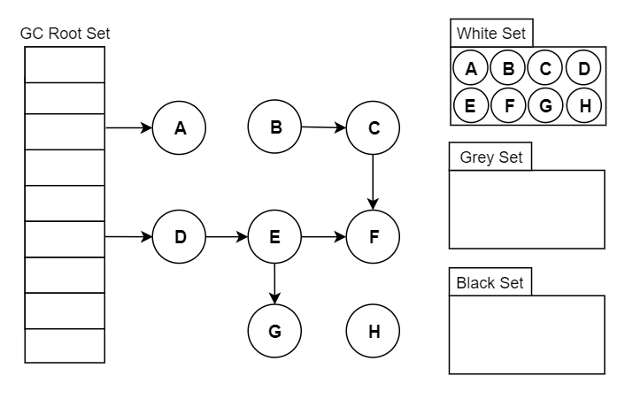
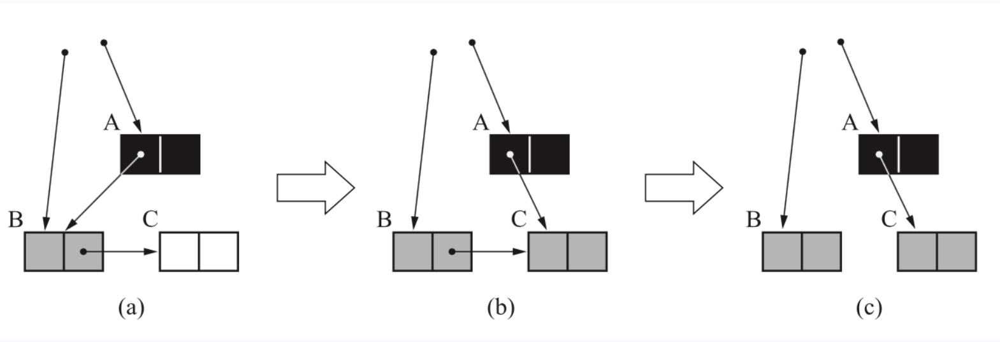
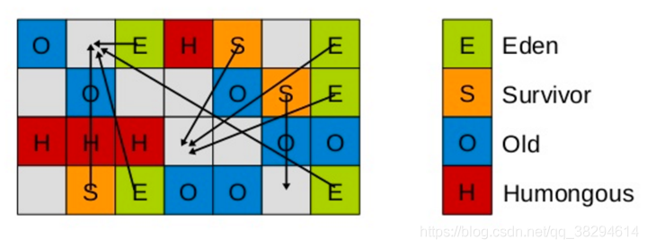

## 写在前面

### 本节常见面试题

问题答案在文中都有提到

- 如何判断对象是否死亡（两种方法）。
- 简单的介绍一下强引用、软引用、弱引用、虚引用（虚引用与软引用和弱引用的区别、使用软引用能带来的好处）。
- 如何判断一个常量是废弃常量
- 如何判断一个类是无用的类
- 垃圾收集有哪些算法，各自的特点？
- HotSpot 为什么要分为新生代和老年代？
- 常见的垃圾回收器有哪些？
- 介绍一下 CMS,G1 收集器。
- Minor Gc 和 Full GC 有什么不同呢？

### 本文导火索


当需要排查各种内存溢出问题、当垃圾收集成为系统达到更高并发的瓶颈时，我们就需要对这些“自动化”的技术实施必要的监控和调节。

## 1 揭开 JVM 内存分配与回收的神秘面纱

Java 的自动内存管理主要是针对对象内存的回收和对象内存的分配。同时，Java 自动内存管理最核心的功能是 **堆** 内存中对象的分配与回收。

Java 堆是垃圾收集器管理的主要区域，因此也被称作**GC 堆（Garbage Collected Heap）**.从垃圾回收的角度，由于现在收集器基本都采用分代垃圾收集算法，所以 Java 堆还可以细分为：新生代和老年代：再细致一点有：Eden 空间、From Survivor、To Survivor 空间等。**进一步划分的目的是更好地回收内存，或者更快地分配内存。**

**堆空间的基本结构：**


上图所示的 Eden 区、From Survivor0("From") 区、To Survivor1("To") 区都属于新生代，Old Memory 区属于老年代。

大部分情况，对象都会首先在 Eden 区域分配，在一次新生代垃圾回收后，如果对象还存活，则会进入 s0 或者 s1，并且对象的年龄还会加 1(Eden 区->Survivor 区后对象的初始年龄变为 1)，当它的年龄增加到一定程度（默认为大于 15 岁），就会被晋升到老年代中。对象晋升到老年代的年龄阈值，可以通过参数 `-XX:MaxTenuringThreshold` 来设置默认值，这个值会在虚拟机运行过程中进行调整，可以通过`-XX:+PrintTenuringDistribution`来打印出当次 GC 后的 Threshold。

> **🐛 修正（参见：[issue552](https://github.com/Snailclimb/JavaGuide/issues/552)）**：“Hotspot 遍历所有对象时，按照年龄从小到大对其所占用的大小进行累积，当累积的某个年龄大小超过了 survivor 区的一半时，取这个年龄和 MaxTenuringThreshold 中更小的一个值，作为新的晋升年龄阈值”。
>
> **动态年龄计算的代码如下**
>
> ```c++
> uint ageTable::compute_tenuring_threshold(size_t survivor_capacity) {
> //survivor_capacity是survivor空间的大小
> size_t desired_survivor_size = (size_t)((((double)survivor_capacity)*TargetSurvivorRatio)/100);
> size_t total = 0;
> uint age = 1;
> while (age < table_size) {
>   //sizes数组是每个年龄段对象大小
>   total += sizes[age];
>   if (total > desired_survivor_size) {
>       break;
>   }
>   age++;
> }
> uint result = age < MaxTenuringThreshold ? age : MaxTenuringThreshold;
> ...
> }
> 
> ```

经过这次 GC 后，Eden 区和"From"区已经被清空。这个时候，"From"和"To"会交换他们的角色，也就是新的"To"就是上次 GC 前的“From”，新的"From"就是上次 GC 前的"To"。不管怎样，都会保证名为 To 的 Survivor 区域是空的。Minor GC 会一直重复这样的过程，在这个过程中，有可能当次 Minor GC 后，Survivor 的"From"区域空间不够用，有一些还达不到进入老年代条件的实例放不下，则放不下的部分会提前进入老年代。

接下来我们提供一个调试脚本来测试这个过程。

**调试代码参数如下**

```
-verbose:gc
-Xmx200M
-Xms200M
-Xmn50M
-XX:+PrintGCDetails
-XX:TargetSurvivorRatio=60
-XX:+PrintTenuringDistribution
-XX:+PrintGCDetails
-XX:+PrintGCDateStamps
-XX:MaxTenuringThreshold=3
-XX:+UseConcMarkSweepGC
-XX:+UseParNewGC
```

**示例代码如下：**

```java
/*
* 本实例用于java GC以后，新生代survivor区域的变化，以及晋升到老年代的时间和方式的测试代码。需要自行分步注释不需要的代码进行反复测试对比
*
* 由于java的main函数以及其他基础服务也会占用一些eden空间，所以要提前空跑一次main函数，来看看这部分占用。
*
* 自定义的代码中，我们使用堆内分配数组和栈内分配数组的方式来分别模拟不可被GC的和可被GC的资源。
*
*
* */

public class JavaGcTest {

    public static void main(String[] args) throws InterruptedException {
        //空跑一次main函数来查看java服务本身占用的空间大小，我这里是占用了3M。所以40-3=37，下面分配三个1M的数组和一个34M的垃圾数组。


        // 为了达到TargetSurvivorRatio（期望占用的Survivor区域的大小）这个比例指定的值, 即5M*60%=3M(Desired survivor size)，
        // 这里用1M的数组的分配来达到Desired survivor size
        //说明: 5M为S区的From或To的大小，60%为TargetSurvivorRatio参数指定,可以更改参数获取不同的效果。
        byte[] byte1m_1 = new byte[1 * 1024 * 1024];
        byte[] byte1m_2 = new byte[1 * 1024 * 1024];
        byte[] byte1m_3 = new byte[1 * 1024 * 1024];

        //使用函数方式来申请空间，函数运行完毕以后，就会变成垃圾等待回收。此时应保证eden的区域占用达到100%。可以通过调整传入值来达到效果。
        makeGarbage(34);

        //再次申请一个数组，因为eden已经满了，所以这里会触发Minor GC
        byte[] byteArr = new byte[10*1024*1024];
        // 这次Minor Gc时, 三个1M的数组因为尚有引用，所以进入From区域（因为是第一次GC）age为1
        // 且由于From区已经占用达到了60%(-XX:TargetSurvivorRatio=60), 所以会重新计算对象晋升的age。
        // 计算方法见上文，计算出age：min(age, MaxTenuringThreshold) = 1，输出中会有Desired survivor size 3145728 bytes, new threshold 1 (max 3)字样
        //新的数组byteArr进入eden区域。


        //再次触发垃圾回收，证明三个1M的数组会因为其第二次回收后age为2，大于上一次计算出的new threshold 1，所以进入老年代。
        //而byteArr因为超过survivor的单个区域，直接进入了老年代。
        makeGarbage(34);
    }
    private static void makeGarbage(int size){
        byte[] byteArrTemp = new byte[size * 1024 * 1024];
    }
}

```

注意:如下输出结果中老年代的信息为 `concurrent mark-sweep generation` 和以前版本略有不同。另外，还列出了某次 GC 后是否重新生成了 threshold，以及各个年龄占用空间的大小。

```bash
2021-07-01T10:41:32.257+0800: [GC (Allocation Failure) 2021-07-01T10:41:32.257+0800: [ParNew
Desired survivor size 3145728 bytes, new threshold 1 (max 3)
- age   1:    3739264 bytes,    3739264 total
: 40345K->3674K(46080K), 0.0014584 secs] 40345K->3674K(199680K), 0.0015063 secs] [Times: user=0.00 sys=0.00, real=0.00 secs]
2021-07-01T10:41:32.259+0800: [GC (Allocation Failure) 2021-07-01T10:41:32.259+0800: [ParNew
Desired survivor size 3145728 bytes, new threshold 3 (max 3)
: 13914K->0K(46080K), 0.0046596 secs] 13914K->13895K(199680K), 0.0046873 secs] [Times: user=0.00 sys=0.00, real=0.00 secs]
Heap
 par new generation   total 46080K, used 35225K [0x05000000, 0x08200000, 0x08200000)
  eden space 40960K,  86% used [0x05000000, 0x072667f0, 0x07800000)
  from space 5120K,   0% used [0x07800000, 0x07800000, 0x07d00000)
  to   space 5120K,   0% used [0x07d00000, 0x07d00000, 0x08200000)
 concurrent mark-sweep generation total 153600K, used 13895K [0x08200000, 0x11800000, 0x11800000)
 Metaspace       used 153K, capacity 2280K, committed 2368K, reserved 4480K

```

### 1.1 对象优先在 eden 区分配

目前主流的垃圾收集器都会采用分代回收算法，因此需要将堆内存分为新生代和老年代，这样我们就可以根据各个年代的特点选择合适的垃圾收集算法。

大多数情况下，对象在新生代中 eden 区分配。当 eden 区没有足够空间进行分配时，虚拟机将发起一次 Minor GC.下面我们来进行实际测试以下。

**测试：**

```java
public class GCTest {
	public static void main(String[] args) {
		byte[] allocation1, allocation2;
		allocation1 = new byte[30900*1024];
		//allocation2 = new byte[900*1024];
	}
}
```

通过以下方式运行：


添加的参数：`-XX:+PrintGCDetails`


运行结果 (红色字体描述有误，应该是对应于 JDK1.7 的永久代)：


从上图我们可以看出 eden 区内存几乎已经被分配完全（即使程序什么也不做，新生代也会使用 2000 多 k 内存）。假如我们再为 allocation2 分配内存会出现什么情况呢？

```java
allocation2 = new byte[900*1024];
```


**简单解释一下为什么会出现这种情况：** 因为给 allocation2 分配内存的时候 eden 区内存几乎已经被分配完了，我们刚刚讲了当 Eden 区没有足够空间进行分配时，虚拟机将发起一次 Minor GC.GC 期间虚拟机又发现 allocation1 无法存入 Survivor 空间，所以只好通过 **分配担保机制** 把新生代的对象提前转移到老年代中去，老年代上的空间足够存放 allocation1，所以不会出现 Full GC。执行 Minor GC 后，后面分配的对象如果能够存在 eden 区的话，还是会在 eden 区分配内存。可以执行如下代码验证：

```java
public class GCTest {

	public static void main(String[] args) {
		byte[] allocation1, allocation2,allocation3,allocation4,allocation5;
		allocation1 = new byte[32000*1024];
		allocation2 = new byte[1000*1024];
		allocation3 = new byte[1000*1024];
		allocation4 = new byte[1000*1024];
		allocation5 = new byte[1000*1024];
	}
}

```

### 1.2 大对象直接进入老年代

大对象就是需要大量连续内存空间的对象（比如：字符串、数组）。

**为什么要这样呢？**

为了避免为大对象分配内存时由于分配担保机制带来的复制而降低效率。

### 1.3 长期存活的对象将进入老年代

既然虚拟机采用了分代收集的思想来管理内存，那么内存回收时就必须能识别哪些对象应放在新生代，哪些对象应放在老年代中。为了做到这一点，虚拟机给每个对象一个对象年龄（Age）计数器。

如果对象在 Eden 出生并经过第一次 Minor GC 后仍然能够存活，并且能被 Survivor 容纳的话，将被移动到 Survivor 空间中，并将对象年龄设为 1.对象在 Survivor 中每熬过一次 MinorGC,年龄就增加 1 岁，当它的年龄增加到一定程度（默认为 15 岁），就会被晋升到老年代中。对象晋升到老年代的年龄阈值，可以通过参数 `-XX:MaxTenuringThreshold` 来设置。

### 1.4 动态对象年龄判定

大部分情况，对象都会首先在 Eden 区域分配，在一次新生代垃圾回收后，如果对象还存活，则会进入 s0 或者 s1，并且对象的年龄还会加 1(Eden 区->Survivor 区后对象的初始年龄变为 1)，当它的年龄增加到一定程度（默认为 15 岁），就会被晋升到老年代中。对象晋升到老年代的年龄阈值，可以通过参数 `-XX:MaxTenuringThreshold` 来设置。

> 修正（[issue552](https://github.com/Snailclimb/JavaGuide/issues/552)）：“Hotspot 遍历所有对象时，按照年龄从小到大对其所占用的大小进行累积，当累积的某个年龄大小超过了 survivor 区的 50% 时（默认值是 50%，可以通过 `-XX:TargetSurvivorRatio=percent` 来设置，参见 [issue1199](https://github.com/Snailclimb/JavaGuide/issues/1199) ），取这个年龄和 MaxTenuringThreshold 中更小的一个值，作为新的晋升年龄阈值”。
>
> jdk8 官方文档引用 ：https://docs.oracle.com/javase/8/docs/technotes/tools/unix/java.html 。
>
> 
>
> **动态年龄计算的代码如下：**
>
> ```c++
> uint ageTable::compute_tenuring_threshold(size_t survivor_capacity) {
> //survivor_capacity是survivor空间的大小
> size_t desired_survivor_size = (size_t)((((double)survivor_capacity)*TargetSurvivorRatio)/100);
> size_t total = 0;
> uint age = 1;
> while (age < table_size) {
> //sizes数组是每个年龄段对象大小
> total += sizes[age];
> if (total > desired_survivor_size) {
>    break;
> }
> age++;
> }
> uint result = age < MaxTenuringThreshold ? age : MaxTenuringThreshold;
> ...
> }
> 
> ```
>
> 额外补充说明([issue672](https://github.com/Snailclimb/JavaGuide/issues/672))：**关于默认的晋升年龄是 15，这个说法的来源大部分都是《深入理解 Java 虚拟机》这本书。**
> 如果你去 Oracle 的官网阅读[相关的虚拟机参数](https://docs.oracle.com/javase/8/docs/technotes/tools/unix/java.html)，你会发现`-XX:MaxTenuringThreshold=threshold`这里有个说明
>
> **Sets the maximum tenuring threshold for use in adaptive GC sizing. The largest value is 15. The default value is 15 for the parallel (throughput) collector, and 6 for the CMS collector.默认晋升年龄并不都是 15，这个是要区分垃圾收集器的，CMS 就是 6.**

### 1.5 主要进行 gc 的区域

周志明先生在《深入理解 Java 虚拟机》第二版中 P92 如是写道：

> ~~_“老年代 GC（Major GC/Full GC），指发生在老年代的 GC……”_~~

上面的说法已经在《深入理解 Java 虚拟机》第三版中被改正过来了。感谢 R 大的回答：


**总结：**

针对 HotSpot VM 的实现，它里面的 GC 其实准确分类只有两大种：

部分收集 (Partial GC)：

- 新生代收集（Minor GC / Young GC）：只对新生代进行垃圾收集；
- 老年代收集（Major GC / Old GC）：只对老年代进行垃圾收集。需要注意的是 Major GC 在有的语境中也用于指代整堆收集；
- 混合收集（Mixed GC）：对整个新生代和部分老年代进行垃圾收集。

整堆收集 (Full GC)：收集整个 Java 堆和方法区。

### 1.6 空间分配担保

空间分配担保是为了确保在 Minor GC 之前老年代本身还有容纳新生代所有对象的剩余空间。

《深入理解 Java 虚拟机》第三章对于空间分配担保的描述如下：

> JDK 6 Update 24 之前，在发生 Minor GC 之前，虚拟机必须先检查老年代最大可用的连续空间是否大于新生代所有对象总空间，如果这个条件成立，那这一次 Minor GC 可以确保是安全的。如果不成立，则虚拟机会先查看 `-XX:HandlePromotionFailure` 参数的设置值是否允许担保失败(Handle Promotion Failure);如果允许，那会继续检查老年代最大可用的连续空间是否大于历次晋升到老年代对象的平均大小，如果大于，将尝试进行一次 Minor GC，尽管这次 Minor GC 是有风险的;如果小于，或者 `-XX: HandlePromotionFailure` 设置不允许冒险，那这时就要改为进行一次 Full GC。
>
> JDK 6 Update 24 之后的规则变为只要老年代的连续空间大于新生代对象总大小或者历次晋升的平均大小，就会进行 Minor GC，否则将进行 Full GC。

## 2 对象已经死亡？

堆中几乎放着所有的对象实例，对堆垃圾回收前的第一步就是要判断哪些对象已经死亡（即不能再被任何途径使用的对象）。

### 2.1 引用计数法

给对象中添加一个引用计数器，每当有一个地方引用它，计数器就加 1；当引用失效，计数器就减 1；任何时候计数器为 0 的对象就是不可能再被使用的。

**这个方法实现简单，效率高，但是目前主流的虚拟机中并没有选择这个算法来管理内存，其最主要的原因是它很难解决对象之间相互循环引用的问题。** 所谓对象之间的相互引用问题，如下面代码所示：除了对象 objA 和 objB 相互引用着对方之外，这两个对象之间再无任何引用。但是他们因为互相引用对方，导致它们的引用计数器都不为 0，于是引用计数算法无法通知 GC 回收器回收他们。

```java
public class ReferenceCountingGc {
    Object instance = null;
	public static void main(String[] args) {
		ReferenceCountingGc objA = new ReferenceCountingGc();
		ReferenceCountingGc objB = new ReferenceCountingGc();
		objA.instance = objB;
		objB.instance = objA;
		objA = null;
		objB = null;

	}
}
```

### 2.2 可达性分析算法

这个算法的基本思想就是通过一系列的称为 **“GC Roots”** 的对象作为起点，从这些节点开始向下搜索，节点所走过的路径称为引用链，当一个对象到 GC Roots 没有任何引用链相连的话，则证明此对象是不可用的，需要被回收。

下图中的 `Object 6 ~ Object 10` 之间虽有引用关系，但它们到 GC Roots 不可达，因此为需要被回收的对象。


**哪些对象可以作为 GC Roots 呢？**

- 虚拟机栈(栈帧中的本地变量表)中引用的对象
- 本地方法栈(Native 方法)中引用的对象
- 方法区中类静态属性引用的对象
- 方法区中常量引用的对象
- 所有被同步锁持有的对象

**对象可以被回收，就代表一定会被回收吗？**

即使在可达性分析法中不可达的对象，也并非是“非死不可”的，这时候它们暂时处于“缓刑阶段”，要真正宣告一个对象死亡，至少要经历两次标记过程；可达性分析法中不可达的对象被第一次标记并且进行一次筛选，筛选的条件是此对象是否有必要执行 `finalize` 方法。当对象没有覆盖 `finalize` 方法，或 `finalize` 方法已经被虚拟机调用过时，虚拟机将这两种情况视为没有必要执行。

被判定为需要执行的对象将会被放在一个队列中进行第二次标记，除非这个对象与引用链上的任何一个对象建立关联，否则就会被真的回收。

> `Object` 类中的 `finalize` 方法一直被认为是一个糟糕的设计，成为了 Java 语言的负担，影响了 Java 语言的安全和 GC 的性能。JDK9 版本及后续版本中各个类中的 `finalize` 方法会被逐渐弃用移除。忘掉它的存在吧！
>
> 参考：
>
> - [JEP 421: Deprecate Finalization for Removal](https://openjdk.java.net/jeps/421)
> - [是时候忘掉 finalize 方法了](https://mp.weixin.qq.com/s/LW-paZAMD08DP_3-XCUxmg)

### 2.3 再谈引用

无论是通过引用计数法判断对象引用数量，还是通过可达性分析法判断对象的引用链是否可达，判定对象的存活都与“引用”有关。

JDK1.2 之前，Java 中引用的定义很传统：如果 reference 类型的数据存储的数值代表的是另一块内存的起始地址，就称这块内存代表一个引用。

JDK1.2 以后，Java 对引用的概念进行了扩充，将引用分为强引用、软引用、弱引用、虚引用四种（引用强度逐渐减弱）

**1．强引用（StrongReference）**

以前我们使用的大部分引用实际上都是强引用，这是使用最普遍的引用。如果一个对象具有强引用，那就类似于**必不可少的生活用品**，垃圾回收器绝不会回收它。当内存空间不足，Java 虚拟机宁愿抛出 OutOfMemoryError 错误，使程序异常终止，也不会靠随意回收具有强引用的对象来解决内存不足问题。

**2．软引用（SoftReference）**

如果一个对象只具有软引用，那就类似于**可有可无的生活用品**。如果内存空间足够，垃圾回收器就不会回收它，如果内存空间不足了，就会回收这些对象的内存。只要垃圾回收器没有回收它，该对象就可以被程序使用。软引用可用来实现内存敏感的高速缓存。

软引用可以和一个引用队列（ReferenceQueue）联合使用，如果软引用所引用的对象被垃圾回收，JAVA 虚拟机就会把这个软引用加入到与之关联的引用队列中。

**3．弱引用（WeakReference）**

如果一个对象只具有弱引用，那就类似于**可有可无的生活用品**。弱引用与软引用的区别在于：只具有弱引用的对象拥有更短暂的生命周期。在垃圾回收器线程扫描它所管辖的内存区域的过程中，一旦发现了只具有弱引用的对象，不管当前内存空间足够与否，都会回收它的内存。不过，由于垃圾回收器是一个优先级很低的线程， 因此不一定会很快发现那些只具有弱引用的对象。

弱引用可以和一个引用队列（ReferenceQueue）联合使用，如果弱引用所引用的对象被垃圾回收，Java 虚拟机就会把这个弱引用加入到与之关联的引用队列中。

**4．虚引用（PhantomReference）**

"虚引用"顾名思义，就是形同虚设，与其他几种引用都不同，虚引用并不会决定对象的生命周期。如果一个对象仅持有虚引用，那么它就和没有任何引用一样，在任何时候都可能被垃圾回收。

**虚引用主要用来跟踪对象被垃圾回收的活动**。

**虚引用与软引用和弱引用的一个区别在于：** 虚引用必须和引用队列（ReferenceQueue）联合使用。当垃圾回收器准备回收一个对象时，如果发现它还有虚引用，就会在回收对象的内存之前，把这个虚引用加入到与之关联的引用队列中。程序可以通过判断引用队列中是否已经加入了虚引用，来了解被引用的对象是否将要被垃圾回收。程序如果发现某个虚引用已经被加入到引用队列，那么就可以在所引用的对象的内存被回收之前采取必要的行动。

特别注意，在程序设计中一般很少使用弱引用与虚引用，使用软引用的情况较多，这是因为**软引用可以加速 JVM 对垃圾内存的回收速度，可以维护系统的运行安全，防止内存溢出（OutOfMemory）等问题的产生**。

### 2.5 如何判断一个常量是废弃常量？

运行时常量池主要回收的是废弃的常量。那么，我们如何判断一个常量是废弃常量呢？

~~**JDK1.7 及之后版本的 JVM 已经将运行时常量池从方法区中移了出来，在 Java 堆（Heap）中开辟了一块区域存放运行时常量池。**~~

> **🐛 修正（参见：[issue747](https://github.com/Snailclimb/JavaGuide/issues/747)，[reference](https://blog.csdn.net/q5706503/article/details/84640762)）** ：
>
> 1. **JDK1.7 之前运行时常量池逻辑包含字符串常量池存放在方法区, 此时 hotspot 虚拟机对方法区的实现为永久代**
> 2. **JDK1.7 字符串常量池被从方法区拿到了堆中, 这里没有提到运行时常量池,也就是说字符串常量池被单独拿到堆,运行时常量池剩下的东西还在方法区, 也就是 hotspot 中的永久代** 。
> 3. **JDK1.8 hotspot 移除了永久代用元空间(Metaspace)取而代之, 这时候字符串常量池还在堆, 运行时常量池还在方法区, 只不过方法区的实现从永久代变成了元空间(Metaspace)**

假如在字符串常量池中存在字符串 "abc"，如果当前没有任何 String 对象引用该字符串常量的话，就说明常量 "abc" 就是废弃常量，如果这时发生内存回收的话而且有必要的话，"abc" 就会被系统清理出常量池了。

### 2.6 如何判断一个类是无用的类

方法区主要回收的是无用的类，那么如何判断一个类是无用的类的呢？

判定一个常量是否是“废弃常量”比较简单，而要判定一个类是否是“无用的类”的条件则相对苛刻许多。类需要同时满足下面 3 个条件才能算是 **“无用的类”** ：

- 该类所有的实例都已经被回收，也就是 Java 堆中不存在该类的任何实例。
- 加载该类的 `ClassLoader` 已经被回收。
- 该类对应的 `java.lang.Class` 对象没有在任何地方被引用，无法在任何地方通过反射访问该类的方法。

虚拟机可以对满足上述 3 个条件的无用类进行回收，这里说的仅仅是“可以”，而并不是和对象一样不使用了就会必然被回收。

## 3 垃圾收集算法

### 3.1 标记-清除算法

该算法分为“标记”和“清除”阶段：首先标记出所有不需要回收的对象，在标记完成后统一回收掉所有没有被标记的对象。它是最基础的收集算法，后续的算法都是对其不足进行改进得到。这种垃圾收集算法会带来两个明显的问题：

1. **效率问题**
2. **空间问题（标记清除后会产生大量不连续的碎片）**


### 3.2 标记-复制算法

为了解决效率问题，“标记-复制”收集算法出现了。它可以将内存分为大小相同的两块，每次使用其中的一块。当这一块的内存使用完后，就将还存活的对象复制到另一块去，然后再把使用的空间一次清理掉。这样就使每次的内存回收都是对内存区间的一半进行回收。


### 3.3 标记-整理算法

根据老年代的特点提出的一种标记算法，标记过程仍然与“标记-清除”算法一样，但后续步骤不是直接对可回收对象回收，而是让所有存活的对象向一端移动，然后直接清理掉端边界以外的内存。


### 3.4 分代收集算法

当前虚拟机的垃圾收集都采用分代收集算法，这种算法没有什么新的思想，只是根据对象存活周期的不同将内存分为几块。一般将 java 堆分为新生代和老年代，这样我们就可以根据各个年代的特点选择合适的垃圾收集算法。

**比如在新生代中，每次收集都会有大量对象死去，所以可以选择”标记-复制“算法，只需要付出少量对象的复制成本就可以完成每次垃圾收集。而老年代的对象存活几率是比较高的，而且没有额外的空间对它进行分配担保，所以我们必须选择“标记-清除”或“标记-整理”算法进行垃圾收集。**

**延伸面试问题：** HotSpot 为什么要分为新生代和老年代？

根据上面的对分代收集算法的介绍回答。

## 4 垃圾收集器

**如果说收集算法是内存回收的方法论，那么垃圾收集器就是内存回收的具体实现。**

虽然我们对各个收集器进行比较，但并非要挑选出一个最好的收集器。因为直到现在为止还没有最好的垃圾收集器出现，更加没有万能的垃圾收集器，**我们能做的就是根据具体应用场景选择适合自己的垃圾收集器**。试想一下：如果有一种四海之内、任何场景下都适用的完美收集器存在，那么我们的 HotSpot 虚拟机就不会实现那么多不同的垃圾收集器了。

### 4.1 Serial 收集器

Serial（串行）收集器是最基本、历史最悠久的垃圾收集器了。大家看名字就知道这个收集器是一个单线程收集器了。它的 **“单线程”** 的意义不仅仅意味着它只会使用一条垃圾收集线程去完成垃圾收集工作，更重要的是它在进行垃圾收集工作的时候必须暂停其他所有的工作线程（ **"Stop The World"** ），直到它收集结束。

**新生代采用标记-复制算法，老年代采用标记-整理算法。**


虚拟机的设计者们当然知道 Stop The World 带来的不良用户体验，所以在后续的垃圾收集器设计中停顿时间在不断缩短（仍然还有停顿，寻找最优秀的垃圾收集器的过程仍然在继续）。

但是 Serial 收集器有没有优于其他垃圾收集器的地方呢？当然有，它**简单而高效（与其他收集器的单线程相比）**。Serial 收集器由于没有线程交互的开销，自然可以获得很高的单线程收集效率。Serial 收集器对于运行在 Client 模式下的虚拟机来说是个不错的选择。

### 4.2 ParNew 收集器

**ParNew 收集器其实就是 Serial 收集器的多线程版本，除了使用多线程进行垃圾收集外，其余行为（控制参数、收集算法、回收策略等等）和 Serial 收集器完全一样。**

**新生代采用标记-复制算法，老年代采用标记-整理算法。**


它是许多运行在 Server 模式下的虚拟机的首要选择，除了 Serial 收集器外，只有它能与 CMS 收集器（真正意义上的并发收集器，后面会介绍到）配合工作。

**并行和并发概念补充：**

- **并行（Parallel）** ：指多条垃圾收集线程并行工作，但此时用户线程仍然处于等待状态。

- **并发（Concurrent）**：指用户线程与垃圾收集线程同时执行（但不一定是并行，可能会交替执行），用户程序在继续运行，而垃圾收集器运行在另一个 CPU 上。

### 4.3 Parallel Scavenge 收集器

Parallel Scavenge 收集器也是使用标记-复制算法的多线程收集器，它看上去几乎和 ParNew 都一样。 **那么它有什么特别之处呢？**

```
-XX:+UseParallelGC

    使用 Parallel 收集器+ 老年代串行

-XX:+UseParallelOldGC

    使用 Parallel 收集器+ 老年代并行

```

**Parallel Scavenge 收集器关注点是吞吐量（高效率的利用 CPU）。CMS 等垃圾收集器的关注点更多的是用户线程的停顿时间（提高用户体验）。所谓吞吐量就是 CPU 中用于运行用户代码的时间与 CPU 总消耗时间的比值。** Parallel Scavenge 收集器提供了很多参数供用户找到最合适的停顿时间或最大吞吐量，如果对于收集器运作不太了解，手工优化存在困难的时候，使用 Parallel Scavenge 收集器配合自适应调节策略，把内存管理优化交给虚拟机去完成也是一个不错的选择。

**新生代采用标记-复制算法，老年代采用标记-整理算法。**


**这是 JDK1.8 默认收集器**

使用 java -XX:+PrintCommandLineFlags -version 命令查看

```
-XX:InitialHeapSize=262921408 -XX:MaxHeapSize=4206742528 -XX:+PrintCommandLineFlags -XX:+UseCompressedClassPointers -XX:+UseCompressedOops -XX:+UseParallelGC
java version "1.8.0_211"
Java(TM) SE Runtime Environment (build 1.8.0_211-b12)
Java HotSpot(TM) 64-Bit Server VM (build 25.211-b12, mixed mode)
```

JDK1.8 默认使用的是 Parallel Scavenge + Parallel Old，如果指定了-XX:+UseParallelGC 参数，则默认指定了-XX:+UseParallelOldGC，可以使用-XX:-UseParallelOldGC 来禁用该功能

### 4.4.Serial Old 收集器

**Serial 收集器的老年代版本**，它同样是一个单线程收集器。它主要有两大用途：一种用途是在 JDK1.5 以及以前的版本中与 Parallel Scavenge 收集器搭配使用，另一种用途是作为 CMS 收集器的后备方案。

### 4.5 Parallel Old 收集器

**Parallel Scavenge 收集器的老年代版本**。使用多线程和“标记-整理”算法。在注重吞吐量以及 CPU 资源的场合，都可以优先考虑 Parallel Scavenge 收集器和 Parallel Old 收集器。

### 4.6 CMS 收集器

**CMS（Concurrent Mark Sweep）收集器是一种以获取最短回收停顿时间为目标的收集器。它非常符合在注重用户体验的应用上使用。**

**CMS（Concurrent Mark Sweep）收集器是 HotSpot 虚拟机第一款真正意义上的并发收集器，它第一次实现了让垃圾收集线程与用户线程（基本上）同时工作。**

从名字中的**Mark Sweep**这两个词可以看出，CMS 收集器是一种 **“标记-清除”算法**实现的，它的运作过程相比于前面几种垃圾收集器来说更加复杂一些。整个过程分为四个步骤：

- **初始标记：** 暂停所有的其他线程，并记录下直接与 root 相连的对象，速度很快 ；
- **并发标记：** 同时开启 GC 和用户线程，用一个闭包结构去记录可达对象。但在这个阶段结束，这个闭包结构并不能保证包含当前所有的可达对象。因为用户线程可能会不断的更新引用域，所以 GC 线程无法保证可达性分析的实时性。所以这个算法里会跟踪记录这些发生引用更新的地方。
- **重新标记：** 重新标记阶段就是为了修正并发标记期间因为用户程序继续运行而导致标记产生变动的那一部分对象的标记记录，这个阶段的停顿时间一般会比初始标记阶段的时间稍长，远远比并发标记阶段时间短
- **并发清除：** 开启用户线程，同时 GC 线程开始对未标记的区域做清扫。


从它的名字就可以看出它是一款优秀的垃圾收集器，主要优点：**并发收集、低停顿**。但是它有下面三个明显的缺点：

- **对 CPU 资源敏感；**
- **无法处理浮动垃圾；**
- **它使用的回收算法-“标记-清除”算法会导致收集结束时会有大量空间碎片产生。**

#### 4.6.1 三色标记法

##### 1. 基本算法

要找出存活对象，根据可达性分析，从GC Roots开始进行遍历访问，可达的则为存活对象：

[](https://upload-images.jianshu.io/upload_images/7779607-90fb56d1b362a074.png?imageMogr2/auto-orient/strip|imageView2/2/w/509/format/webp)

最终结果：A/D/E/F/G 可达

我们把遍历对象图**过程**中遇到的对象，按“是否访问过”这个条件标记成以下三种颜色：

- **白色**：尚未访问过。
- **黑色**：本对象已访问过，而且本对象 引用到 的其他对象 也全部访问过了。
- **灰色**：本对象已访问过，但是本对象 引用到 的其他对象 尚未全部访问完。全部访问后，会转换为黑色。

[](https://upload-images.jianshu.io/upload_images/7779607-eecbd09f81b721f8.gif?imageMogr2/auto-orient/strip|imageView2/2/w/706/format/webp)

三色标记遍历过程

假设现在有白、灰、黑三个集合（表示当前对象的颜色），其遍历访问过程为：

1. 初始时，所有对象都在 【白色集合】中；
2. 将GC Roots 直接引用到的对象 挪到 【灰色集合】中；
3. 从灰色集合中获取对象：
   3.1. 将本对象 引用到的 其他对象 全部挪到 【灰色集合】中；
   3.2. 将本对象 挪到 【黑色集合】里面。
4. 重复步骤3，直至【灰色集合】为空时结束。
5. 结束后，仍在【白色集合】的对象即为GC Roots 不可达，可以进行回收。

> 注：如果标记结束后对象仍为白色，意味着已经“找不到”该对象在哪了，不可能会再被重新引用。

当Stop The World （以下简称 STW）时，对象间的引用 是不会发生变化的，可以轻松完成标记。
而当需要支持并发标记时，即标记期间应用线程还在继续跑，**对象间的引用可能发生变化**，**多标**和**漏标**的情况就有可能发生。

- 浮动垃圾(多标)：将原本应该被清除的对象，误标记为存活对象。后果是垃圾回收不彻底，不过影响不大，可以在下个周期被回收；
- 对象消失(漏标)：**将原本应该存活的对象，误标记为需要清理的对象。后果很严重，影响程序运行，是不可容忍的。**

能不能在并发标记期间，将用户线程对引用关系的修改都保存起来？并发标记完成后，再将这些保存的修改过程，重新进行标记和调整？能，CMS 就是这么干的。**它将并发标记期间引用发生变化的对象都暂存起来，并发标记完成后，再重新对这些暂存的对象重新进行一次标记**。虽然重新标记的过程是需要 STW 的，但是重新标记的对象数量远远小于并发标记阶段的对象数量，因此停顿时间也是短暂且相对固定的，因此这个方法可行！

##### 2. 多标-浮动垃圾

假设已经遍历到E（变为灰色了），此时应用执行了 `objD.fieldE = null` ：

[](https://upload-images.jianshu.io/upload_images/7779607-7a5ce353116237e2.png?imageMogr2/auto-orient/strip|imageView2/2/w/683/format/webp)

D > E 的引用断开

此刻之后，对象E/F/G是“应该”被回收的。然而因为**E已经变为灰色**了，其仍会被**当作存活对象**继续遍历下去。最终的结果是：这部分对象仍会被标记为存活，即**本轮GC不会回收这部分内存**。

这部分本应该回收 但是 没有回收到的内存，被称之为“**浮动垃圾**”。浮动垃圾并不会影响应用程序的正确性，只是需要等到下一轮垃圾回收中才被清除。

另外，针对并发标记开始后的**新对象**，通常的做法是直接全部**当成黑色**，本轮不会进行清除。这部分对象期间可能会变为垃圾，这也算是浮动垃圾的一部分。

##### 3. 漏标-读写屏障

假设GC线程已经遍历到E（变为灰色了），此时应用线程先执行了：s

```java
var G = objE.fieldG; 
objE.fieldG = null;  // 灰色E 断开引用 白色G 
objD.fieldG = G;  // 黑色D 引用 白色G
```

[](https://upload-images.jianshu.io/upload_images/7779607-dab8f35ecb417433.png?imageMogr2/auto-orient/strip|imageView2/2/w/689/format/webp)

E > G 断开，D引用 G

此时切回GC线程继续跑，因为**E已经没有对G的引用了，所以不会将G放到灰色集合**；尽管因为D重新引用了G，但因为**D已经是黑色**了，不会再重新做遍历处理。
最终导致的结果是：G会一直停留在白色集合中，**最后被当作垃圾进行清除**。这直接**影响到了应用程序的正确性**，是不可接受的。

漏标必须要同时满足以下两个条件：

1. 赋值器插入了一条或者多条从黑色对象到白色对象的新引用；
2. 赋值器删除了全部从灰色对象到该白色对象的直接或间接引用。

这两个条件必须全部满足，才会出现对象消失的问题。那么我们只需要对上面条件进行破坏，破坏其中的任意一个，都可以防止对象消失问题的产生。这样就产生了两种解决方案：

- 增量更新：Incremental Update。
- 原始快照：Snapshot At The Beginning，SATB。

增量更新破坏的是第一个条件，当黑色对象插入新的指向白色对象的引用时，就将这个新加入的引用记录下来，待并发标记完成后，重新对这种新增的引用记录进行扫描；原始快照破坏的是第二个条件，当灰色对象要删除指向白色对象的引用关系时，也是将这个记录下来，并发标记完成后，对该记录进行重新扫描。

HotSpot 虚拟机中，不管是新增还是删除，这种记录的操作都是通过写屏障实现的。我们可以将写屏障理解为 JVM 对引用修改操作的一层 AOP，注意它与内存屏障是两个不同的东西。

增量更新与原始快照在 HotSpot 中都有实际应用，其中增量更新用在 CMS 中，原始快照用在了 G1、Shenandoah 等回收器中。

##### 4. 增量更新

增量更新破坏的是第一个条件，在新增一条引用时，将该记录保存。实际的实现中，通常是将引用相关的节点进行重新标记。考虑下图中的例子：

[](https://img2020.cnblogs.com/blog/443934/202103/443934-20210325194056807-812743969.png)

上面就是一次引用关系修改导致的对象消失问题。增量更新进行的处理，就是将由 A 到 C 的这条新增的引用关系进行保存。首先看下 Dijkstra 等人提出的方式：

```php
write_barrier(obj, field, newobj) {
    if (newobj.mark == FALSE) {
        newobj.mark = TRUE;
        push(newobj, $mark_stack);
    }
    *field = newobj;
}
```

如果新引用的对象 newobj 没有被标记，那么就将其标记后堆到标记栈里。换句话说， 如果 newobj 是白色对象，就把它涂成灰色。这样操作后的结果如下图所示：

[](https://img2020.cnblogs.com/blog/443934/202103/443934-20210325194126948-1014403721.png)

此时 C 被涂成了灰色，它将在后续被重新扫描，阻止了对象消失。

Steele 提出了一种更严厉的方法，它相比 Dijkstra 的方法，可以减少错误标记的对象数量。

```php
write_barrier(obj, field, newobj) {
    if($gc_phase == GC_MARK && obj.mark == TRUE && newobj.mark == FALSE) {
        obj.mark = FALSE;
        push(obj, $mark_stack);
    }
    *field = newobj;
}
```

如果在标记过程中发出引用的对象是黑色对象，且新的引用的目标对象为灰色或白色，那么我们就把发出引用的对象涂成灰色。这样操作后的结果如下图：

[](https://img2020.cnblogs.com/blog/443934/202103/443934-20210325194155049-205343745.png)

此时 A 由原来的黑色变成了灰色，将在后续被重新扫描。

##### 6. 原始快照

原始快照破坏的是第二个条件，当灰色对象要删除指向白色对象的引用关系时，就将这个要删除的引用记录下来，并发扫描结束后，在将这些记录重新扫描一次。

```php
write_barrier(obj, field, newobj) {
    oldobj = *field;
    if(gc_phase == GC_MARK && oldobj.mark == FALSE) {
        oldobj.mark = TRUE;
        push(oldobj, $mark_stack);
    }
    *field = newobj;
}
```

当 GC 进入到标记阶段且 oldobj 没被标记时，则标记 oldobj，并将其记录。也就是说，在标记阶段中如果指针更新前引用的 oldobj 是白色对象，就将其涂成灰色。

[](https://img2020.cnblogs.com/blog/443934/202103/443934-20210325194228979-1144898086.png)

1上图依旧是对象消失的例子。a 到 b 中，产生了一条由 A 到 C 的引用关系，这里并没有像增量更新那样将 A 或者 C 标为灰色，相反原始快照中允许出现从黑色指向白色的引用。而在从 b 到 c 中，删除了由 B 到 C 的引用关系。这时候就需要进行处理，将 C 涂为灰色。

#### 4.6.2 三色标记法与现代垃圾回收器

现代追踪式（可达性分析）的垃圾回收器几乎都借鉴了三色标记的算法思想，尽管实现的方式不尽相同：比如白色/黑色集合一般都不会出现（但是有其他体现颜色的地方）、灰色集合可以通过栈/队列/缓存日志等方式进行实现、遍历方式可以是广度/深度遍历等等。

对于读写屏障，以Java HotSpot VM为例，其并发标记时对漏标的处理方案如下：

- **CMS：写屏障 + 增量更新**
- **G1：写屏障 + SATB（原始快照）**
- **ZGC：读屏障**

工程实现中，读写屏障还有其他功能，比如写屏障可以用于记录跨代/区引用的变化，读屏障可以用于支持移动对象的并发执行等。功能之外，还有性能的考虑，所以对于选择哪种，每款垃圾回收器都有自己的想法。

> 值得注意的是，CMS中使用的增量更新，在重新标记阶段，除了需要遍历 写屏障的记录，还需要重新扫描遍历GC Roots（当然标记过的无需再遍历了），这是由于CMS对于astore_x等指令不添加写屏障的原因，具体可参考[这里](https://links.jianshu.com/go?to=https%3A%2F%2Fhllvm-group.iteye.com%2Fgroup%2Ftopic%2F44529)。

#### 4.6.3 为什么G1用SATB？CMS用增量更新？

增量更新：黑色对象新增一条指向白色对象的引用，那么要进行深入扫描白色对象及它的引用对象。

原始快照：灰色对象删除了一条指向白色对象的引用，实际上就产生了浮动垃圾，好处是不需要像 CMS 那样 remark，再走一遍 root trace 这种相当耗时的流程。

我的理解：SATB相对增量更新效率会高(当然SATB可能造成更多的浮动垃圾)，因为不需要在重新标记阶段再次深度扫描被删除引用对象，而CMS对增量引用的根对象会做深度扫描，G1因为很多对象都位于不同的region，CMS就一块老年代区域，重新深度扫描对象的话G1的代价会比CMS高，所以G1选择SATB不深度扫描对象，只是简单标记，等到下一轮GC再深度扫描。

#### 4.6.4 记忆集与卡表

在新生代做GCRoots可达性扫描过程中可能会碰到跨代引用的对象，这种如果又去对老年代再去扫描效率太低了。为此，在新生代可以引入记录集（Remember Set）的数据结构（记录从非收集区到收集区的指针集合），避免把整个老年代加入GCRoots扫描范围。事实上并不只是新生代、 老年代之间才有跨代引用的问题， 所有涉及部分区域收集（Partial GC） 行为的垃圾收集器， 典型的如G1、 ZGC和Shenandoah收集器， 都会面临相同的问题。

垃圾收集场景中，收集器只需通过记忆集判断出某一块非收集区域是否存在指向收集区域的指针即可，无需了解跨代引用指针的全部细节。

#### 4.6.5 跨代引用

所谓跨代引用就是老年代的对象引用了新生代的对象，或者新生代的对象引用了老年代的对象。那对于这种情况我们的GC在进行扫描的时候不可能直接把我们的整个堆都扫描完，那这样效率也太低了。所以这时候就需要开辟了一小块空间，维护这种引用，而不必让GC扫描整个堆区域。

#### 4.6.6 记忆集

记忆集也叫rememberSet，垃圾收集器在新生代中建立了记忆集这样的数据结构，用来避免把整个老年代加入到GC ROOTS的扫描范围中。对于记忆集来说，我们可以理解为他是一个抽象类，那么具体实现它的方法将由子类去完成。这里我们简单列举一下实现记忆集的三种方式：
1.字长精度
2.对象精度
3.卡精度（卡表）

#### 4.6.7 卡表

卡表(Card Table)是一种对记忆集的具体实现。主要定义了记忆集的记录精度、与堆内存的映射关系等。卡表中的每一个元素都对应着一块特定大小的内存块，这个内存块我们称之为卡页（card page），当存在跨带引用的时候，它会将卡页标记为dirty。那么JVM对于卡页的维护也是通过**写屏障**的方式，这也就是为什么刚刚我们跟进写屏障操作到最后会发现它会对卡表进行一系列的操作。


### 4.7 G1 收集器

**G1 (Garbage-First) 是一款面向服务器的垃圾收集器,主要针对配备多颗处理器及大容量内存的机器. 以极高概率满足 GC 停顿时间要求的同时,还具备高吞吐量性能特征.**

被视为 JDK1.7 中 HotSpot 虚拟机的一个重要进化特征。它具备以下特点：

- **并行与并发**：G1 能充分利用 CPU、多核环境下的硬件优势，使用多个 CPU（CPU 或者 CPU 核心）来缩短 Stop-The-World 停顿时间。部分其他收集器原本需要停顿 Java 线程执行的 GC 动作，G1 收集器仍然可以通过并发的方式让 java 程序继续执行。
- **分代收集**：虽然 G1 可以不需要其他收集器配合就能独立管理整个 GC 堆，但是还是保留了分代的概念。
- **空间整合**：与 CMS 的“标记-清理”算法不同，G1 从整体来看是基于“标记-整理”算法实现的收集器；从局部上来看是基于“标记-复制”算法实现的。
- **可预测的停顿**：这是 G1 相对于 CMS 的另一个大优势，降低停顿时间是 G1 和 CMS 共同的关注点，但 G1 除了追求低停顿外，还能建立可预测的停顿时间模型，能让使用者明确指定在一个长度为 M 毫秒的时间片段内。

G1 收集器的运作大致分为以下几个步骤：

- **初始标记**
- **并发标记**
- **最终标记**
- **筛选回收**

**G1 收集器在后台维护了一个优先列表，每次根据允许的收集时间，优先选择回收价值最大的 Region(这也就是它的名字 Garbage-First 的由来)** 。这种使用 Region 划分内存空间以及有优先级的区域回收方式，保证了 G1 收集器在有限时间内可以尽可能高的收集效率（把内存化整为零）。

#### 4.7.1 内存模型

G1与其他垃圾收集器不同之处在于，heap被划分为一系列大小相等的“小堆区”，也称为region。每个小堆区（region）的大小为1~32MB，整个堆默认划分出2048个小堆区。与上一代的垃圾收集器一样在逻辑上被划分Eden、Survivor和老年代，但是各种角色的region个数都不是固定的。下图中的绿色代表Eden小堆区、黄色为Survivor小堆区、蓝色则为老年代小堆区、而灰色则会未被使用的区域。


在G1中，还有一种特殊的区域，叫Humongous区域。 如果一个对象占用的空间超过了分区容量50%以上，G1收集器就认为这是一个巨型对象。这些巨型对象，默认直接会被分配在年老代，但是如果它是一个短期存在的巨型对象，就会对垃圾收集器造成负面影响。为了解决这个问题，G1划分了一个Humongous区，它用来专门存放巨型对象。如果一个H区装不下一个巨型对象，那么G1会寻找连续的H分区来存储。为了能找到连续的H区，有时候不得不启动Full GC。

#### 4.7. 2 G1 Young GC

Young GC主要是对Eden区进行GC，它在Eden空间耗尽时会被触发。在这种情况下，Eden空间的数据移动到Survivor空间中，如果Survivor空间不够，Eden空间的部分数据会直接晋升到年老代空间。Survivor区的数据移动到新的Survivor区中，也有部分数据晋升到老年代空间中。最终Eden空间的数据为空，GC停止工作，应用线程继续执行。




这时，我们需要考虑一个问题，如果仅仅GC 新生代对象，我们如何找到所有的根对象呢？ 老年代的所有对象都是根么？那这样扫描下来会耗费大量的时间。于是，G1引进了RSet的概念。它的全称是Remembered Set，作用是跟踪指向某个heap区内的对象引用。


在CMS中，也有RSet的概念，在老年代中有一块区域用来记录指向新生代的引用。这是一种point-out，在进行Young GC时，扫描根时，仅仅需要扫描这一块区域，而不需要扫描整个老年代。

但在G1中，并没有使用point-out，这是由于一个分区太小，分区数量太多，如果是用point-out的话，会造成大量的扫描浪费，有些根本不需要GC的分区引用也扫描了。于是G1中使用point-in来解决。point-in的意思是哪些分区引用了当前分区中的对象。这样，仅仅将这些对象当做根来扫描就避免了无效的扫描。由于新生代有多个，那么我们需要在新生代之间记录引用吗？这是不必要的，原因在于每次GC时，所有新生代都会被扫描，所以只需要记录老年代到新生代之间的引用即可。

需要注意的是，如果引用的对象很多，赋值器需要对每个引用做处理，赋值器开销会很大，为了解决赋值器开销这个问题，在G1 中又引入了另外一个概念，卡表（Card Table）。一个Card Table将一个分区在逻辑上划分为固定大小的连续区域，每个区域称之为卡。卡通常较小，介于128到512字节之间。Card Table通常为字节数组，由Card的索引（即数组下标）来标识每个分区的空间地址。默认情况下，每个卡都未被引用。当一个地址空间被引用时，这个地址空间对应的数组索引的值被标记为”0″，即标记为脏被引用，此外RSet也将这个数组下标记录下来。一般情况下，这个RSet其实是一个Hash Table，Key是别的Region的起始地址，Value是一个集合，里面的元素是Card Table的Index。

Young GC 阶段：

阶段1：根扫描
静态和本地对象被扫描
阶段2：更新RS
处理dirty card队列更新RS
阶段3：处理RS
检测从年轻代指向年老代的对象
阶段4：对象拷贝
拷贝存活的对象到survivor/old区域
阶段5：处理引用队列
软引用，弱引用，虚引用处理

#### 4.7.3  G1 Mix GC

当整个堆大小在jvm堆栈空间中占比达到IHOP阈值-XX:InitiatingHeapOccupancyPercent(默认45%)时，G1就会启动一次混合垃圾收集周期。Mix GC不仅进行正常的新生代垃圾收集，同时也回收部分后台扫描线程标记的老年代分区。

它的GC步骤分2步：

全局并发标记（global concurrent marking）
拷贝存活对象（evacuation）
在进行Mix GC之前，会先进行global concurrent marking（全局并发标记）。 global concurrent marking的执行过程是怎样的呢？

在G1 GC中，它主要是为Mixed GC提供标记服务的，并不是一次GC过程的一个必须环节。global concurrent marking的执行过程分为五个步骤：

初始标记（initial mark，STW）
初始标记(Initial Mark)负责标记所有能被直接可达的根对象(原生栈对象、全局对象、JNI对象)，根是对象图的起点，因此初始标记需要将Mutator线程(Java应用线程)暂停掉，也就是需要一个STW的时间段。事实上，当达到IHOP阈值时，G1并不会立即发起并发标记周期，而是等待下一次年轻代收集，利用年轻代收集的STW时间段，完成初始标记，这种方式称为借道(Piggybacking)。在初始标记暂停中，分区的NTAMS都被设置到分区顶部Top，初始标记是并发执行，直到所有的分区处理完。

根区域扫描（root region scan）
在初始标记暂停结束后，年轻代收集也完成的对象复制到Survivor的工作，应用线程开始活跃起来。此时为了保证标记算法的正确性，所有新复制到Survivor分区的对象，都需要被扫描并标记成根，这个过程称为根分区扫描(Root Region Scanning)，同时扫描的Suvivor分区也被称为根分区(Root Region)。根分区扫描必须在下一次年轻代垃圾收集启动前完成(并发标记的过程中，可能会被若干次年轻代垃圾收集打断)，因为每次GC会产生新的存活对象集合。

并发标记（Concurrent Marking）
和应用线程并发执行，并发标记线程在并发标记阶段启动，由参数-XX:ConcGCThreads(默认GC线程数的1/4，即-XX:ParallelGCThreads/4)控制启动数量，每个线程每次只扫描一个分区，从而标记出存活对象图。在这一阶段会处理Previous/Next标记位图，扫描标记对象的引用字段。同时，并发标记线程还会定期检查和处理STAB全局缓冲区列表的记录，更新对象引用信息。参数-XX:+ClassUnloadingWithConcurrentMark会开启一个优化，如果一个类不可达(不是对象不可达)，则在重新标记阶段，这个类就会被直接卸载。所有的标记任务必须在堆满前就完成扫描，如果并发标记耗时很长，那么有可能在并发标记过程中，又经历了几次年轻代收集。如果堆满前没有完成标记任务，则会触发担保机制，经历一次长时间的串行Full GC。

最终标记（Remark，STW）
重新标记(Remark)是最后一个标记阶段。在该阶段中，G1需要一个暂停的时间，去处理剩下的SATB日志缓冲区和所有更新，找出所有未被访问的存活对象，同时安全完成存活数据计算。这个阶段也是并行执行的，通过参数-XX:ParallelGCThread可设置GC暂停时可用的GC线程数。同时，引用处理也是重新标记阶段的一部分，所有重度使用引用对象(弱引用、软引用、虚引用、最终引用)的应用都会在引用处理上产生开销。

清除垃圾（Cleanup，STW）
紧挨着重新标记阶段的清除(Clean)阶段也是STW的。Previous/Next标记位图、以及PTAMS/NTAMS，都会在清除阶段交换角色。清除阶段主要执行以下操作：

RSet梳理，启发式算法会根据活跃度和RSet尺寸对分区定义不同等级，同时RSet数理也有助于发现无用的引用。参数-XX:+PrintAdaptiveSizePolicy可以开启打印启发式算法决策细节；

整理堆分区，为混合收集周期识别回收收益高(基于释放空间和暂停目标)的老年代分区集合；

识别所有空闲分区，即发现无存活对象的分区。该分区可在清除阶段直接回收，无需等待下次收集周期。


### 4.8 ZGC 收集器

与 CMS 中的 ParNew 和 G1 类似，ZGC 也采用标记-复制算法，不过 ZGC 对该算法做了重大改进。

在 ZGC 中出现 Stop The World 的情况会更少！

详情可以看 ： [《新一代垃圾回收器 ZGC 的探索与实践》](https://tech.meituan.com/2020/08/06/new-zgc-practice-in-meituan.html)

## 参考

- 《深入理解 Java 虚拟机：JVM 高级特性与最佳实践（第二版》
- https://my.oschina.net/hosee/blog/644618
- <https://docs.oracle.com/javase/specs/jvms/se8/html/index.html>
