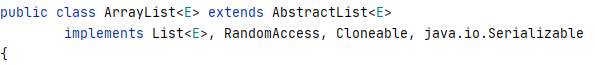

## 1、初始化(字段)

```java
private static final int DEFAULT_CAPACITY = 10; //默认的ArrayList的初始容量为10
private static final Object[] EMPTY_ELEMENTDATA = {}; //用于空实例的空数组
private static final Object[] DEFAULTCAPACITY_EMPTY_ELEMENTDATA = {}; //初始化如果没有给定initialCapacity那么就，初始化为此
transient Object[] elementData; // 保存ArrayList数据的数组
private int size; //arraylist所包含的元素的个数
private static final int MAX_ARRAY_SIZE = Integer.MAX_VALUE - 8; //最大的数组长度
protected transient int modCount = 0; //记录ArrayList被修改的次数
```



注意点：

- 实现了RandomAccess接口表明此类支持随机访问，RandomAccess起到了标志作用，其内部并没有方法；
- 实现了Cloneable接口，覆盖了clone()函数，那么ArrayList是支持克隆的；
- `ArrayList` 实现了 `java.io.Serializable`接口，这意味着`ArrayList`支持序列化，能通过序列化去传输。


## 2、构造函数


```java
 public ArrayList(int initialCapacity) {
        if (initialCapacity > 0) {//如果给了initialCapacity那么就申请此大小的数组，不过这里判断了initialCapacity是否合法；
            this.elementData = new Object[initialCapacity];
        } else if (initialCapacity == 0) { //如果initialCapacity == 0, 给一个空数组；
            this.elementData = EMPTY_ELEMENTDATA;
        } else {
            throw new IllegalArgumentException("Illegal Capacity: "+
                                               initialCapacity);
        }
    }

	//初始化给的是一个集合，那么通过吊用Arrays.copyof进行元素的拷贝；
    public ArrayList(Collection<? extends E> c) {
        Object[] a = c.toArray();
        if ((size = a.length) != 0) {
            if (c.getClass() == ArrayList.class) {
                elementData = a;
            } else {
                elementData = Arrays.copyOf(a, size, Object[].class);
            }
        } else {
            // replace with empty array.
            elementData = EMPTY_ELEMENTDATA;
        }
    }
```

## 3、add函数

```java
    public boolean add(E e) { 
        ensureCapacityInternal(size + 1);  // 如果新增一个元素导致size + 1 > elementData的长度，就进行扩容操作；
        elementData[size++] = e; //将元素放入导size+1的位置；
        return true;
    }

    private void ensureCapacityInternal(int minCapacity) {
        ensureExplicitCapacity(calculateCapacity(elementData, minCapacity));
    }

	//r如果minCapacity大于elementData的长度才进行grow操作，也就是扩容
    private void ensureExplicitCapacity(int minCapacity) {
        modCount++;

        // overflow-conscious code
        if (minCapacity - elementData.length > 0)
            grow(minCapacity);
    }
	
	//如果没有插入过元素则elementData 为空，那么返回给定的minCapacity和DEFAULT_CAPACITY的最大值
    private static int calculateCapacity(Object[] elementData, int minCapacity) {
        if (elementData  == DEFAULTCAPACITY_EMPTY_ELEMENTDATA) {
            return Math.max(DEFAULT_CAPACITY, minCapacity);
        }
        return minCapacity;
    }

```

## 4、set函数

```java
    public E set(int index, E element) {
        rangeCheck(index); //首先判断index是否超出了数组的大小，只有小于才可以set

        E oldValue = elementData(index);
        elementData[index] = element;
        return oldValue;
    }
```

## 5、grow函数


```java
    private void grow(int minCapacity) {
        // overflow-conscious code
        int oldCapacity = elementData.length;
        int newCapacity = oldCapacity + (oldCapacity >> 1); //扩容1.5倍
        if (newCapacity - minCapacity < 0)//如果扩容后还是比minCapacity小那么扩容导minCapacity就行；
            newCapacity = minCapacity;
        if (newCapacity - MAX_ARRAY_SIZE > 0) //newCapacity不能大于MAX_ARRAY_SIZE
            newCapacity = hugeCapacity(minCapacity);
        // minCapacity is usually close to size, so this is a win:
        elementData = Arrays.copyOf(elementData, newCapacity); //调用Arrays.copyof函数进行拷贝；
    }

Arrays工具类中：
        public static <T,U> T[] copyOf(U[] original, int newLength, Class<? extends T[]> newType) {
        @SuppressWarnings("unchecked")
        T[] copy = ((Object)newType == (Object)Object[].class) //获取原数组的类
            ? (T[]) new Object[newLength]
            : (T[]) Array.newInstance(newType.getComponentType(), newLength);
        System.arraycopy(original, 0, copy, 0,
                         Math.min(original.length, newLength)); //调用System的copy函数进行拷贝，这是一个本地方法；
        return copy;
    }
```

## 6、remove函数

```java
    public E remove(int index) {  //依据下标删除
        rangeCheck(index); //检查下标位置是否合法

        modCount++; //删除操作需要将modCount加一
        E oldValue = elementData(index); //获取index位置值；

        int numMoved = size - index - 1;//计算需要移动的元素的个数；
        if (numMoved > 0)
            System.arraycopy(elementData, index+1, elementData, index,
                             numMoved);//从源数组的index+1位置开始拷贝导index，长度位numMoved，也就是全体向前移动一次
        elementData[--size] = null; // clear to let GC do its work

        return oldValue;
    }
```

