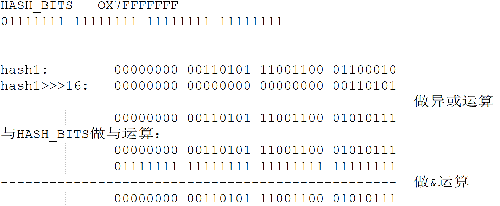
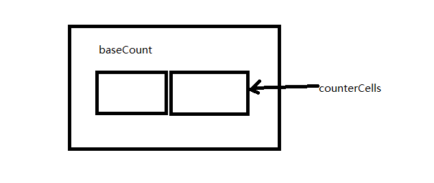
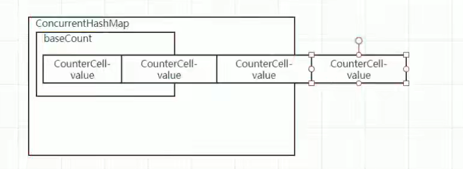
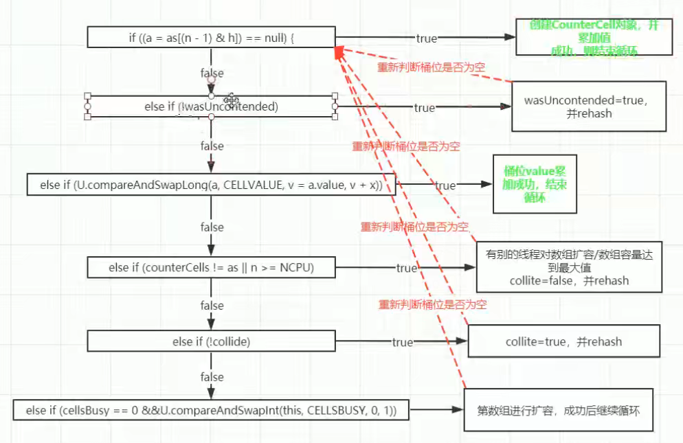
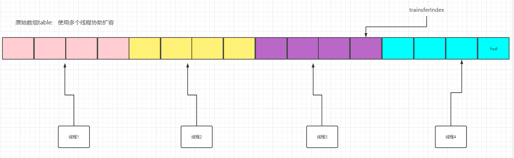

## 1、初始化

```java
private static final int MAXIMUM_CAPACITY = 1 << 30; //数组最大的容量，01000000 00000000 00000000 00000000
private static final int DEFAULT_CAPACITY = 16; //初始化容量
static final int MAX_ARRAY_SIZE = Integer.MAX_VALUE - 8; //
private static final int DEFAULT_CONCURRENCY_LEVEL = 16; //默认的并发级别,默认是16个tsegment所以每个segment都可以被加上一把锁
private static final float LOAD_FACTOR = 0.75f; //默认的加载因子
static final int TREEIFY_THRESHOLD = 8; //树化的阈值
static final int UNTREEIFY_THRESHOLD = 6; //树退化的阈值
static final int MIN_TREEIFY_CAPACITY = 64;//树化的最小segment长度
private static final int MIN_TRANSFER_STRIDE = 16;//扩容线程每次最少要迁移16个hash桶
private static int RESIZE_STAMP_BITS = 16; //
private static final int MAX_RESIZERS = (1 << (32 - RESIZE_STAMP_BITS)) - 1; //最多有多多少个线程可以同时对Map进行扩容
private static final int RESIZE_STAMP_SHIFT = 32 - RESIZE_STAMP_BITS; //


static final int MOVED     = -1; // hash for forwarding nodes
static final int TREEBIN   = -2; // hash for roots of trees
static final int RESERVED  = -3; // hash for transient reservations
static final int HASH_BITS = 0x7fffffff; // usable bits of normal node hash


transient volatile Node<K,V>[] table; //table数组
private transient volatile Node<K,V>[] nextTable; //resize的时候，记录下一个将使用的table;
private transient volatile long baseCount; //

private transient volatile int sizeCtl;//控制数组大小
private transient volatile int transferIndex; //扩容的时候新数组下标位置
private transient volatile int cellsBusy; //标识当前cell数组是否在初始化或扩容中的CAS标志位
private transient volatile CounterCell[] counterCells; //记录每一个segment的结点数量counterCells数组，总数值的分值分别存在每个cell中

// views
private transient KeySetView<K,V> keySet;
private transient ValuesView<K,V> values;
private transient EntrySetView<K,V> entrySet;
```

### 1.1 sizeCtl详解

- 未初始化：sizeCtl=0：表示没有指定初始容量。sizeCtl>0：表示初始容量。
- 初始化中：sizeCtl=-1,标记作用，告知其他线程，正在初始化
- 正常状态：sizeCtl=0.75n,扩容阈值
- 扩容中：sizeCtl < 0 : 表示有其他线程正在执行扩容
- sizeCtl = (resizeStamp(n) << RESIZE_STAMP_SHIFT)+2 表示此时只有一个线程在执行扩容；

## 2、ConcurrentHashMap中的Node结点

- 这个和HashMap中的Node一致；

```java
static class Node<K,V> implements Map.Entry<K,V> {
        final int hash;
        final K key;
        volatile V val;
        volatile Node<K,V> next;

        Node(int hash, K key, V val, Node<K,V> next) {
            this.hash = hash;
            this.key = key;
            this.val = val;
            this.next = next;
        }

        public final K getKey()       { return key; }
        public final V getValue()     { return val; }
        public final int hashCode()   { return key.hashCode() ^ val.hashCode(); }
        public final String toString(){ return key + "=" + val; }
        public final V setValue(V value) {
            throw new UnsupportedOperationException();
        }

        public final boolean equals(Object o) {
            Object k, v, u; Map.Entry<?,?> e;
            return ((o instanceof Map.Entry) &&
                    (k = (e = (Map.Entry<?,?>)o).getKey()) != null &&
                    (v = e.getValue()) != null &&
                    (k == key || k.equals(key)) &&
                    (v == (u = val) || v.equals(u)));
        }

        /**
         * Virtualized support for map.get(); overridden in subclasses.
         */
        Node<K,V> find(int h, Object k) {
            Node<K,V> e = this;
            if (k != null) {
                do {
                    K ek;
                    if (e.hash == h &&
                        ((ek = e.key) == k || (ek != null && k.equals(ek))))
                        return e;
                } while ((e = e.next) != null);
            }
            return null;
        }
    }
```
## 3、FowardingNode结点


```java
//A node inserted at head of bins during transfer operations.
static final class ForwardingNode<K,V> extends Node<K,V> {
        final Node<K,V>[] nextTable;
        ForwardingNode(Node<K,V>[] tab) {
            super(MOVED, null, null, null);
            this.nextTable = tab;
        }

        Node<K,V> find(int h, Object k) {
            // loop to avoid arbitrarily deep recursion on forwarding nodes
            outer: for (Node<K,V>[] tab = nextTable;;) {
                Node<K,V> e; int n;
                if (k == null || tab == null || (n = tab.length) == 0 ||
                    (e = tabAt(tab, (n - 1) & h)) == null)
                    return null;
                for (;;) {
                    int eh; K ek;
                    if ((eh = e.hash) == h &&
                        ((ek = e.key) == k || (ek != null && k.equals(ek))))
                        return e;
                    if (eh < 0) {
                        if (e instanceof ForwardingNode) {
                            tab = ((ForwardingNode<K,V>)e).nextTable;
                            continue outer;
                        }
                        else
                            return e.find(h, k);
                    }
                    if ((e = e.next) == null)
                        return null;
                }
            }
        }
    }
```


## 3、扰动函数

- 在hashMap中spread函数，最后会与HASH_BITS做与运算，这是因为MAXIMUM_CAPACITY = 01000000 00000000 00000000 00000000，保证HASH值

  

```java
//ConcurrentHashMap扰动函数， 
static final int spread(int h) {
        return (h ^ (h >>> 16)) & HASH_BITS; //因为MAXIMUM_CAPACITY最高位必须为0，所以计算完后还需要与HASH_BITS做与操作，将hash最高位置0，而最高位是为了帮助扩容的，因为sizeCtl < 0时最高位为1，此时正在扩容；
    }

//hashMap中的扰动函数,
static final int hash(Object key) {
        int h;
        return (key == null) ? 0 : (h = key.hashCode()) ^ (h >>> 16);
    }

```

## 4、构造函数

```java

public ConcurrentHashMap(int initialCapacity) {
    if (initialCapacity < 0)
        throw new IllegalArgumentException();
    int cap = ((initialCapacity >= (MAXIMUM_CAPACITY >>> 1)) ?
               MAXIMUM_CAPACITY :
               tableSizeFor(initialCapacity + (initialCapacity >>> 1) + 1)); //计算大于1.5*initialCapacity的2的幂次方
    this.sizeCtl = cap;//
}

public ConcurrentHashMap(int initialCapacity,
                         float loadFactor, int concurrencyLevel) {
    if (!(loadFactor > 0.0f) || initialCapacity < 0 || concurrencyLevel <= 0)
        throw new IllegalArgumentException();
    if (initialCapacity < concurrencyLevel)   // Use at least as many bins
        initialCapacity = concurrencyLevel;   // as estimated threads
    long size = (long)(1.0 + (long)initialCapacity / loadFactor);  //
    int cap = (size >= (long)MAXIMUM_CAPACITY) ?
        MAXIMUM_CAPACITY : tableSizeFor((int)size);
    this.sizeCtl = cap; //
}


```

## 5、get方法


```java
    public V get(Object key) {
        Node<K,V>[] tab; Node<K,V> e, p; int n, eh; K ek;
        int h = spread(key.hashCode()); //计算Hash值
        if ((tab = table) != null && (n = tab.length) > 0 &&
            (e = tabAt(tab, (n - 1) & h)) != null) { //找到key对应的segment下标
            if ((eh = e.hash) == h) { //
                if ((ek = e.key) == key || (ek != null && key.equals(ek))) //地址相等或者值相等
                    return e.val;
            }
            else if (eh < 0)//hash值最高为为1，
                return (p = e.find(h, key)) != null ? p.val : null;
            while ((e = e.next) != null) { //在链表中查找
                if (e.hash == h &&
                    ((ek = e.key) == key || (ek != null && key.equals(ek))))
                    return e.val;
            }
        }
        return null;
    }
```

## 6、putval函数（向map中添加元素）

向concurrenthashmap中添加元素时，需要保证添加的key和value均不为null;


```java
 final V putVal(K key, V value, boolean onlyIfAbsent) {
        if (key == null || value == null) throw new NullPointerException(); //key、value均不能为null
        int hash = spread(key.hashCode()); //首先计算key的hash值
        int binCount = 0;
        for (Node<K,V>[] tab = table;;) { //遍历table
            Node<K,V> f; int n, i, fh;  //fh记录结点f的hash
            if (tab == null || (n = tab.length) == 0) //如果table为空，说明map还没有申请内存空间
                tab = initTable(); //初始化table；
            else if ((f = tabAt(tab, i = (n - 1) & hash)) == null) { //如果下标位置为空
                //如果此位置没有元素，利用cas往下标位置加，如果为空才加，否则加不了；
                if (casTabAt(tab, i, null,
                             new Node<K,V>(hash, key, value, null))) //cas操作尝试将插入结点到此位置
                    break;                   // no lock when adding to empty bin
            }
            else if ((fh = f.hash) == MOVED) //如果当前map正在扩容，那么先协助扩容再更新值；
                tab = helpTransfer(tab, f);
            else {
                V oldVal = null;
                synchronized (f) {//对桶的头节点加锁，某个线程在插入过程中，不允许其他线程对桶中元素进行修改
                    if (tabAt(tab, i) == f) { //这里判断是因为为了防止添加元素后变成了一颗树
                        if (fh >= 0) { //是普通的链表结构
                            binCount = 1;
                            for (Node<K,V> e = f;; ++binCount) { //循环遍历链表
                                K ek;
                                //如果key相等则直接替换value，然后break;
                                if (e.hash == hash &&
                                    ((ek = e.key) == key ||
                                     (ek != null && key.equals(ek)))) {
                                    oldVal = e.val;
                                    if (!onlyIfAbsent)
                                        e.val = value;
                                    break;
                                }
                                //不相等则继续查找下一个元素
                                Node<K,V> pred = e;
                                //查找到末尾结点发现还是不相等，则插入新结点到末尾结点之后
                                if ((e = e.next) == null) {
                                    pred.next = new Node<K,V>(hash, key,
                                                              value, null);
                                    break;
                                }
                            }
                        }
                        else if (f instanceof TreeBin) { //如果fh < 0则不是链表结构，为树结构，
                            Node<K,V> p;
                            binCount = 2;
                            if ((p = ((TreeBin<K,V>)f).putTreeVal(hash, key,
                                                           value)) != null) {
                                oldVal = p.val;
                                if (!onlyIfAbsent)
                                    p.val = value;
                            }
                        }
                    }
                }
                if (binCount != 0) {
                    if (binCount >= TREEIFY_THRESHOLD)//如果是链表，判断链表长度是否达到了树化的阈值，如果达到了就需要树化
                        treeifyBin(tab, i);
                    if (oldVal != null)
                        return oldVal;
                    break;
                }
            }
        }
        addCount(1L, binCount); //
        return null;
    }

```

### 6.1 initTable申请内存空间

- initTable是在多线程情况下，假设同时有多个线程尝试initTable；
- 首先每个线程都会判断table是否为null，如果为空就会尝试初始化table;
- 如果当前sizeCtl < 0，那么说明table正在被其他线程创建，此线程就通过Thread.yield()函数挂起，让出cpu的执行权；
- 如果说sizeCtl>=0，那么当前table还没有被初始化，当前线程尝试CAS修改sizeCtl的内存值，如果修改失败就重新进入循环；
- 如果当前线程修改sizeCtl内存值成功，说明当前线程获取到了初始化table的权限，尝试为table申请内存空间；
- 在申请前还要再次判断tab是否为空，
- 判断sizeCtl是否大于0,  不大于0就使用默认的初始化容量；
- 申请内存空间；
- 将sizeCtl赋值为0.75初始化容量大小；

```java
//初始化表的过程
    private final Node<K,V>[] initTable() {
        Node<K,V>[] tab; int sc;
        while ((tab = table) == null || tab.length == 0) { //如果表为空
            if ((sc = sizeCtl) < 0) //判断sizeCtl大小，我们根据sizeCtl来申请具体大小的内存空间
                Thread.yield(); // lost initialization race; just spin 
            else if (U.compareAndSwapInt(this, SIZECTL, sc, -1)) { //SIZECTL表示sizeCtl的偏移量//通过CAS
                try {
                    if ((tab = table) == null || tab.length == 0) { //第二次还需要判断是为了避免重复初始化；
                        int n = (sc > 0) ? sc : DEFAULT_CAPACITY;
                        @SuppressWarnings("unchecked")
                        Node<K,V>[] nt = (Node<K,V>[])new Node<?,?>[n];
                        table = tab = nt;
                        sc = n - (n >>> 2); //0.75n
                    }
                } finally {
                    sizeCtl = sc; //记录扩容阈值
                }
                break;
            }
        }
        return tab;
    }
```

### 6.2 CAS过程

o: 传入的对象；

offset: 偏移量

expected: 期待值；

x: 如果o对象offset处值为expected，那么将其修改为x; 

```java
compareAndSwapInt(Object o, long offset, int expected, int x);
```

### 6.3 treeifyBin函数树化过程


```java
 private final void treeifyBin(Node<K,V>[] tab, int index) {
        Node<K,V> b; int n, sc;
        if (tab != null) {
            if ((n = tab.length) < MIN_TREEIFY_CAPACITY) //如果table最大长度小于64，则不会树化，而是选择扩容
                tryPresize(n << 1); //扩容到原来的两倍
            
            //这里才会进行树化操作，因为是多线程情况下，所以一旦某个线程在树化，就会对Index位置的桶加锁，其他线程无法树化
            else if ((b = tabAt(tab, index)) != null && b.hash >= 0) {
                synchronized (b) {
                    if (tabAt(tab, index) == b) {
                        TreeNode<K,V> hd = null, tl = null;
                        //循环将链表结构转换为树结构，这里不是真正的树化过程，只是通过TreeNode的next指针将树连接起来
                        for (Node<K,V> e = b; e != null; e = e.next) {
                            TreeNode<K,V> p =
                                new TreeNode<K,V>(e.hash, e.key, e.val,
                                                  null, null);
                            if ((p.prev = tl) == null)
                                hd = p;
                            else
                                tl.next = p;
                            tl = p;
                        }
                        //调用TreeBin实现真正的树化过程，并且将树的根结点存放到index下标的桶中
                        setTabAt(tab, index, new TreeBin<K,V>(hd));
                    }
                }
            }
        }
    }

//扩容过程,这里传入的size是原数组大小扩容为2倍的值
private final void tryPresize(int size) {
    	//首先判断扩容后数组大小是否超过了MAXIMUM_CAPACITY，大于的化调整为MAXIMUM_CAPACITY
    	//否则，调用tableSizeFor调整为2的幂次方
        int c = (size >= (MAXIMUM_CAPACITY >>> 1)) ? MAXIMUM_CAPACITY :
            tableSizeFor(size + (size >>> 1) + 1);
        int sc; //记录sizeCtl
        while ((sc = sizeCtl) >= 0) {//自旋尝试扩容
            Node<K,V>[] tab = table; int n;
            //如果数组为null，或者数组长度为0，说明数组还没有初始化呢，那么进行初始化操作
            if (tab == null || (n = tab.length) == 0) {
                n = (sc > c) ? sc : c;//n为sizeCtl和c较大值
                //尝试CAS将sizeCtl的值替换为-1，也就是一个标记为，如果为-1说明有线程正在扩容，CAS成功，说明当前线程获得了扩容权限
                if (U.compareAndSwapInt(this, SIZECTL, sc, -1)) {
                    try {
                        //双重判断，当前线程进入后再判断一次table是否为空，为空才会申请内存
                        if (table == tab) {
                            @SuppressWarnings("unchecked")
                            Node<K,V>[] nt = (Node<K,V>[])new Node<?,?>[n];
                            table = nt;
                            sc = n - (n >>> 2);
                        }
                    } finally {
                        //sizeCtl = 0.75*capacity；
                        sizeCtl = sc;
                    }
                }
            }
            //数组不为空，扩容值小于sizeCtl或者大于最大容量，直接Break；
            else if (c <= sc || n >= MAXIMUM_CAPACITY)
                break;
            //table不为空的扩容过程
            else if (tab == table) {
                int rs = resizeStamp(n);
                if (sc < 0) {
                    Node<K,V>[] nt;
                    
                    //sc右移动16位后和rs判读是否值相等
                    if ((sc >>> RESIZE_STAMP_SHIFT) != rs || sc == rs + 1 ||
                        sc == rs + MAX_RESIZERS || (nt = nextTable) == null ||
                        transferIndex <= 0)
                        break;
                    if (U.compareAndSwapInt(this, SIZECTL, sc, sc + 1))
                        transfer(tab, nt);
                }
                else if (U.compareAndSwapInt(this, SIZECTL, sc,
                                             (rs << RESIZE_STAMP_SHIFT) + 2))
                    transfer(tab, null);
            }
        }
    }


   TreeBin(TreeNode<K,V> b) {
            super(TREEBIN, null, null, null);
            this.first = b; //first取b的头节点
            TreeNode<K,V> r = null; //r记录根结点
       		//循环遍历树结点，
            for (TreeNode<K,V> x = b, next; x != null; x = next) {
                next = (TreeNode<K,V>)x.next;
                x.left = x.right = null;
                if (r == null) {//如果开始r为空，那么r = x；
                    x.parent = null;
                    x.red = false;
                    r = x;
                }
                //
                else {
                    K k = x.key;
                    int h = x.hash;
                    Class<?> kc = null;
                    for (TreeNode<K,V> p = r;;) {//p指向已经树化的那部分结点
                        int dir, ph;
                        K pk = p.key;
                        if ((ph = p.hash) > h)//判断ph的hash值和h的hash值，大于dir = -1:
                            dir = -1;
                        else if (ph < h) //小于 ， dir = 1；
                            dir = 1;
                        //如果ph == h也就是hash值相等，那么调用tieBreakOrder判断需要插入左子树还是右子树
                        else if ((kc == null &&
                                  (kc = comparableClassFor(k)) == null) ||
                                 (dir = compareComparables(kc, k, pk)) == 0)
                            dir = tieBreakOrder(k, pk);
                            TreeNode<K,V> xp = p;
                        //如果dir <= 0, 并且p.left为空，那么就将结点插入到左子树。
                        // 如果dir > 0, 并且p.right为空，那么就将结点插入到右子树。
                        if ((p = (dir <= 0) ? p.left : p.right) == null) {
                            x.parent = xp;
                            if (dir <= 0)
                                xp.left = x;
                            else
                                xp.right = x;
                            //插值完成后，可能会破坏红黑树的特性，这里需要平衡一次
                            r = balanceInsertion(r, x);
                            break;
                        }
                    }
                }
            }
            this.root = r;
            assert checkInvariants(root);
        }

/**
  * 用这个方法来比较两个对象，返回值要么大于0，要么小于0，不会为0
  * 也就是说这一步一定能确定要插入的节点要么是树的左节点，要么是右节点，不然就无继续满足二叉树结构了
  * 先比较两个对象的类名，类名是字符串对象，就按字符串的比较规则
  * 如果两个对象是同一个类型，那么调用本地方法为两个对象生成hashCode值，再进行比较，hashCode相等的话返回-1
  */
static int tieBreakOrder(Object a, Object b) {
    int d;
    if (a == null || b == null ||
        (d = a.getClass().getName().
         compareTo(b.getClass().getName())) == 0)
        d = (System.identityHashCode(a) <= System.identityHashCode(b) ?
             -1 : 1);
    return d;
}

//平衡过程和HashMap的一样的，因为能够进入这个函数的时候，当前线程已经对桶加了锁，所以这里面不需要加锁考虑并发问题
 static <K,V> TreeNode<K,V> balanceInsertion(TreeNode<K,V> root,
                                                    TreeNode<K,V> x) {
            x.red = true;
            for (TreeNode<K,V> xp, xpp, xppl, xppr;;) {
                if ((xp = x.parent) == null) {
                    x.red = false;
                    return x;
                }
                else if (!xp.red || (xpp = xp.parent) == null)
                    return root;
                if (xp == (xppl = xpp.left)) {
                    if ((xppr = xpp.right) != null && xppr.red) {
                        xppr.red = false;
                        xp.red = false;
                        xpp.red = true;
                        x = xpp;
                    }
                    else {
                        if (x == xp.right) {
                            root = rotateLeft(root, x = xp);
                            xpp = (xp = x.parent) == null ? null : xp.parent;
                        }
                        if (xp != null) {
                            xp.red = false;
                            if (xpp != null) {
                                xpp.red = true;
                                root = rotateRight(root, xpp);
                            }
                        }
                    }
                }
                else {
                    if (xppl != null && xppl.red) {
                        xppl.red = false;
                        xp.red = false;
                        xpp.red = true;
                        x = xpp;
                    }
                    else {
                        if (x == xp.left) {
                            root = rotateRight(root, x = xp);
                            xpp = (xp = x.parent) == null ? null : xp.parent;
                        }
                        if (xp != null) {
                            xp.red = false;
                            if (xpp != null) {
                                xpp.red = true;
                                root = rotateLeft(root, xpp);
                            }
                        }
                    }
                }
            }
        }

```


## 7、扩容过程

### 7.1 addCount判断是否需要扩容





- 首先尝试对baseCount进行加操作，如果没有加成功则找对应的桶下标的CounterCell做加一操作；
- 这里之之所以需要使用counterCells是因为多个线程尝试对baseCount增加压力过大，使用counterCells数组分担压力，最后计算具体的count值，只需要将baseCount的值和counterCells里面的值求和就行；

```java
private final void addCount(long x, int check) {
        CounterCell[] as; long b, s;  //as中记录的是每个桶的结点数量
    
    	//尝试把数量加到baseCount上，如果失败了再加到分段的CounterCell上
        if ((as = counterCells) != null ||
            !U.compareAndSwapLong(this, BASECOUNT, b = baseCount, s = b + x)) {
            CounterCell a; long v; int m;
            boolean uncontended = true;
            //如果当前as为空，或者长度为0，或者当前线程所在的段为null，或者当前线程的段上加数量失败
            if (as == null || (m = as.length - 1) < 0 ||
                (a = as[ThreadLocalRandom.getProbe() & m]) == null ||
                !(uncontended =
                  U.compareAndSwapLong(a, CELLVALUE, v = a.value, v + x))) {
                //强制增加数量，不同线程对应的不同段都更新失败说明冲突已经发生，对counterCells进行扩容，减少多线程hash到同一段的概率；
                fullAddCount(x, uncontended);
                return;
            }
            //check大于1，为添加元素，小于等于1则不是
            if (check <= 1)
                return;
            //计算数组元素个数
            s = sumCount();
        }
        if (check >= 0) {
            Node<K,V>[] tab, nt; int n, sc;
            while (s >= (long)(sc = sizeCtl) && (tab = table) != null &&
                   (n = tab.length) < MAXIMUM_CAPACITY) {
                
                //resizeStamp会将n向移动15为得到值给rs
                int rs = resizeStamp(n);
                if (sc < 0) {//小于0说明有其他线程正在执行扩容操作，线程会协助扩容
                    if ((sc >>> RESIZE_STAMP_SHIFT) != rs || sc == rs + 1 ||
                        sc == rs + MAX_RESIZERS || (nt = nextTable) == null ||
                        transferIndex <= 0)
                        break;
                    if (U.compareAndSwapInt(this, SIZECTL, sc, sc + 1))
                        transfer(tab, nt);//协助扩容
                }
                //这里rs向左移动16位，加上之前移动的15位那么就是移动了31位，最高位将会变成1,：
                //所以这里是尝试将sizeCtl修改为负值，当sizeCtl为负值；；
                else if (U.compareAndSwapInt(this, SIZECTL, sc,
                                             (rs << RESIZE_STAMP_SHIFT) + 2))
                    //如果修改成功，则执行扩容过程
                    transfer(tab, null);//进行扩容
                s = sumCount();
            }
        }
    }


```

### 7.2 fullAddCount函数（countercells为空，或者当线程无法对countercells加值时）

强制增加数量，不同线程对应的不同段都更新失败说明冲突已经发生，对counterCells进行扩容，减少多线程hash到同一段的概率；



```java
private final void fullAddCount(long x, boolean wasUncontended) {
        int h;
    	//计算数组角标h
        if ((h = ThreadLocalRandom.getProbe()) == 0) {
            ThreadLocalRandom.localInit();      // force initialization
            h = ThreadLocalRandom.getProbe();
            wasUncontended = true;
        }
        boolean collide = false;                // True if last slot nonempty
        for (;;) {
            CounterCell[] as; CounterCell a; int n; long v;
            //如果counterCells不为空，并且as的长度大于0
            if ((as = counterCells) != null && (n = as.length) > 0) {
                //如果当前线程对应的counterCell位置中槽位为空，在此位置添加一个CounterCell元素；
                //再并发环境下，可能存在多线程同时尝试对counterCells槽中位置添加counterCell所以cellBusy是一个标记位
                //如果cellsBusy为0，才可以添加counterCell；
                if ((a = as[(n - 1) & h]) == null) {
                    //如果当前CounterCell没有再扩容，使用Double Check；
                    if (cellsBusy == 0) {            // Try to attach new Cell
                        CounterCell r = new CounterCell(x); // Optimistic create
                        //
                        if (cellsBusy == 0 &&
                            U.compareAndSwapInt(this, CELLSBUSY, 0, 1)) {
                            boolean created = false;
                            //尝试在j位置添加counterCell；
                            try {               // Recheck under lock
                                CounterCell[] rs; int m, j;
                                if ((rs = counterCells) != null &&
                                    (m = rs.length) > 0 &&
                                    rs[j = (m - 1) & h] == null) {
                                    rs[j] = r;
                                    created = true;
                                }
                            } finally {
                                //添加成功后将cellsBusy置为0
                                cellsBusy = 0;
                            }
                            if (created)
                                break;
                            continue;           // Slot is now non-empty
                        }
                    }
                    collide = false;
                }
                //如果对应counterCells槽位置不为空
                else if (!wasUncontended)       // CAS already known to fail
                    wasUncontended = true;      // Continue after rehash
                //尝试CAS修改countercells对应槽中的value值；
                else if (U.compareAndSwapLong(a, CELLVALUE, v = a.value, v + x))
                    break;
                
                //如果数组的长度大于cpu个数，没必要进行扩容了
                else if (counterCells != as || n >= NCPU)
                    collide = false;            // At max size or stale
                //为扩容做准备
                else if (!collide)
                    collide = true;
                //如果这些线程尝试向counterCells中添加元素失败了，说明这个countercells太小了，需要进行扩容操作。CAS + 自旋尝试对counterCells扩容，扩容为原来的两倍，并且将原来的counterCells数组元素拷贝到新数组中；
                else if (cellsBusy == 0 &&
                         U.compareAndSwapInt(this, CELLSBUSY, 0, 1)) {
                    try {
                        if (counterCells == as) {// Expand table unless stale
                            CounterCell[] rs = new CounterCell[n << 1];
                            for (int i = 0; i < n; ++i)
                                rs[i] = as[i];
                            counterCells = rs;
                        }
                    } finally {
                        cellsBusy = 0;
                    }
                    collide = false;
                    continue;                   // Retry with expanded table
                }
                h = ThreadLocalRandom.advanceProbe(h);
            }
            //如果CounterCells没有被初始化，没有其他线程对其进行初始化，那么当前线程尝试CAS修改cellBusy为1
            //默认初始化为2
            else if (cellsBusy == 0 && counterCells == as &&
                     U.compareAndSwapInt(this, CELLSBUSY, 0, 1)) {
                boolean init = false;
                try {                           // Initialize table
                    if (counterCells == as) {
                        CounterCell[] rs = new CounterCell[2];
                        rs[h & 1] = new CounterCell(x);
                        counterCells = rs;
                        init = true;
                    }
                } finally {
                    cellsBusy = 0;
                }
                if (init)
                    break;
            }
            //如果数组正在被创建的过程中，那么当选线程优先往basecount里面加值；
            else if (U.compareAndSwapLong(this, BASECOUNT, v = baseCount, v + x))
                break;                          // Fall back on using base
        }
    }
```


### 7.3 helpTransfer协助扩容

```java
final Node<K,V>[] helpTransfer(Node<K,V>[] tab, Node<K,V> f) {
    Node<K,V>[] nextTab; int sc;
    if (tab != null && (f instanceof ForwardingNode) &&
        (nextTab = ((ForwardingNode<K,V>)f).nextTable) != null) {
        int rs = resizeStamp(tab.length); //n左移动15位
        //如果有线程正在执行扩容
        while (nextTab == nextTable && table == tab &&
               (sc = sizeCtl) < 0) {
            //判断是否已经有足够的的线程进行扩容，也就是slot不够
            if ((sc >>> RESIZE_STAMP_SHIFT) != rs || sc == rs + 1 ||
                sc == rs + MAX_RESIZERS || transferIndex <= 0)
                break;
            //Cas尝试协助扩容；
            if (U.compareAndSwapInt(this, SIZECTL, sc, sc + 1)) {
                transfer(tab, nextTab);
                break;
            }
        }
        return nextTab;
    }
    return table;
}
```
### 7.4 transfer迁移元素

每个线程负责一部分的元素进行迁移，最小的任务单元的16；

如果table某个slot位置的元素已经被迁移完成，则将其位置设置为ForwardingNode结点;  结点内部hash值为MOVED




```java
private final void transfer(Node<K,V>[] tab, Node<K,V>[] nextTab) {
        int n = tab.length, stride;
    	//最小的任务单元是16个
        if ((stride = (NCPU > 1) ? (n >>> 3) / NCPU : n) < MIN_TRANSFER_STRIDE)
            stride = MIN_TRANSFER_STRIDE; // subdivide range
    	//如果是正在扩容的线程而不是协助扩容的线程
        if (nextTab == null) {            // initiating
            try {
                @SuppressWarnings("unchecked")
                //新建一个数组，容量为原来数组的两倍
                Node<K,V>[] nt = (Node<K,V>[])new Node<?,?>[n << 1];
                nextTab = nt;
            } catch (Throwable ex) {      // try to cope with OOME
                sizeCtl = Integer.MAX_VALUE;
                return;
            }
            //nextTable记录新数组
            nextTable = nextTab;
            //记录旧数组的size
            transferIndex = n;
        }
        int nextn = nextTab.length;
        ForwardingNode<K,V> fwd = new ForwardingNode<K,V>(nextTab);
        boolean advance = true;
        boolean finishing = false; // to ensure sweep before committing nextTab
        for (int i = 0, bound = 0;;) {
            Node<K,V> f; int fh;
            
            //计算当前线程需要负责哪些部分
            while (advance) {
                int nextIndex, nextBound;
                if (--i >= bound || finishing)
                    advance = false;
                else if ((nextIndex = transferIndex) <= 0) {
                    i = -1;
                    advance = false;
                }
                //判断集合长度是否大于步长，大于nextBound = nextIndex - stride否则等于0,每次都会修改transferindex
                else if (U.compareAndSwapInt
                         (this, TRANSFERINDEX, nextIndex,
                          nextBound = (nextIndex > stride ?
                                       nextIndex - stride : 0))) {
                    bound = nextBound;
                    i = nextIndex - 1;
                    advance = false;
                }
            }
            //判断是否扩容完成了
            if (i < 0 || i >= n || i + n >= nextn) {
                int sc;
                //如果扩容完成了，那么将新的Table赋值给原来的table;
                if (finishing) {
                    nextTable = null;
                    table = nextTab;
                    sizeCtl = (n << 1) - (n >>> 1); //sizeCtl = 0.75* n;  n<<1会改变n的值，n>>>1不会改变n的值
                    return;
                }
                //如果扩容动作做完了，那么才会将finish标记为true
                if (U.compareAndSwapInt(this, SIZECTL, sc = sizeCtl, sc - 1)) {
                    if ((sc - 2) != resizeStamp(n) << RESIZE_STAMP_SHIFT)
                        return;
                    finishing = advance = true;
                    i = n; // recheck before commit
                }
            }
            //这一部分内容是具体的迁移过程
            else if ((f = tabAt(tab, i)) == null)//如果i的位置元素为空，那么不需要进行迁移
                advance = casTabAt(tab, i, null, fwd); //直接往当前位置设置fwd；
            else if ((fh = f.hash) == MOVED)
                advance = true; // already processed
            else {
                synchronized (f) { //对迁移的位置加锁，这是为了防止多线程环境下一个线程正在迁移元素，而其他线程对此位置进行元素添加或者删除操作
                    
                    //首先判断还是之前那个slot吗，是的话继续迁移
                    if (tabAt(tab, i) == f) {
                        Node<K,V> ln, hn;
                        // 第一个元素的hash值大于等于0
                        // 说明该桶中元素是以链表形式存储的
                        // 这里与HashMap迁移算法基本类似
                        // 唯一不同的是多了一步寻找lastRun
                        // 这里的lastRun是提取出链表后面不用处理再特殊处理的子链表
                        // 比如所有元素的hash值与桶大小n与操作后的值分别为 0 0 4 4 0 0 0
                        // 则最后后面三个0对应的元素肯定还是在同一个桶中
                        // 这时lastRun对应的就是倒数第三个节点
                        // 至于为啥要这样处理，我也没太搞明白
                        if (fh >= 0) {//如果hash值大于0
                            //等于0的放到低位链表(low)中，不等于0的放到高位链表(high)中
                            int runBit = fh & n; //记录在新的桶中迁移是迁移到元素下标位置还是原始下标位置加原始数组大小
                            Node<K,V> lastRun = f; //记录桶中最近一个迁移元素
                            
                            //找到最后几个必定在同一个桶的元素
                            for (Node<K,V> p = f.next; p != null; p = p.next) {
                                int b = p.hash & n; //记录下一个元素的下标位置
                                if (b != runBit) { //如果下一个下标和前一个下标位置不一致
                                    runBit = b; //当前迁移下标
                                    lastRun = p; //记录当前迁移元素
                                }
                            }
                            if (runBit == 0) { //runBit == 0说明在新数组中迁移到位置不变
                                ln = lastRun;
                                hn = null;
                            }
                            else {//runBit == 1说明在新数组中迁移到位置改变了
                                hn = lastRun;
                                ln = null;
                            }
                            
                            //遍历链表，把hash&n == 0的放在Low链表中、等于1的放入高链表中；
                            for (Node<K,V> p = f; p != lastRun; p = p.next) {
                                int ph = p.hash; K pk = p.key; V pv = p.val;
                                if ((ph & n) == 0)
                                    ln = new Node<K,V>(ph, pk, pv, ln);
                                else
                                    hn = new Node<K,V>(ph, pk, pv, hn);
                            }
                            setTabAt(nextTab, i, ln);//将ln存放到低位
                            setTabAt(nextTab, i + n, hn); //将hn存放到高位
                            setTabAt(tab, i, fwd);//迁移完成的原来数组i位置设置为fwd；
                            advance = true;
                        }
                        //如果当前槽是树结构
                        // lo 记录低位头结点，loTail记录低位末尾节点， lc记录低位结点数
                        // hi 记录高位头结点， hiTail记录高位末尾节点，hc记录高位结点数
                        else if (f instanceof TreeBin) {
                            TreeBin<K,V> t = (TreeBin<K,V>)f;
                            TreeNode<K,V> lo = null, loTail = null;
                            TreeNode<K,V> hi = null, hiTail = null;
                            int lc = 0, hc = 0;
                            for (Node<K,V> e = t.first; e != null; e = e.next) {
                                int h = e.hash;
                                TreeNode<K,V> p = new TreeNode<K,V>
                                    (h, e.key, e.val, null, null);
                                if ((h & n) == 0) {
                                    if ((p.prev = loTail) == null)
                                        lo = p;
                                    else
                                        loTail.next = p;
                                    loTail = p;
                                    ++lc;
                                }
                                else {
                                    if ((p.prev = hiTail) == null)
                                        hi = p;
                                    else
                                        hiTail.next = p;
                                    hiTail = p;
                                    ++hc;
                                }
                            }
                            //判断低位是否需要树退化，不需要退化就重新建立低位的红黑树结构
                            ln = (lc <= UNTREEIFY_THRESHOLD) ? untreeify(lo) :
                                (hc != 0) ? new TreeBin<K,V>(lo) : t;
                            //判断高位是否需要树退化，不需要退化就建立高位的红黑树结构
                            hn = (hc <= UNTREEIFY_THRESHOLD) ? untreeify(hi) :
                                (lc != 0) ? new TreeBin<K,V>(hi) : t;
                      
                            setTabAt(nextTab, i, ln); //设置低位slot结点为root
                            setTabAt(nextTab, i + n, hn); //设置高位slot结点
                            setTabAt(tab, i, fwd); //设置原来数组位置为fwd；
                            advance = true;
                        }
                    }
                }
            }
        }
    }
```

