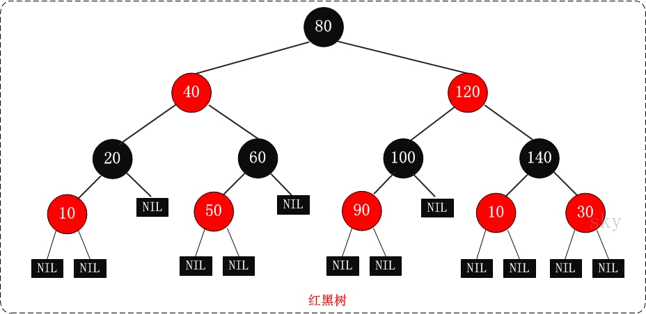

## 1、初始化

```java
static final int DEFAULT_INITIAL_CAPACITY = 1 << 4; //默认初始化
static final int MAXIMUM_CAPACITY = 1 << 30; //最大容量
static final float DEFAULT_LOAD_FACTOR = 0.75f; //默认负载因子
static final int TREEIFY_THRESHOLD = 8; //树化的阈值
static final int UNTREEIFY_THRESHOLD = 6; //退化的阈值
static final int MIN_TREEIFY_CAPACITY = 64; //树化组数最小值
transient Node<K,V>[] table;  //table数组，用来存储
transient Set<Map.Entry<K,V>> entrySet; //将map转为集合
transient int size; //map中包含的key-value个数
transient int modCount; //记录当前集合被修改的次数
int threshold; //如果尚未分配表数组，则此字段保存初始数组容量，或表示为零
final float loadFactor; //hash table加载因子
```

### 1.1 为什么默认负载因子位0.75？

**加载因子过高，例如为1，虽然减少了空间开销，提高了空间利用率，但同时也增加了查询时间成本；**

**加载因子过低，例如0.5，虽然可以减少查询时间成本，但是空间利用率很低，同时提高了rehash操作的次数**；

**在设置初始容量时应该考虑到映射中所需的条目数及其加载因子，以便最大限度地减少rehash操作次数，所以，一般在使用HashMap时建议根据预估值设置初始容量，减少扩容操作；**

**选择0.75作为默认的加载因子，完全是时间和空间成本上寻求的一种折衷选择；**

### 1.2 为什么树的退化阈值是6，为什么不是小于8直接退化？

- **如果不设置退化阈值，只以8来树化与退化：那么8将成为一个临界值，时而树化，时而退化，此时会非常影响性能，因此，我们需要一个比8小的退化阀值；**

- **如果UNTREEIFY_THRESHOLD = 7，同样，与上面的情况没有好多少，仅相差1个元素，仍旧会在链表与树之间反复转化；**
- **那为什么是6呢？源码中也说了，考虑到内存（树节点比普通节点内存大2倍，以及避免反复转化），所以，退化阀值最多为6。**

### 1.3 为什么树化的table数组长度为64？

**当Table所有元素超过改值，才会进行树化（为了防止前期阶段频繁扩容和树化过程冲突）。**

### 1.4 **为什么HashMap的容量一定要是2的n次幂？**

**1.关系到元素在桶中的位置计算问题：**当容量为2的n次幂的时候，(capacity - 1) & hash可以实现和hash % capacity一样的效果


**2、关系到扩容后元素在newCap中的放置问题：**避免了扩容后再重复处理哈希碰撞问题

## 2、Entry结点

```java
static class Node<K,V> implements Map.Entry<K,V> {
        final int hash;
        final K key;
        V value;
        Node<K,V> next;

        Node(int hash, K key, V value, Node<K,V> next) {
            this.hash = hash;
            this.key = key;
            this.value = value;
            this.next = next;
        }

        public final K getKey()        { return key; }
        public final V getValue()      { return value; }
        public final String toString() { return key + "=" + value; }

        public final int hashCode() {
            return Objects.hashCode(key) ^ Objects.hashCode(value); //key的hashcode与value的hashcode做异或运算作为Node的hashcode值。
        }

        public final V setValue(V newValue) {
            V oldValue = value;
            value = newValue;
            return oldValue;
        }

        public final boolean equals(Object o) { //判断两个Entry是否相等
            if (o == this)
                return true;
            if (o instanceof Map.Entry) {
                Map.Entry<?,?> e = (Map.Entry<?,?>)o;
                if (Objects.equals(key, e.getKey()) &&
                    Objects.equals(value, e.getValue()))
                    return true;
            }
            return false;
        }
    }
```

## 3、计算key的hashcode值

使用扰动函数来降低碰撞概率，

```java
static final int hash(Object key) {
        int h;
        return (key == null) ? 0 : (h = key.hashCode()) ^ (h >>> 16);
    }
```


右位移16位，正好是32bit的一半，自己的高半区和低半区做异或，就是为了混合原始哈希码的高位和低位，以此来加大低位的随机性。而且混合后的低位掺杂了高位的部分特征，这样高位的信息也被变相保留下来。

## 4、构造函数

默认加载因子是0.75，初始容量为16，当传入初始容量，以及加载因子时，加载因子会直接修改，**而容量通过tableSizeFor调整为大于传入值的2的幂次方。**

```java
public HashMap(int initialCapacity, float loadFactor) {
        if (initialCapacity < 0)
            throw new IllegalArgumentException("Illegal initial capacity: " +
                                               initialCapacity);
        if (initialCapacity > MAXIMUM_CAPACITY)
            initialCapacity = MAXIMUM_CAPACITY;
        if (loadFactor <= 0 || Float.isNaN(loadFactor))
            throw new IllegalArgumentException("Illegal load factor: " +
                                               loadFactor);
        this.loadFactor = loadFactor;
        this.threshold = tableSizeFor(initialCapacity);
    }

//例如传入的值为5，则返回的为大于5的2的幂次方，结果为8
static final int tableSizeFor(int cap) {
        int n = cap - 1;
        n |= n >>> 1;
        n |= n >>> 2;
        n |= n >>> 4;
        n |= n >>> 8;
        n |= n >>> 16;
        return (n < 0) ? 1 : (n >= MAXIMUM_CAPACITY) ? MAXIMUM_CAPACITY : n + 1;
    }

//调用的是HashMap(int initialCapacity, float loadFactor)
public HashMap(int initialCapacity) {
        this(initialCapacity, DEFAULT_LOAD_FACTOR);
    }

public HashMap() {
        this.loadFactor = DEFAULT_LOAD_FACTOR; // all other fields defaulted
    }

//构造时传入一个map，将map里面的键值对均复制到this，其中调用了putMapEntries;
public HashMap(Map<? extends K, ? extends V> m) {
        this.loadFactor = DEFAULT_LOAD_FACTOR;
        putMapEntries(m, false);
    }

```

## 5、put函数（向map中添加元素）

### 5.1 putMapEntries

- if (table == null)分支，说明是HashMap的拷贝构造函数来调用的putMapEntries，或者是构造以后还没有放过任何元素，然后再调用putAll。
- **float ft = ((float)s / loadFactor) + 1.0F这里的加1是因为，size / loadFactor = capacity，但如果算出来的capacity是小数，却又向下取整，会造成容量不够大，所以，如果是小数的capacity，那么必须向上取整。**
- 算出来的容量必须小于最大容量MAXIMUM_CAPACITY，否则直接让capacity等于MAXIMUM_CAPACITY。
- if (t > threshold)这里的threshold成员实际存放的值是capacity的值。因为在table还没有初始化时（table还是null），用户给定的capacity会暂存到threshold成员上去（毕竟HashMap没有一个成员叫做capacity，capacity是作为table数组的大小而隐式存在的）。
- **else if (s > threshold)说明传入map的size都已经大于当前map的threshold了，即当前map肯定是装不下两个map的并集的，所以这里必须要执行resize操作。**
- 最后循环里的putVal可能也会触发resize操作。
  

```java
final void putMapEntries(Map<? extends K, ? extends V> m, boolean evict) {
        int s = m.size(); //获取原map集合大小
        if (s > 0) {
            if (table == null) { // pre-size，当table为空时，计算数组初始容量ft，如果ft小于threshold则resize为threshold即可。如果ft不为0的整数倍则调用tableSizeFor调整为2的整数倍。
                float ft = ((float)s / loadFactor) + 1.0F;
                int t = ((ft < (float)MAXIMUM_CAPACITY) ?
                         (int)ft : MAXIMUM_CAPACITY);
                if (t > threshold)
                    threshold = tableSizeFor(t);
            }
            else if (s > threshold)//如果table不为空，直接扩容，
                resize();
            for (Map.Entry<? extends K, ? extends V> e : m.entrySet()) {
                K key = e.getKey();
                V value = e.getValue();
                putVal(hash(key), key, value, false, evict); //元素添加
            }
        }
    }
```

### 5.2 putval

- 如果table为空或者table长度为0，那么通过resize函数初始化table数组。
- 如果要插入的table位置为null，则直接在此位置插入新结点。
- 如果table不为空、且插入位置已经包含元素，将按照以下步骤插入元素；
- 如果将要插入的元素hash值与插入位置首节点hash值相等，且key值相等....
- 否则如果插入位置为红黑树结构，将新节点插入树中；
- 如果插入位置为链表结构，尾插法将新节点插入链表；其中如果插入新节点导致结点个数达到了8，那么进行树化；
- 如果插入的新结点key在链表中已经存在了，那么直接更新value值；
- modCount增加一次；
- 如果插入完成后，size的值大于threshold，那么需要进行扩容处理，resize()；

```java
final V putVal(int hash, K key, V value, boolean onlyIfAbsent,
                   boolean evict) {
        Node<K,V>[] tab; Node<K,V> p; int n, i;
        if ((tab = table) == null || (n = tab.length) == 0)
            n = (tab = resize()).length;
        if ((p = tab[i = (n - 1) & hash]) == null)
            tab[i] = newNode(hash, key, value, null);
        else {
            Node<K,V> e; K k;
            if (p.hash == hash &&
                ((k = p.key) == key || (key != null && key.equals(k))))
                e = p;
            else if (p instanceof TreeNode)
                e = ((TreeNode<K,V>)p).putTreeVal(this, tab, hash, key, value);
            else {
                for (int binCount = 0; ; ++binCount) {
                    if ((e = p.next) == null) {
                        p.next = newNode(hash, key, value, null);
                        if (binCount >= TREEIFY_THRESHOLD - 1) // -1 for 1st
                            treeifyBin(tab, hash);
                        break;
                    }
                    if (e.hash == hash &&
                        ((k = e.key) == key || (key != null && key.equals(k))))
                        break;
                    p = e;
                }
            }
            if (e != null) { // existing mapping for key
                V oldValue = e.value;
                if (!onlyIfAbsent || oldValue == null)
                    e.value = value;
                afterNodeAccess(e);
                return oldValue;
            }
        }
        ++modCount;
        if (++size > threshold)
            resize();
        afterNodeInsertion(evict);
        return null;
    }
```

## 6、get函数（取元素）

- 如果table不为空，并且key的hash值所在位置的桶中包含元素，才进行下面的取值操作，否则直接返回null;
- 比较桶中第一个元素hash值以及key值是否相等，相等就返回第一个元素；
- 不是第一个元素，就判断当前位置是否是红黑树结构，如果是的话从树中取值；
- 否则在链表中逐个比较即可；

```java
public V get(Object key) {
        Node<K,V> e;
        return (e = getNode(hash(key), key)) == null ? null : e.value;
    }


final Node<K,V> getNode(int hash, Object key) {
        Node<K,V>[] tab; Node<K,V> first, e; int n; K k;
        if ((tab = table) != null && (n = tab.length) > 0 &&
            (first = tab[(n - 1) & hash]) != null) {
            if (first.hash == hash && // always check first node
                ((k = first.key) == key || (key != null && key.equals(k))))
                return first;
            if ((e = first.next) != null) {
                if (first instanceof TreeNode)
                    return ((TreeNode<K,V>)first).getTreeNode(hash, key);
                do {
                    if (e.hash == hash &&
                        ((k = e.key) == key || (key != null && key.equals(k))))
                        return e;
                } while ((e = e.next) != null);
            }
        }
        return null;
    }
```

## 7、resize函数扩容

### 7.1 什么时候扩容？

```
1、resize（）函数在size　> threshold时被调用。
2、resize（）函数在table为空被调用。
```

### 7.2 元素索引在新数组下标如何确定？

在扩容的时候元素在新数组中的位置要么是原数组所在位置，要么是原位置再移动原数组长度的位置；在扩容的时候如果高位是0就依然在原位置，如果高位是1则就在原位置+原数组长度；


因此，我们在扩充HashMap的时候，只需要看看原来的hash值新增的那个bit是1还是0就好了，是0的话索引没变，是1的话索引变成“原索引+oldCap”，可以看看下图为16扩充为32的resize示意图：


这个算法很巧妙，既省去了重新计算hash值的时间，而且同时，由于新增的1bit是0还是1可以认为是随机的，因此resize的过程，均匀的把之前的冲突的节点分散到新的槽中了。

### 7.3 resize扩容过程？

- 首先计算原始数组的容量，如果数组容量已经达到了MAXIMUM_CAPACITY那么无法进行扩容了，直接返回；
- 如果原数组大小0，则时初始化的时候，数组大小的默认的大小；
- 否则将数组扩容为原来的两倍；
- 接下来申请一个为原来数组2倍大小的新数组；
- 如果原数组不为空，即数组中包含元素，那么以此遍历数组各个位置，对每个位置的数据复制到新的数组中去；这里包含以下几种情况；
  - 1、当前访问的第j个位置只有一个元素，那么e.hash & (newCap - 1)计算此元素在新数组中下标位置；
  - 2、如果此结点位置是一颗红黑树，那么调用TreeNode.split方法，进行树的分裂；
  - 3、如果当前位置是链表结构，那么进行以下操作；
    - loHead，loTail表示新数组此链表的头节点和尾节点、hiHead，hiTail表示新数组此链表的头节点和末尾节点；
    - 判断(e.hash & oldCap) == 0，这里计算的是在新数组中的高位是0还是1，如果是0那么在新数组下标为原数组下标位置；如果是1的话，那么在新数组的下标位置为原数组位置 + 原数组大小；
    - 如果计算得到的是true，那么先回判断loHead是否为空，为空就将lohead和lotail指向当前结点；其中lohead为低位链表头节点，只要指向过了就不会发生改变了，后面再有其他结点为true，采用尾插法将结点插入即可，同时将lotail指向末尾节点；
    - 如果计算的是false;那么先回判断hiHead是否为空，为空就将hihead和hitail指向当前结点；其中lohead为低位链表头节点，只要指向过了就不会发生改变了，，后面再有其他结点为true，采用尾插法将结点插入即可，同时将lotail指向末尾节点；

```java
final Node<K,V>[] resize() {
        Node<K,V>[] oldTab = table;
        int oldCap = (oldTab == null) ? 0 : oldTab.length;
        int oldThr = threshold;
        int newCap, newThr = 0;
        if (oldCap > 0) {
            if (oldCap >= MAXIMUM_CAPACITY) {//如果原始的容量已经打到了最大容量，则无法再扩容了，直接返回
                threshold = Integer.MAX_VALUE;
                return oldTab;
            }
            else if ((newCap = oldCap << 1) < MAXIMUM_CAPACITY &&
                     oldCap >= DEFAULT_INITIAL_CAPACITY)//扩容为原来的两倍
                newThr = oldThr << 1; // double threshold
        }
        else if (oldThr > 0) // initial capacity was placed in threshold
            newCap = oldThr;
        else {               // zero initial threshold signifies using defaults
            newCap = DEFAULT_INITIAL_CAPACITY;
            newThr = (int)(DEFAULT_LOAD_FACTOR * DEFAULT_INITIAL_CAPACITY);
        }
        if (newThr == 0) {
            float ft = (float)newCap * loadFactor;
            newThr = (newCap < MAXIMUM_CAPACITY && ft < (float)MAXIMUM_CAPACITY ?
                      (int)ft : Integer.MAX_VALUE);
        }
        threshold = newThr;
        @SuppressWarnings({"rawtypes","unchecked"})
        Node<K,V>[] newTab = (Node<K,V>[])new Node[newCap];
        table = newTab;
        if (oldTab != null) {
            for (int j = 0; j < oldCap; ++j) { //遍历原数组每一个位置，将其位置的链表或者红黑树复制到新数组中去；
                Node<K,V> e;
                if ((e = oldTab[j]) != null) {  //e为原数组对应位置的根节点
                    oldTab[j] = null;
                    if (e.next == null) //此位置只有一个节点，直接将其复制到新数组对应下标位置，下标位置为hash & (newCap - 1)
                        newTab[e.hash & (newCap - 1)] = e;
                    else if (e instanceof TreeNode) //如果是一颗红黑树
                        ((TreeNode<K,V>)e).split(this, newTab, j, oldCap); //调用split函数进行复制
                    else { // preserve order //如果是链表
                        Node<K,V> loHead = null, loTail = null;  //原数组head和tail节点
                        Node<K,V> hiHead = null, hiTail = null; //扩容数组的head和tail结点
                        Node<K,V> next;
                        do {
                            next = e.next;
                            if ((e.hash & oldCap) == 0) {//假设原来数组大小为16，0000 1000，这个和hash做&运算，得到的结果为 0000 0000或者 0000 1000，可以看到第四位不是0就是1，如果是0的话，那么e在新数组中的位置为原数组下标位置x,  如果第四位为1的话，那么e在新数组的下标位置为x+16；所以这个操作是用来判断e在新数组的下标位置的；
                                if (loTail == null) //如果lotail没有赋值过，则lotail = e节点
                                    loHead = e;
                                else //totail不为空，lotail---->e
                                    loTail.next = e;
                                loTail = e;
                            }
                            else {  //否则说明在高位，操作和低位的一致
                                if (hiTail == null)
                                    hiHead = e;
                                else
                                    hiTail.next = e;
                                hiTail = e;
                            }
                        } while ((e = next) != null);
                        //当第j个位置的数组访问完毕时，将lohead和hihead存放到新数组低位和高位；
                        if (loTail != null) {
                            loTail.next = null;
                            newTab[j] = loHead;
                        }
                        if (hiTail != null) {
                            hiTail.next = null;
                            newTab[j + oldCap] = hiHead;
                        }
                    }
                }
            }
        }
        return newTab;
    }
```

### 7.4 红黑树

**红黑树的特性**:
**（1）每个节点或者是黑色，或者是红色。**
**（2）根节点是黑色。**
**（3）每个叶子节点（NIL）是黑色。 [注意：这里叶子节点，是指为空(NIL或NULL)的叶子节点！]**
**（4）如果一个节点是红色的，则它的子节点必须是黑色的。**
**（5）从一个节点到该节点的子孙节点的所有路径上包含相同数目的黑节点。**

**注意**：
(01) 特性(3)中的叶子节点，是只为空(NIL或null)的节点。
(02) 特性(5)，确保没有一条路径会比其他路径长出俩倍。因而，红黑树是相对是接近平衡的二叉树。



### 7.4 红黑树字段？


### 7.4 红黑树split过程？


```java
final void split(HashMap<K,V> map, Node<K,V>[] tab, int index, int bit) {
            TreeNode<K,V> b = this; //b为当前红黑树
            // Relink into lo and hi lists, preserving order
            TreeNode<K,V> loHead = null, loTail = null; //还是使用lohead、lotail记录低位的头结点和末尾结点；
            TreeNode<K,V> hiHead = null, hiTail = null; //使用hiHead、hiTail记录高位的头结点和末尾结点；
            int lc = 0, hc = 0; //low count and high count
            for (TreeNode<K,V> e = b, next; e != null; e = next) { //遍历TreeNode的每个结点
                next = (TreeNode<K,V>)e.next;
                e.next = null;
                if ((e.hash & bit) == 0) { //传入的为原数组大小，原数组与hash &运算
                    if ((e.prev = loTail) == null)
                        loHead = e;
                    else
                        loTail.next = e;
                    loTail = e;
                    ++lc;
                }
                else {
                    if ((e.prev = hiTail) == null)
                        hiHead = e;
                    else
                        hiTail.next = e;
                    hiTail = e;
                    ++hc;
                }
            }

            if (loHead != null) {
                if (lc <= UNTREEIFY_THRESHOLD) //如果low count 小于树化个数，那么就退化；
                    tab[index] = loHead.untreeify(map); //调用untreeify函数退化树
                else { //否则已经是一颗树了
                    tab[index] = loHead;
                    if (hiHead != null) // (else is already treeified)
                        loHead.treeify(tab);
                }
            }
            if (hiHead != null) {
                if (hc <= UNTREEIFY_THRESHOLD)
                    tab[index + bit] = hiHead.untreeify(map);
                else {
                    tab[index + bit] = hiHead;
                    if (loHead != null)
                        hiHead.treeify(tab);
                }
            }
        }
```

### 7.5 treeifyBin树化过程

- 如果数组长度小于树化最小长度，则resize就行，不需要树化；
- 首先将此位置的链表复制到TreeNode上，hd记录头结点，tl记录末尾结点；
- 然后调用TreeNode.treeify树化；

```java
    final void treeifyBin(Node<K,V>[] tab, int hash) {
        int n, index; Node<K,V> e;
        if (tab == null || (n = tab.length) < MIN_TREEIFY_CAPACITY)
            resize();
        else if ((e = tab[index = (n - 1) & hash]) != null) {
            TreeNode<K,V> hd = null, tl = null;
            do {
                TreeNode<K,V> p = replacementTreeNode(e, null);
                if (tl == null)
                    hd = p;
                else {
                    p.prev = tl;
                    tl.next = p;
                }
                tl = p;
            } while ((e = e.next) != null);
            if ((tab[index] = hd) != null)
                hd.treeify(tab);
        }
    }


final void treeify(Node<K,V>[] tab) {
            TreeNode<K,V> root = null;
            for (TreeNode<K,V> x = this, next; x != null; x = next) {  //x = this头节点
                next = (TreeNode<K,V>)x.next; //next = x.next
                x.left = x.right = null;  
                if (root == null) { //开始的时候root==null，将hd头节点作为root
                    x.parent = null;
                    x.red = false;
                    root = x;
                } 
                else {
                    K k = x.key;
                    int h = x.hash;
                    Class<?> kc = null;
                    for (TreeNode<K,V> p = root;;) { //循环遍历root
                        int dir, ph; //方向、p的hash
                        K pk = p.key;
                        if ((ph = p.hash) > h) //如果树中结点hash值大于TreeNode还没有树化的当前结点值，dir = -1;
                            dir = -1;
                        else if (ph < h) //否则dir = 1;
                            dir = 1;
                        else if ((kc == null &&
                                  (kc = comparableClassFor(k)) == null) ||
                                 (dir = compareComparables(kc, k, pk)) == 0)
                            dir = tieBreakOrder(k, pk); //依据key值判断插入左子树还是右子树；

                        TreeNode<K,V> xp = p;
                        if ((p = (dir <= 0) ? p.left : p.right) == null) {//如果dir小于0，往p的左子树插入、如果dir大于0往p的右子树插入，这里需要往叶子结点插入，所以需要一直往下面判断
                            x.parent = xp; //需要插入的结点x的父节点为p；
                            if (dir <= 0)  //将结点插入到左子树中
                                xp.left = x;
                            else  //将结点插入到右结点中；
                                xp.right = x;
                            root = balanceInsertion(root, x); //插入完成后有可能导致红黑树需要平衡
                            break;
                        }
                    }
                }
            }
            moveRootToFront(tab, root);  //确保根节点是桶中的第一个结点；
        }

/**
  * 用这个方法来比较两个对象，返回值要么大于0，要么小于0，不会为0
  * 也就是说这一步一定能确定要插入的节点要么是树的左节点，要么是右节点，不然就无继续满足二叉树结构了
  * 先比较两个对象的类名，类名是字符串对象，就按字符串的比较规则
  * 如果两个对象是同一个类型，那么调用本地方法为两个对象生成hashCode值，再进行比较，hashCode相等的话返回-1
  */
static int tieBreakOrder(Object a, Object b) {
    int d;
    if (a == null || b == null ||
        (d = a.getClass().getName().
         compareTo(b.getClass().getName())) == 0)
        d = (System.identityHashCode(a) <= System.identityHashCode(b) ?
             -1 : 1);
    return d;
}

//当插入元素时，需要平衡红黑树
static <K,V> TreeNode<K,V> balanceInsertion(TreeNode<K,V> root,
                                                    TreeNode<K,V> x) {
            x.red = true;
            for (TreeNode<K,V> xp, xpp, xppl, xppr;;) {
                if ((xp = x.parent) == null) {
                    x.red = false;
                    return x;
                }
                else if (!xp.red || (xpp = xp.parent) == null)
                    return root;
                if (xp == (xppl = xpp.left)) {
                    if ((xppr = xpp.right) != null && xppr.red) {
                        xppr.red = false;
                        xp.red = false;
                        xpp.red = true;
                        x = xpp;
                    }
                    else {
                        if (x == xp.right) {
                            root = rotateLeft(root, x = xp);
                            xpp = (xp = x.parent) == null ? null : xp.parent;
                        }
                        if (xp != null) {
                            xp.red = false;
                            if (xpp != null) {
                                xpp.red = true;
                                root = rotateRight(root, xpp);
                            }
                        }
                    }
                }
                else {
                    if (xppl != null && xppl.red) {
                        xppl.red = false;
                        xp.red = false;
                        xpp.red = true;
                        x = xpp;
                    }
                    else {
                        if (x == xp.left) {
                            root = rotateRight(root, x = xp);
                            xpp = (xp = x.parent) == null ? null : xp.parent;
                        }
                        if (xp != null) {
                            xp.red = false;
                            if (xpp != null) {
                                xpp.red = true;
                                root = rotateLeft(root, xpp);
                            }
                        }
                    }
                }
            }
        }


	/**
    * 把红黑树的根节点设为  其所在的数组槽 的第一个元素
     * 首先明确：TreeNode既是一个红黑树结构，也是一个双链表结构
     * 这个方法里做的事情，就是保证树的根节点一定也要成为链表的首节点
     */
static <K,V> void moveRootToFront(Node<K,V>[] tab, TreeNode<K,V> root) {
    int n;
    if (root != null && tab != null && (n = tab.length) > 0) {
        int index = (n - 1) & root.hash; //首先计算根结点在数组中的位置，这里存在hash冲突；
        TreeNode<K,V> first = (TreeNode<K,V>)tab[index]; //取得此位置上的第一个元素；
        if (root != first) { //如果根结点不是槽中第一个元素 ，如果是的话就不需要移动根结点了
            Node<K,V> rn;
            tab[index] = root;  //直接让tab[index]指向root结点；
            TreeNode<K,V> rp = root.prev; //rp为root的前一个结点
            if ((rn = root.next) != null) //rn为root的下一个结点，这里是双链表的结构
                ((TreeNode<K,V>)rn).prev = rp; 让下一个结点的prev指向前一个结点，也就是实现双链表
            if (rp != null)//让上一个结点的Next指向下一个结点
                rp.next = rn;
            if (first != null) //让first结点的prev指向root结点；
                first.prev = root;
            root.next = first;
            root.prev = null;
        }
        assert checkInvariants(root);
    }
}
```


### 7.5 untree函数

- 当树中结点个数小于等于6时，树需要退化为链表结构，这里利用TreeNode保留的双链表，依次访问TreeNode，构建出一个链表结构；

```java
 final Node<K,V> untreeify(HashMap<K,V> map) {
            Node<K,V> hd = null, tl = null;
            for (Node<K,V> q = this; q != null; q = q.next) {//for循环遍历树结点，采用尾插法插入
                Node<K,V> p = map.replacementNode(q, null);
                if (tl == null)
                    hd = p;
                else
                    tl.next = p;
                tl = p;
            }
            return hd;
        }

//新建一个结点，复制p结点的hash、key、value值；
Node<K,V> replacementNode(Node<K,V> p, Node<K,V> next) {
        return new Node<>(p.hash, p.key, p.value, next);
    }
```

