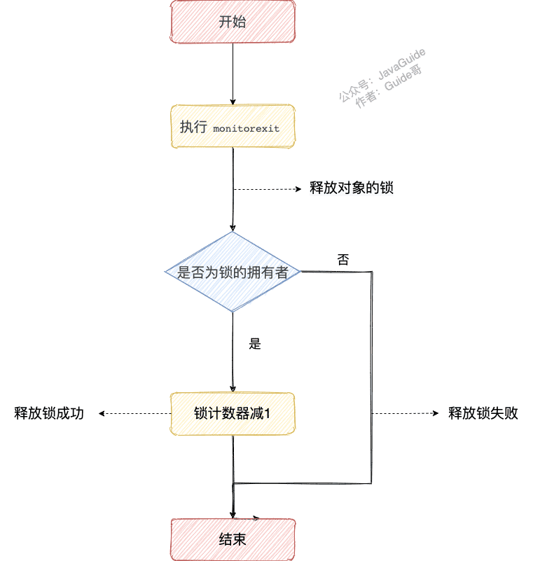
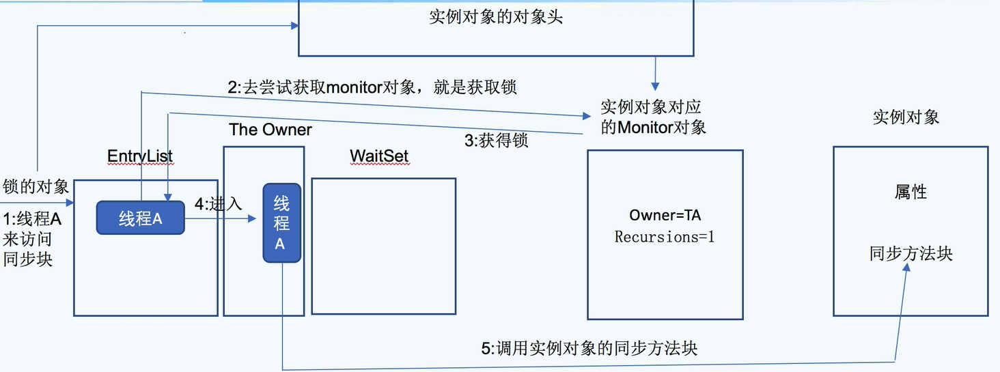
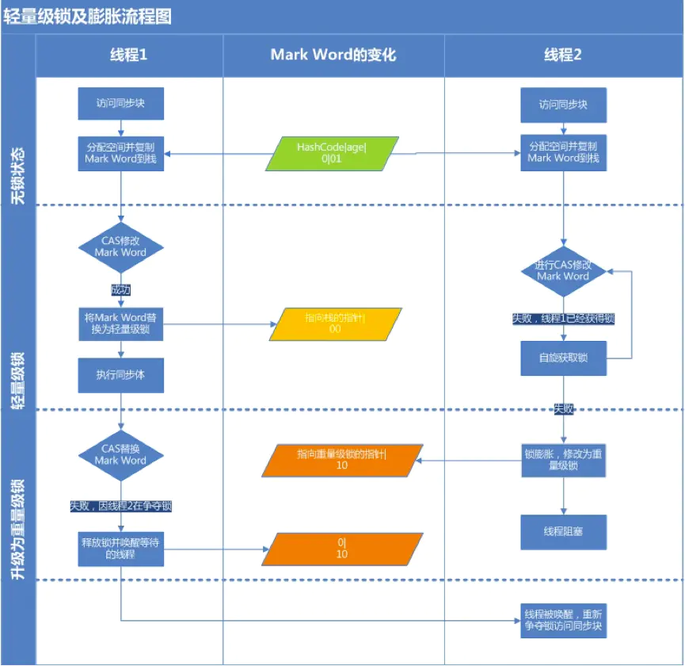

## 1.synchronized 关键字

### [#](#_1-1-说一说自己对于-synchronized-关键字的了解) 1.1.说一说自己对于 synchronized 关键字的了解

**`synchronized` 关键字解决的是多个线程之间访问资源的同步性，`synchronized`关键字可以保证被它修饰的方法或者代码块在任意时刻只能有一个线程执行。**

另外，在 Java 早期版本中，`synchronized` 属于 **重量级锁**，效率低下。

**为什么呢？**

因为监视器锁（monitor）是依赖于底层的操作系统的 `Mutex Lock` 来实现的，Java 的线程是映射到操作系统的原生线程之上的。如果要挂起或者唤醒一个线程，都需要操作系统帮忙完成，而操作系统实现线程之间的切换时需要从用户态转换到内核态，这个状态之间的转换需要相对比较长的时间，时间成本相对较高。

庆幸的是在 Java 6 之后 Java 官方对从 JVM 层面对 `synchronized` 较大优化，所以现在的 `synchronized` 锁效率也优化得很不错了。JDK1.6 对锁的实现引入了大量的优化，如自旋锁、适应性自旋锁、锁消除、锁粗化、偏向锁、轻量级锁等技术来减少锁操作的开销。

所以，你会发现目前的话，不论是各种开源框架还是 JDK 源码都大量使用了 `synchronized` 关键字。

### [#](#_1-2-说说自己是怎么使用-synchronized-关键字) 1.2. 说说自己是怎么使用 synchronized 关键字

**synchronized 关键字最主要的三种使用方式：**

**1.修饰实例方法:** 作用于当前对象实例加锁，进入同步代码前要获得 **当前对象实例的锁**

```java
synchronized void method() {
    //业务代码
}
```

**2.修饰静态方法:** 也就是给当前类加锁，会作用于类的所有对象实例 ，进入同步代码前要获得 **当前 class 的锁**。因为静态成员不属于任何一个实例对象，是类成员（ *static 表明这是该类的一个静态资源，不管 new 了多少个对象，只有一份*）。所以，如果一个线程 A 调用一个实例对象的非静态 `synchronized` 方法，而线程 B 需要调用这个实例对象所属类的静态 `synchronized` 方法，是允许的，不会发生互斥现象，**因为访问静态 `synchronized` 方法占用的锁是当前类的锁，而访问非静态 `synchronized` 方法占用的锁是当前实例对象锁**。

```java
synchronized static void method() {
    //业务代码
}
```

**3.修饰代码块** ：指定加锁对象，对给定对象/类加锁。`synchronized(this|object)` 表示进入同步代码库前要获得**给定对象的锁**。`synchronized(类.class)` 表示进入同步代码前要获得 **当前 class 的锁**

```java
synchronized(this) {
    //业务代码
}
```

**总结：**

- `synchronized` 关键字加到 `static` 静态方法和 `synchronized(class)` 代码块上都是是给 Class 类上锁。
- `synchronized` 关键字加到实例方法上是给对象实例上锁。
- 尽量不要使用 `synchronized(String a)` 因为 JVM 中，字符串常量池具有缓存功能！

下面我以一个常见的面试题为例讲解一下 `synchronized` 关键字的具体使用。

面试中面试官经常会说：“单例模式了解吗？来给我手写一下！给我解释一下双重检验锁方式实现单例模式的原理呗！”

**双重校验锁实现对象单例（线程安全）**

```java
public class Singleton {

    private volatile static Singleton uniqueInstance;

    private Singleton() {
    }

    public  static Singleton getUniqueInstance() {
       //先判断对象是否已经实例过，没有实例化过才进入加锁代码
        if (uniqueInstance == null) {
            //类对象加锁
            synchronized (Singleton.class) {
                if (uniqueInstance == null) {
                    uniqueInstance = new Singleton();
                }
            }
        }
        return uniqueInstance;
    }
}
```

另外，需要注意 `uniqueInstance` 采用 `volatile` 关键字修饰也是很有必要。

`uniqueInstance` 采用 `volatile` 关键字修饰也是很有必要的， `uniqueInstance = new Singleton();` 这段代码其实是分为三步执行：

1. 为 `uniqueInstance` 分配内存空间
2. 初始化 `uniqueInstance`
3. 将 `uniqueInstance` 指向分配的内存地址

但是由于 JVM 具有指令重排的特性，执行顺序有可能变成 1->3->2。指令重排在单线程环境下不会出现问题，但是在多线程环境下会导致一个线程获得还没有初始化的实例。例如，线程 T1 执行了 1 和 3，此时 T2 调用 `getUniqueInstance`() 后发现 `uniqueInstance` 不为空，因此返回 `uniqueInstance`，但此时 `uniqueInstance` 还未被初始化。

使用 `volatile` 可以禁止 JVM 的指令重排，保证在多线程环境下也能正常运行。

### [#](#_1-3-构造方法可以使用-synchronized-关键字修饰么) 1.3. 构造方法可以使用 synchronized 关键字修饰么？

先说结论：**构造方法不能使用 synchronized 关键字修饰。**

构造方法本身就属于线程安全的，不存在同步的构造方法一说。

### [#](#_1-3-讲一下-synchronized-关键字的底层原理) 1.3. 讲一下 synchronized 关键字的底层原理

**synchronized 关键字底层原理属于 JVM 层面。**

#### [#](#_1-3-1-synchronized-同步语句块的情况) 1.3.1. synchronized 同步语句块的情况


```java
public class SynchronizedDemo {
    public void method() {
        synchronized (this) {
            System.out.println("synchronized 代码块");
        }
    }
}
```

通过 JDK 自带的 `javap` 命令查看 `SynchronizedDemo` 类的相关字节码信息：首先切换到类的对应目录执行 `javac SynchronizedDemo.java` 命令生成编译后的 .class 文件，然后执行`javap -c -s -v -l SynchronizedDemo.class`。


从上面我们可以看出：**`synchronized` 同步语句块的实现使用的是 `monitorenter` 和 `monitorexit` 指令，其中 `monitorenter` 指令指向同步代码块的开始位置，`monitorexit` 指令则指明同步代码块的结束位置。**

当执行 `monitorenter` 指令时，线程试图获取锁也就是获取 **对象监视器 `monitor`** 的持有权。

> 在 Java 虚拟机(HotSpot)中，Monitor 是基于 C++实现的，由[ObjectMonitor  (opens new window)](https://github.com/openjdk-mirror/jdk7u-hotspot/blob/50bdefc3afe944ca74c3093e7448d6b889cd20d1/src/share/vm/runtime/objectMonitor.cpp)实现的。每个对象中都内置了一个 `ObjectMonitor`对象。
>
> 另外，`wait/notify`等方法也依赖于`monitor`对象，这就是为什么只有在同步的块或者方法中才能调用`wait/notify`等方法，否则会抛出`java.lang.IllegalMonitorStateException`的异常的原因。

在执行`monitorenter`时，会尝试获取对象的锁，如果锁的计数器为 0 则表示锁可以被获取，获取后将锁计数器设为 1 也就是加 1。


对象锁的的拥有者线程才可以执行 `monitorexit` 指令来释放锁。在执行 `monitorexit` 指令后，将锁计数器设为 0，表明锁被释放，其他线程可以尝试获取锁。



如果获取对象锁失败，那当前线程就要阻塞等待，直到锁被另外一个线程释放为止。

#### [#](#_1-3-2-synchronized-修饰方法的的情况) 1.3.2. synchronized 修饰方法的的情况


```java
public class SynchronizedDemo2 {
    public synchronized void method() {
        System.out.println("synchronized 方法");
    }
}
```


`synchronized` 修饰的方法并没有 `monitorenter` 指令和 `monitorexit` 指令，取得代之的确实是 `ACC_SYNCHRONIZED` 标识，该标识指明了该方法是一个同步方法。JVM 通过该 `ACC_SYNCHRONIZED` 访问标志来辨别一个方法是否声明为同步方法，从而执行相应的同步调用。

如果是实例方法，JVM 会尝试获取实例对象的锁。如果是静态方法，JVM 会尝试获取当前 class 的锁。

#### [#](#_1-3-3-总结) 1.3.3.总结

`synchronized` 同步语句块的实现使用的是 `monitorenter` 和 `monitorexit` 指令，其中 `monitorenter` 指令指向同步代码块的开始位置，`monitorexit` 指令则指明同步代码块的结束位置。

`synchronized` 修饰的方法并没有 `monitorenter` 指令和 `monitorexit` 指令，取得代之的确实是 `ACC_SYNCHRONIZED` 标识，该标识指明了该方法是一个同步方法。

**不过两者的本质都是对对象监视器 monitor 的获取。**

相关推荐：[Java锁与线程的那些事 - 有赞技术团队  (opens new window)](https://tech.youzan.com/javasuo-yu-xian-cheng-de-na-xie-shi/) 。

🧗🏻进阶一下：学有余力的小伙伴可以抽时间详细研究一下对象监视器 `monitor`。

### 1.4 通过源码看monitorenter和monitorexit

monitorenter和monitorexit在源码层级上处于openjdk的 `hotspot\src\share\vm\interpreter\interpreterRuntime.hpp`文件下

#### 1.4.1 interpreterRuntime.hpp

里面定义了两个函数，monitorenter和monitorexit函数，传入的参数位当前THread和需要上锁的对象

```c++
  // Synchronization
  static void    monitorenter(JavaThread* thread, BasicObjectLock* elem);
  static void    monitorexit (JavaThread* thread, BasicObjectLock* elem);
```

#### 1.4.2 interpreterRuntime.cpp

```c++

//------------------------------------------------------------------------------------------------------------------------
// Synchronization
//
// The interpreter's synchronization code is factored out so that it can
// be shared by method invocation and synchronized blocks.
//%note synchronization_3

//%note monitor_1
//JavaThread为当前获取锁的线程， BasicObjectLock为基础锁对象
IRT_ENTRY_NO_ASYNC(void, InterpreterRuntime::monitorenter(JavaThread* thread, BasicObjectLock* elem))
#ifdef ASSERT
  thread->last_frame().interpreter_frame_verify_monitor(elem);
#endif
  if (PrintBiasedLockingStatistics) {
    Atomic::inc(BiasedLocking::slow_path_entry_count_addr());
  }
  Handle h_obj(thread, elem->obj());
  assert(Universe::heap()->is_in_reserved_or_null(h_obj()),
         "must be NULL or an object");
//判断是否启动偏向锁
  if (UseBiasedLocking) {
    // Retry fast entry if bias is revoked to avoid unnecessary inflation
    ObjectSynchronizer::fast_enter(h_obj, elem->lock(), true, CHECK);
  } else {//如果不支持偏向锁
    ObjectSynchronizer::slow_enter(h_obj, elem->lock(), CHECK);
  }
  assert(Universe::heap()->is_in_reserved_or_null(elem->obj()),
         "must be NULL or an object");
#ifdef ASSERT
  thread->last_frame().interpreter_frame_verify_monitor(elem);
#endif
IRT_END
```

在synchronizer.cpp文件下

```java
// -----------------------------------------------------------------------------
//  Fast Monitor Enter/Exit
// This the fast monitor enter. The interpreter and compiler use
// some assembly copies of this code. Make sure update those code
// if the following function is changed. The implementation is
// extremely sensitive to race condition. Be careful.

void ObjectSynchronizer::fast_enter(Handle obj, BasicLock* lock, bool attempt_rebias, TRAPS) {
 if (UseBiasedLocking) { //判断是否开启锁
    if (!SafepointSynchronize::is_at_safepoint()) { //如果不处于全局安全点
        //revoke_and_rebias这个函数尝试获取偏向锁
      BiasedLocking::Condition cond = BiasedLocking::revoke_and_rebias(obj, attempt_rebias, THREAD);
      //如果是撤销和重偏向直接返回
      if (cond == BiasedLocking::BIAS_REVOKED_AND_REBIASED) {
        return;
      }
    } else {//如果在安全点，撤销偏向锁
      assert(!attempt_rebias, "can not rebias toward VM thread");
      BiasedLocking::revoke_at_safepoint(obj);
    }
    assert(!obj->mark()->has_bias_pattern(), "biases should be revoked by now");
 }

 slow_enter (obj, lock, THREAD) ;
}
```

如果不支持偏向锁：

```java
// -----------------------------------------------------------------------------
// Interpreter/Compiler Slow Case
// This routine is used to handle interpreter/compiler slow case
// We don't need to use fast path here, because it must have been
// failed in the interpreter/compiler code.
void ObjectSynchronizer::slow_enter(Handle obj, BasicLock* lock, TRAPS) {
  markOop mark = obj->mark();
  assert(!mark->has_bias_pattern(), "should not see bias pattern here");

  if (mark->is_neutral()) {
    // Anticipate successful CAS -- the ST of the displaced mark must
    // be visible <= the ST performed by the CAS.
    lock->set_displaced_header(mark);
      //通过CAS操作将mark word更新为指向BasicLock对象的指针，更新成功泽1表示获取得到了轻量级锁
    if (mark == (markOop) Atomic::cmpxchg_ptr(lock, obj()->mark_addr(), mark)) {
      TEVENT (slow_enter: release stacklock) ;
      return ;
    }
    // Fall through to inflate() ...
  } 
    //如果mark word处于加锁状态，并且markword的ptr指针指向当前线程的栈帧，表示为重入操作，不需要抢锁
    else
  if (mark->has_locker() && THREAD->is_lock_owned((address)mark->locker())) {
    assert(lock != mark->locker(), "must not re-lock the same lock");
    assert(lock != (BasicLock*)obj->mark(), "don't relock with same BasicLock");
    lock->set_displaced_header(NULL);
    return;
  }

#if 0
  // The following optimization isn't particularly useful.
  if (mark->has_monitor() && mark->monitor()->is_entered(THREAD)) {
    lock->set_displaced_header (NULL) ;
    return ;
  }
#endif

  // The object header will never be displaced to this lock,
  // so it does not matter what the value is, except that it
  // must be non-zero to avoid looking like a re-entrant lock,
  // and must not look locked either.
  lock->set_displaced_header(markOopDesc::unused_mark());
  ObjectSynchronizer::inflate(THREAD, obj())->enter(THREAD);
}
```

### 1.5 Monitor

```java
  ObjectMonitor() {
    _header       = NULL;
    _count        = 0;  //线程获取锁的次数
    _waiters      = 0,
    _recursions   = 0;  //锁重入的次数
    _object       = NULL;
    _owner        = NULL;  //当前ObjectMontor对象所属于的线程
    _WaitSet      = NULL;  //存放调用wait方法，进入等待队列的线程队列；
    _WaitSetLock  = 0 ;
    _Responsible  = NULL ;
    _succ         = NULL ;
    _cxq          = NULL ;
    FreeNext      = NULL ;
    _EntryList    = NULL ;  //等待锁block状态的线程队列
    _SpinFreq     = 0 ;
    _SpinClock    = 0 ;
    OwnerIsThread = 0 ;
    _previous_owner_tid = 0;
  }
```


```java
synchronized (Object1){
                i++;
}
```

以上面代码为例：

- 首先synchronized修饰一个实例对象Object1，那么我们锁的对象是Object1；
- 这里面Object1对象的对象头中会记录Monitor对象的地址，也就是指向Monitor对象；
- 首先我们把线程A放入Monitor对象的EntryList中，然后




### 1.6 对象的内存结构


### 1.7 锁升级

- 当是重量级锁的时候，指向Monitor对象的指针


#### 1.7.1 偏向锁

- 大多数情况下，同步代码块都是同一个线程访问，所以不需要每次都获取锁以及释放锁；

- 假设现在线程A尝试获取同步代码块的锁，线程A发现锁对象对应的Monitor对象，中Owner为空，recusions为空，那么A就可以获取得到Monitor，将线程A记录在owner中，同时在锁对象的对象头里面将mark word设置为偏向锁，在并且记录线程ID；

- 当线程A再次进入同步代码块，那么首先会判断当前锁是否是偏向锁如果是的话，对比里面记录的线程ID是否是A的线程ID，是的话，则直接进入同步代码块，不需要重复获取锁；

- 如果是其他线程尝试获取锁，也就是发生锁的竞争，那么就会发生锁升级，将偏向锁升级为轻量级锁；

- 偏向锁的释放，只有竞争发生才会释放；

#### 1.7.2 轻量级锁

CAS就是轻量级锁


官方称之为： Displaced Mark Word

CAS操作MW成功，表示线程1获取到同步块的锁

CAS操作MW失败，表示有竞争，锁被别的线程获取到了；


这个时候线程1就会自旋来等待获取锁；

自旋消耗CPU目的是为了等待自旋结束重新竞争锁；

主要避免短时间内对线程进行阻塞、唤醒等操作；

缺点： 


#### 1.7.3 整体流程

- 偏向锁升级流程：


- 轻量级锁升级过程：



### 1.8 锁消除

锁消除是发生在[编译](https://so.csdn.net/so/search?q=编译&spm=1001.2101.3001.7020)器级别的一种锁优化方式。
有时候我们写的代码完全不需要加锁，却执行了加锁操作。

比如，StringBuffer类的append操作：

```java
@Override

public synchronized StringBuffer append(String str) {
    toStringCache = null;
    super.append(str);
    return this;
}
```

从源码中可以看出，append方法用了synchronized关键词，它是线程安全的。但我们可能仅在线程内部把StringBuffer当作局部变量使用：

```java
package com.leeib.thread;
public class Demo {
    public static void main(String[] args) {
        long start = System.currentTimeMillis();
        int size = 10000;
        for (int i = 0; i < size; i++) {
            createStringBuffer("Hyes", "为分享技术而生");
        }
        long timeCost = System.currentTimeMillis() - start;
        System.out.println("createStringBuffer:" + timeCost + " ms");
    }


    public static String createStringBuffer(String str1, String str2) {
        StringBuffer sBuf = new StringBuffer();
        sBuf.append(str1);// append方法是同步操作
        sBuf.append(str2);
        return sBuf.toString();
    }
}
```

代码中createStringBuffer方法中的局部对象sBuf，就只在该方法内的作用域有效，不同线程同时调用createStringBuffer()方法时，都会创建不同的sBuf对象，因此此时的append操作若是使用同步操作，就是白白浪费的系统资源。

这时我们可以通过编译器将其优化，将锁消除，前提是[java](https://so.csdn.net/so/search?q=java&spm=1001.2101.3001.7020)必须运行在server模式（server模式会比client模式作更多的优化），同时必须开启逃逸分析:

-server -XX:+DoEscapeAnalysis -XX:+EliminateLocks

其中+DoEscapeAnalysis表示开启逃逸分析，+EliminateLocks表示锁消除。

> 逃逸分析：比如上面的代码，它要看sBuf是否可能逃出它的作用域？如果将sBuf作为方法的返回值进行返回，那么它在方法外部可能被当作一个全局对象使用，就有可能发生线程安全问题，这时就可以说sBuf这个对象发生逃逸了，因而不应将append操作的锁消除，但我们上面的代码没有发生锁逃逸，锁消除就可以带来一定的性能提升。

### 1.9 锁粗化

通常情况下，为了保证多线程间的有效并发，会要求每个线程持有锁的时间尽可能短，但是大某些情况下，一个程序对同一个锁不间断、高频地请求、同步与释放，会消耗掉一定的系统资源，因为锁的讲求、同步与释放本身会带来性能损耗，这样高频的锁请求就反而不利于系统性能的优化了，虽然单次同步操作的时间可能很短。**锁粗化就是告诉我们任何事情都有个度，有些情况下我们反而希望把很多次锁的请求合并成一个请求，以降低短时间内大量锁请求、同步、释放带来的性能损耗。**

```java
public void doSomethingMethod(){
    synchronized(lock){
        //do some thing
    }
    //这是还有一些代码，做其它不需要同步的工作，但能很快执行完毕
    synchronized(lock){
        //do other thing
    }
}


```

上面的代码是有两块需要同步操作的，但在这两块需要同步操作的代码之间，需要做一些其它的工作，而这些工作只会花费很少的时间，那么我们就可以把这些工作代码放入锁内，将两个同步代码块合并成一个，以降低多次锁请求、同步、释放带来的系统性能消耗，合并后的代码如下:

```java
public void doSomethingMethod(){
    //进行锁粗化：整合成一次锁请求、同步、释放
    synchronized(lock){
        //do some thing
        //做其它不需要同步但能很快执行完的工作
        //do other thing
    }
}
```

还有一种极端情况是：

```java

for(int i=0;i<size;i++){
    synchronized(lock){
    }
}
```


### [#](#_1-4-说说-jdk1-6-之后的-synchronized-关键字底层做了哪些优化-可以详细介绍一下这些优化吗) 1.4. 说说 JDK1.6 之后的 synchronized 关键字底层做了哪些优化，可以详细介绍一下这些优化吗

JDK1.6 对锁的实现引入了大量的优化，如偏向锁、轻量级锁、自旋锁、适应性自旋锁、锁消除、锁粗化等技术来减少锁操作的开销。

锁主要存在四种状态，依次是：无锁状态、偏向锁状态、轻量级锁状态、重量级锁状态，他们会随着竞争的激烈而逐渐升级。注意锁可以升级不可降级，这种策略是为了提高获得锁和释放锁的效率。

关于这几种优化的详细信息可以查看下面这篇文章：[Java6 及以上版本对 synchronized 的优化  (opens new window)](https://www.cnblogs.com/wuqinglong/p/9945618.html)

### [#](#_1-5-谈谈-synchronized-和-reentrantlock-的区别) 1.5. 谈谈 synchronized 和 ReentrantLock 的区别

#### [#](#_1-5-1-两者都是可重入锁) 1.5.1. 两者都是可重入锁

**“可重入锁”** 指的是自己可以再次获取自己的内部锁。比如一个线程获得了某个对象的锁，此时这个对象锁还没有释放，当其再次想要获取这个对象的锁的时候还是可以获取的，如果不可锁重入的话，就会造成死锁。同一个线程每次获取锁，锁的计数器都自增 1，所以要等到锁的计数器下降为 0 时才能释放锁。

#### [#](#_1-5-2-synchronized-依赖于-jvm-而-reentrantlock-依赖于-api) 1.5.2.synchronized 依赖于 JVM 而 ReentrantLock 依赖于 API

`synchronized` 是依赖于 JVM 实现的，前面我们也讲到了 虚拟机团队在 JDK1.6 为 `synchronized` 关键字进行了很多优化，但是这些优化都是在虚拟机层面实现的，并没有直接暴露给我们。`ReentrantLock` 是 JDK 层面实现的（也就是 API 层面，需要 lock() 和 unlock() 方法配合 try/finally 语句块来完成），所以我们可以通过查看它的源代码，来看它是如何实现的。

#### [#](#_1-5-3-reentrantlock-比-synchronized-增加了一些高级功能) 1.5.3.ReentrantLock 比 synchronized 增加了一些高级功能

相比`synchronized`，`ReentrantLock`增加了一些高级功能。主要来说主要有三点：

- **等待可中断** : `ReentrantLock`提供了一种能够中断等待锁的线程的机制，通过 `lock.lockInterruptibly()` 来实现这个机制。也就是说正在等待的线程可以选择放弃等待，改为处理其他事情。
- **可实现公平锁** : `ReentrantLock`可以指定是公平锁还是非公平锁。而`synchronized`只能是非公平锁。所谓的公平锁就是先等待的线程先获得锁。`ReentrantLock`默认情况是非公平的，可以通过 `ReentrantLock`类的`ReentrantLock(boolean fair)`构造方法来制定是否是公平的。
- **可实现选择性通知（锁可以绑定多个条件）**: `synchronized`关键字与`wait()`和`notify()`/`notifyAll()`方法相结合可以实现等待/通知机制。`ReentrantLock`类当然也可以实现，但是需要借助于`Condition`接口与`newCondition()`方法。

> `Condition`是 JDK1.5 之后才有的，它具有很好的灵活性，比如可以实现多路通知功能也就是在一个`Lock`对象中可以创建多个`Condition`实例（即对象监视器），**线程对象可以注册在指定的`Condition`中，从而可以有选择性的进行线程通知，在调度线程上更加灵活。 在使用`notify()/notifyAll()`方法进行通知时，被通知的线程是由 JVM 选择的，用`ReentrantLock`类结合`Condition`实例可以实现“选择性通知”** ，这个功能非常重要，而且是 Condition 接口默认提供的。而`synchronized`关键字就相当于整个 Lock 对象中只有一个`Condition`实例，所有的线程都注册在它一个身上。如果执行`notifyAll()`方法的话就会通知所有处于等待状态的线程这样会造成很大的效率问题，而`Condition`实例的`signalAll()`方法 只会唤醒注册在该`Condition`实例中的所有等待线程。

**如果你想使用上述功能，那么选择 ReentrantLock 是一个不错的选择。性能已不是选择标准**

