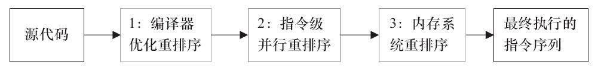
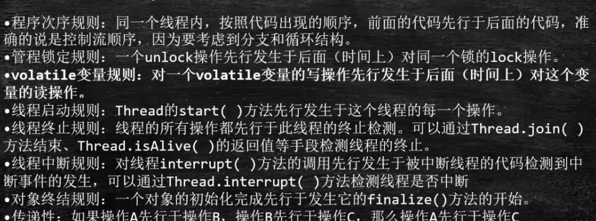

## 1、JMM(java内存模型)

- jmm是java层面的内存模型，主要是为了解决硬件平台和操作系统对内存访问机制的差异化；
- 结构如下：
  - 主内存是所有线程共享的区域，线程共享的数据例如静态域数据、实例数据、数组元素等；
  - 本地内存是线程私有的区域，例如此线程对应的寄存器，线程私有的数据例如局部变量、方法定义参数；

## 2、CPU缓存模型

## 3、并发编程三大特性

- 原子性：synchronized可以保证
- 可见性:  volatile
- 有序性: volatile

## 4、volatile如何保证可见性？

### 4.1 MESI协议

**MESI协议中的状态**

CPU中每个缓存行（caceh line)使用4种状态进行标记（使用额外的两位(bit)表示):

**M: 被修改（Modified)**

该缓存行只被缓存在该CPU的缓存中，并且是被修改过的（dirty),即与主存中的数据不一致，该缓存行中的内存需要在未来的某个时间点（允许其它CPU读取请主存中相应内存之前）写回（write back）主存。

当被写回主存之后，该缓存行的状态会变成独享（exclusive)状态。

**E: 独享的\**（Exclusive)\****

该缓存行只被缓存在该CPU的缓存中，它是未被修改过的（clean)，与主存中数据一致。该状态可以在任何时刻当有其它CPU读取该内存时变成共享状态（shared)。

同样地，当CPU修改该缓存行中内容时，该状态可以变成Modified状态。

**S: 共享的（Shared)**

该状态意味着该缓存行可能被多个CPU缓存，并且各个缓存中的数据与主存数据一致（clean)，当有一个CPU修改该缓存行中，

其它CPU中该缓存行可以被作废（变成无效状态（Invalid））。

 

**I: 无效的（Invalid）**

该缓存是无效的（可能有其它CPU修改了该缓存行）。

## 5、volatile如何保证有序性？

### 5.1 指令重排序

​	我们在编写代码的时候，通常自上而下编写，那么希望执行的顺序，理论上也是逐步串行执行，但是为了提高性能，编译器和处理器常常会对指令做重排序。

>1） 编译器优化的重排序。编译器在不改变单线程程序语义的前提下，可以重新安排语句的执行顺序。（JAVA编译器？）
>2） 指令级并行的重排序。现代处理器采用了指令级并行技术来将多条指令重叠执行。如果不存在数据依赖性，处理器可以改变语句对应机器指令的执行顺序。（汇编层面？）
>3） 内存系统的重排序。由于处理器使用缓存和读/写缓冲区，这使得加载和存储操作看上去可能是在乱序执行。（内存？）

### 5.2 CPU层级内存屏障

sfence ：store|在sfence指令前的写操作当必须在sfence指令后的写操作前完成。
lfence ：load|在lfence指令前的读操作当必须在lfence指令后的读操作前完成。
mfence：mfence指令前的读写操作当必须在mfence指令后的读写操作前完成。（全能屏障）

### 5.3 JVM层级内存屏障

实现这些屏障使用了lock指令，并没有用sfence、lfence、mfence等指令

LoadLoad屏障：读读屏障（load1|loadload|load2）(load1必须在load2之前运行读取完以下三个类似)
StoreStore屏障：写写屏障（store1|storestore|store2）
LoadStore屏障：读写屏障(load|loadstore|store)
StoreLoad屏障：写读屏障(store|storeload|load)（全能屏障）

### 5.4 happens-before语义

规定了哪些指令在执行的时候不可以重排序，需要加屏障；

### 5.5 as-if-serial语义

as-if-serial语义的意思是：不管怎么重排序，单线程程序的执行结果不能被改变。编译器、runtime和处理器都必须遵守as-if-serial语义。所以编译器和处理器不会对存在数据依赖关系的操作做重排序，因为这种重排序会改变执行结果。但是，如果操作之间不存在数据依赖关系，这些操作就可能被编译器和处理器重排序。

## 6、Lock指令

在CPU架构中依靠lock信号保证可见性并禁止重排序。MESI是硬件层级的协议，而Lock是汇编层级的，所以在使用Lock指令的时候其实会会调用底层缓存一致性协议的。，实现线程可见性和防止指令重排序；