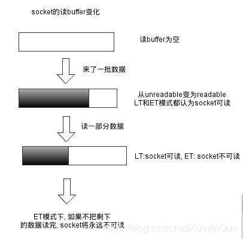

# select、poll、epoll - IO模型超详解


# [Linux操作系统](https://so.csdn.net/so/search?q=Linux操作系统&spm=1001.2101.3001.7020)有关IO的知识铺垫

## 1. `Pagecache`

[Linux](https://so.csdn.net/so/search?q=Linux&spm=1001.2101.3001.7020)内核所使用的的主要磁盘高速缓存。内核读写磁盘的时候都要用到这个PageCache。如果程序想要读的部分不在高速缓存，则先申请一个4KB大小的新页框加到PageCache，然后再用磁盘读到的数据填充。

写操作的时候，先把要写的[数据](https://so.csdn.net/so/search?q=数据&spm=1001.2101.3001.7020)写到pageCache，标记当前页面为脏，然后要么程序自己调用系统调用刷盘，要么就等着内核到了自己的默认设置去给你刷回去。

如果没有及时写出现了断电，那么你就白写了。

## 2. [文件描述符](https://so.csdn.net/so/search?q=文件描述符&spm=1001.2101.3001.7020)

创建文件描述符，文件描述符其实就是一个数字代表的数据结构

### 2.1 普通文件的文件描述符

```bash
exec 6< 1.txt # 创建一个文件描述符6，用6这个数字代表对1.txt的读操作
exec 7> 1.txt # 创建一个文件描述符6，用6这个数字代表对1.txt的写操作
exec 8<> 1.txt

lsof -op $$
lsof -p $BASHPID # 两个命令都可以查看当前进程正在使用的文件的描述符

#以及进到 当前进程的 fd文件夹也可以看到,$$代表当前进程的ID号
cd /proc/$$/fd

echo "hhh" >& 7 # 往1.txt里边写数据
read a  0<&  6 # 就可以读取到第一行数据
123456789101112
```

另外每个进程一旦创建都有三个自己默认的文件描述符 0u（标准输入） 1u（标准输出） 2u（报错信息输出），u代表读写都可以，其实我们自己创建的读入文件描述符6是【6r】【7w】，所以此时当前bash进程已经有了四个文件描述符。

每个文件描述符代表的数据结构中都有自己的偏移量，表示它可以从当前文件的那个位置进行操作（读写）。具体通过什么方式找到的自己的文件对应的PageCache，暂时不知道。

每个进程都有自己的文件描述符，因为进程的隔离，所以不同进程维护的各自的文件描述符可以是重复的，也就是说不同进程的相同的文件描述符可以指向不同的文件

假如不同进程的相同的文件描述符指向了同一个文件，他们仍然各自维护了自己的偏移量指针，也就是每个进程可以各自访问自己区域

### 2.2 socket文件描述符

```bash
# 创建socket文件描述符
exec 8<> /dev/tcp/www.baidu.com

lsof -op $$

12345
```

socket类型的文件描述符也会有自己的缓存数据的区域，但是这个数据不是要刷盘的，是要通过网卡发走的，中间经历了网络各种层间的协议，包装成数据包发往目标IP地址。

```bash
socket() = 3 # socket系统调用返回一个文件描述符，内核开辟一个空间，用该文件描述符指代此空间
bind(3, 8090); # 把这个空间与 8090端口绑定，一旦8090端口有数据到达，放到这块内存空间中
linsten(3); # 开始监听这个内存区域

accept(3,  #BIO阶段 accpet 阻塞，一旦有数据到达，就返回一个新的文件描述符
12345
```

## 3. 中断


### 3.1 `int 0x80`指令

计算机内存可以分为两段：操作系统的空间，用户空间，他们分别使用的地址段就可以称为：内核段、用户端

为了安全考虑，用户段的空间不能随意访问内核段的空间。怎样实现这样的控制呢？

### 3.2 权限设置

以Linux举例，硬件中有两个段寄存器：DPL和CPL两个段寄存器，系统加载时DPL段寄存器被设置为0（指代内核内存空间的权限级别），系统加载完毕启动一个shell执行用户态应用程序时，CPL指代的用户态地址空间的权限级别为3

此时 DPL = 0，CPL=3；

DPL >= CPL才能访问内核段的内存空间

### 3.3 `int 0x80`特殊在哪

所有的指令中，只有 `int 0x80` 指令 可以把CPL设置为0、DPL设置为3，然后才可以访问内核空间

 **DPL >= CPL才能访问内核段的内存空间**

在C语言中与`System.out.println("Hello World!")` 一样功能的代码 `printf("Hello World!")`调用在C语言库函数`write()`的时候通过宏定义展开。

当我们调用`printf()`方法的时候，默认的输出文件描述符（2u）是指向屏幕的，这段代码最终调用`write()`系统调用把输出打印到屏幕的时候，需要最终通过系统调用完成最后的打印操作。

```c
//printf 中调用库函数
_syscall3(int, write, int , fd, const char, *buf, off_t, count);
// 最终另外一个库函数通过宏定义展开
#define _syscall3(type, name, atype, a, btype, b, ctype, c)  //宏定义

//展开为
int write(int fd, const char *buf, off_t count){
    ...
    _asm_ volatile("int 0x80" : "=a"(_res):"(_NR_##name)");  // 这里的name会被宏替换成write，又定义了另外的宏 #define __NR_write 4
    														// 意思就是说 然后把4这个数字放入到 %eax寄存器（就是放到这个寄存器，没有为什么），
    														//把其他变量放入另外的内存地址或者寄存器
    														// 所以完成状态切换之后，计算机会知道去调用哪个系统调用，
    														
    ...
}
123456789101112131415
```

### 3.4 `int 0x80`的执行逻辑：

- 把 DPL 从 0 置为 3，让用户态可以进入内核，（此时才可以查询 IDT中断向量表）

- 查到 0x80 号中断是啥，是一个内核函数入口：`systemcall`

- CPL 置为 0，然后就可以执行内核函数（内核函数应该就是系统调用吧，我是这么理解的）

- ```
  systemcall
  ```

  找到

   

  ```
  %eax
  ```

  寄存器中的值，开始调用

  ```
  write
  ```

  ，然后获取其他相关寄存器中的值，拿到文件描述符和需要打印的字符和长度

  - `int write(int fd, const char *buf, off_t count)`中**已经把`write`的地址和`fd`等存在了其他寄存器或者内存**

- 执行完之后返回用户态， CPL置为3，DPL置为0，返回用户态，该干啥干啥

## 4. 重定向

### 4.1 输出重定向

```bash
# 输出当前目录结构，默认打印在屏幕上
ls ./
# 把ls的输出（1 标准输出流）重定向到 2.txt
ls ./ 1> 2.txt
vi 2.txt # 验证
12345
```

### 4.2 输入重定向

```bash
# vi后边直接加文件名就是直接读取文件
# vi 的 标准输入流（0）从2.txt中读取到数据之后，把它的标准输出（1）重定向到3.txt
vi 0< 2.txt  1> 3.txt 
123
```

### 4.3 read系统调用的输入重定向

`read()`有个特性就是，`read()`读到换行符就会结束，

```bash
read a #程序阻塞，等待键盘输入，等到键盘敲回车的时候把键盘输入的字符赋值给变量a
"asdfasdf" 回车


#read的输入可以来自一个文件，也可以另外的一个文件描述符，比如刚刚创建的6号
#read 也有自己的标准输入输出流 0u 1u 2u
#此处用了0输入流，把它的输入重定向到6号文件描述符（&表示后边的数字是一个文件描述符）
read a  0<&  6

echo $a
12345678910
```

上边的命名的意思就是**把6号文件描述符指向的文件的第一行赋值给a变量（假设目前的文件描述符的便宜些为0）**

可以用`echo $a`来查看`a`的值

### 4.4 文件描述符之间的重定向

假设当前路径中有 `./yes`文件夹，没有`./no`文件夹

```bash
ls ./yes # 正确输出走标准输出流 【1号文件描述符】
ls ./no # 错误输出，走错误输出流 【2号文件描述符】

# 2文件描述符指向1号，但是暂时1号的标准输出还是指向屏幕的，所以错误信息输出到屏幕，
# 然后修改1号文件描述符重定向到1.txt  正确的目录结构输出到1.txt
ls ./yes ./no    2>&1  1> 1.txt

# 上述流程反过来
ls ./yes ./no  1> 1.txt  2>&1
123456789
```

## 5. 管道文件描述符

```bash
head 1.txt # 读取1.txt的前10行
head -5 1.txt # 读取文件前5行 
tail 1.txt # 读取文件末尾十行
tail -2 1.txt # 读取文件末尾2行

head -7 1.txt | tail -1 # 读取文件第7行
123456
```

### 5.1管道是什么：`|`

管道两边分别启动两个**子进程**。

### 5.2 子进程是什么

进程调用`fork()`系统调用，复制自己的PCB，创建一个子进程，子进程可以获取父进程的数据空间、堆栈的副本。是**拥有副本**，不是共享存储空间。现在的技术是采用了**写时复制**的方法，让父子进程可以隔离。

### 5.3什么是写时复制

父进程和子进程先”共享“内存区域，但是内核会把内存区域设置为只读，如果需要写时，则内核只为写的区域制作一个副本，这个区域通常是虚拟存储页中的一页。（4KB）

### 5.4 父子进程是如何通信的

`export` 导出

```bash
echo $$ #查看自己的ID号， 假设他现在是100
x=100   # 在父进程中定义x变量
export x # 导出X

/bin/bash #在当前bash窗口里启动一个新的bash 此时新bash是刚才100进程的子进程
echo $x  #此时子进程可以取到访问到x变量
123456
```

### 5.5 进程与进程是如何通信的

```bash
# 管道两边的进程是兄弟进程
{echo $BASHPID; read x;} | {cat; echo $BASHPID; read y;}

123
```

此时假设 `|`左边进程的ID是 101， 右边进程的ID是102

两个进程都有自己启动时默认的三个 0u，1u，2u的文件描述符，但是此时 101的1u（输出）文件描述符是指向102进程的0u（输入）文件描述符的。

进程间的通信就是通过管道文件描述符实现的。

# 一、磁盘IO

## 1. 堆内存

`sysctl -a | grep dirty` 查询Linux中的脏页

### 1.1 堆上内存

Java是一个操作系统的进程，每个进程都有自己的**文本区，数据区，堆，栈**，JVM的堆内存大小（使用 -Xmx -Xms 命令控制的堆大小）是在Java进程的堆中堆。

`allocat()`就是指在堆中堆中申请内存，其实就是申请一个字节数组

### 1.2 堆外内存

`allocatDirect()`申请堆外内存，这个堆外只是说在Java虚拟机的堆外，在Java进程的堆上。

### 1.3 内存映射

每个进程都有自己的**文本区，数据区，堆，栈**，之外还有通过`mmap()`分配的内存映射空间。

`FileChannel` 文件通道的 `map()`方法创建一个内核的内存映射，这块内存区域存在于进程内，通过调用`map()`方法就是通过系统调用`mmap()`产生

意思就是在用户态申请一个PageCache大小的内存空间，直接映射到内核空间的一个PageCache，通过操作用户态的空间，可以直接操纵内核态的那个对应的PageCache，不需要任何的系统调用和内核态用户态的切换，但是如果想把这个PageCache刷盘保存，仍然是要调用系统调用，让操作系统给你完成刷盘操作（或者等待到操作系统的阈值帮你自动刷盘）

### 1.4 直接IO

仍然有PageCache，但是忽略了Linux操作系统的PageCache，此PageCache是用户进程私有的，因为这不是操作系统帮你开辟的，而是程序自己开辟的！但是仍得自己实现代码来实现一致性处理，脏页处理等一系列复杂的问题。

通俗一点理解就是：应用程序自己开辟了一个字节数组，来存储自己需要用到的数据。

**直接IO跟程序的响应或者吞吐量没有任何联系， 跟数据安全也没有任何联系**

比如Redis，自己动用代码逻辑实现了PageCache中数据的处理，每次写操作刷盘一次，性能该低的低，长时间不做刷盘操作，数据该丢的丢，只是不经过操作系统帮你处理而已。

## 2 总结

**因为有PageCache存在，OS没有绝对的数据可靠性，但是我们为什么还要有设计这个PageCache呢？为了减少真真正正的硬件IO，优先使用内存以提高运行速度。如果追求性能，就要在一致性可靠性之间权衡。但是即便想要的可靠性调成最慢的每写一次就刷盘的模式，单点故障问题总会让你的为了数据安全所付出的性能损耗一点意义都没有。所以我们之后才有了主从复制和Leader选举算法来保证高可用。**

**Redis、zooKeeper等通过网络IO来传输数据达到主从复制的目的。也仍然通过TCP协议来实现了自己的Leader选举算法。**

# 二、网络IO

# 1、BIO（阻塞IO）

## 1.1 系统调用伪代码实例

BIO时代的socket返回的文件描述符都是阻塞的，如果没有连接数据到达会一直阻塞在那个地方等待连接，即使有超时时间，也是设置的一个值，不能达到提高程序性能的目标。

假设服务器端程序启动的时候接收数据从8090端口接受，那么在连接到达之前的系统调用可以如下

```bash
#######  Serversocket server = new ServerSocket(8090);
socket()=3  # 假设server的文件描述符为3
bind(3, 8090)
listen(3)
accept(3,   # 该方法阻塞, 等待客户端连接   Socket client = server.accept(); 
12345
```

等到有连接数据到达之后，accept()系统调用的执行过程中会创建一个新的文件描述符，把当前socket文件描述符中的连接转到新建的文件描述符中，当然BIO时代的文件描述符都是阻塞的，新创建的文件描述符仍然是阻塞的！

```bash
accept(3, ……) = 5
recv(5,     # 该方法阻塞, 等待客户端的请求
12
```

如果不把这个文件描述符放到另外一个线程处理，他就会一直阻塞当前线程，影响之后的客户端连接

所以此时应该新建线程去等待5号文件描述符的请求数据

主线程仍然继续阻塞等待新的连接数据，所以此时BIO的伪代码应该如下

```java
socket()=3 
bind(3, 8090)
listen(3)
    
while(1){
    
    accept(3,
    new thread -> (/* accept(3) = 5 */)
           
}
1234567891011
```

## 1.2 Java代码示例

```java
public class TestSocket{
    public static void main(String[] args){
        Serversocket server = new ServerSocket(8090);
        while(1){
            Socket client = server.accept();
            
            new Thread(new Runnable(){
                Socket ss;
                public Runnable setSS(Socket s){
                    ss = s;
                    return this;
                }
                public void run(){
                    try{
                        InputStream in = ss.getInputStream();
                        BufferReader reader = new BufferReader(new InputStreamReader(in));
                        while(1){
                            sout(reader.readLine());
                        }
                    }catch (IOException e){
                        e.printStackTrace();
                    }
                }
            }.setSS(client)
            ).start();
        }
    }
}
1234567891011121314151617181920212223242526272829
```

## 1.3 线程日志中的系统调用

### out.主线程号中的日志内容

```shell
#######  Serversocket server = new ServerSocket(8090);
socket()=3  # 假设server的文件描述符为3
bind(3, 8090)
listen(3)
accept(3,   # 该方法阻塞, 等待客户端连接   Socket client = server.accept(); 

### 当有客户端建立连接之后返回一个新的文件描述符， accept(3, ……) = 5， 假设新的客户端连接的文件描述符为5
### clone()一个线程，该线程也阻塞等待文件描述符是否有数据到达，如果有处理他的数据或者请求   recv(5,
accept(3,  # 继续等待客户端连接
123456789
```

### out.子线程号中的日志内容

每个线程都建立一个连接

```shell
accept(3, ……) = 5
recv(5,     # 该方法阻塞, 等待客户端的请求
12
```


------

# 2、NIO

为了解决BIO的问题，就有了后来的NIO

此时的文件描述符不在阻塞，没有连接数据到达直接返回 -1

此时一个线程就可以完成BIO时代的好多个线程的工作

```bash
#######  Serversocket server = new ServerSocket(8090);
socket()=3  # 假设server的文件描述符为3
bind(3, 8090)
listen(3)
accept(3, ……) = -1   # 该方法不再阻塞等待客户端连接    

123456
```

即使有了新的连接，accept()返回的文件描述符也已经是非阻塞的了

```bash
### 当有客户端建立连接之后返回一个新的文件描述符， ， 假设新的客户端连接的文件描述符为5
### recv(5,
accept(3, ……) = 5 # 继续等待客户端连接
listen(5);
recv(5) = -1
#判断返回值 查看是否有数据，有则读取，无则继续执行其他逻辑
123456
```

此时的伪代码可以写成如下：

```java
fd[] fds;
socket()=3 
bind(3, 8090)
listen(3)
    
while(1){
    int i = accept(3, ……)
    if(i != -1){
        fds.add(i);
    }
    
    for(int j=0; j < fds.length; j++){
        int k = recv(j);
        if(k != -1){
            doSomething();
        }
    }
}
123456789101112131415161718
```

## 2.2 Java代码示例

```java
public class SocketNIO{
    public static void main(String[] args){
        
        LinkedList<SocketChannel> clients = new LinkedList<>();
        
        ServerSocketChannel ss = ServerSocketChannel.open();
        ss.bind(new InetSocketAddress(9090));
        ss.configureBlocking(false);  //☆☆☆☆☆☆☆
        
        
        while(1){
            SocketChannel client = ss.accept();//不会阻塞， 如果accpet()系统调用返回的文件描述符为-1，client则为null
            /*
             *	ss.configureBlocking(false);  //☆☆☆☆☆☆☆已经把ss设置为非阻塞
             *  ss.accept()的时候，调用accept系统调用，如果有请求连接则返回对应的文件描述符，
             *  如果没有连接请求，则也不阻塞，返回-1
            */
            if(client == null){
                sout("null");
            }else{
                client.configureBlocking(false);  //☆☆☆☆☆☆☆
                int port = client.socket().getPort();
                sout("client port" + port);
                clients.add(client);
            }
            
            ByteBuffer buffer = ByteBuffer.allocateDirect(4096);
            
            for(SocketChannel c:clients){
                int num = c.read(buffer);
                if(num > 0){
                    buffer.flip();
                    byte[] aaa = new byte[buffer.limit()];
                    buffer.get(aaa);
                    String b = new String(aaa);
                    buffer.clear();
                }
            }
        }
    }
}
1234567891011121314151617181920212223242526272829303132333435363738394041
```

## 2.3 out.主线程号中的内容

此时一个主线程即可完成BIO中多个线程完成的任务

```shell
#######  Serversocket server = new ServerSocket(8090);
socket()=3  # 假设server的文件描述符为3
bind(3, 8090)
listen(3)
accept(3, ……) = -1   # 该方法不再阻塞等待客户端连接    
### 当有客户端建立连接之后返回一个新的文件描述符， accept(3, ……) = 5， 假设新的客户端连接的文件描述符为5
### recv(5,
accept(3, ……) = -1  # 继续等待客户端连接
12345678
```

## 2.4 弊端

-  while()循环中嵌套了一层**for遍历整个client链表**，查看客户端连接中是否有数据到达，每次查看是否有数据到达都要调用 **recv()** 系统调用，用户态到内核态的切换造成的中断保护现场是比较费时的操作，当连接数量过大的时候，效率就会异常低下

```java
while(1){
    SocketChannel client = ss.accept();//不会阻塞， 如果accpet()系统调用返回的文件描述符为-1，client则为null

    if(client == null){
        sout("null");
    }else{
        client.configureBlocking(false);  //☆☆☆☆☆☆☆
        int port = client.socket().getPort();
        sout("client port" + port);
        clients.add(client);
    }

    ByteBuffer buffer = ByteBuffer.allocateDirect(4096);

    for(SocketChannel c:clients){
        int num = c.read(buffer);
        if(num > 0){
            buffer.flip();
            byte[] aaa = new byte[buffer.limit()];
            buffer.get(aaa);
            String b = new String(aaa);
            buffer.clear();
        }
    }
}
12345678910111213141516171819202122232425
```


------

# 3、多路复用

## 3.1 [select](https://so.csdn.net/so/search?q=select&spm=1001.2101.3001.7020)（UNIX环境高级编程版）

```c
int FD_ISSET(int fd, fd_set *fdset);  //返回值：若fd在文件描述符集中，返回非0值；否则，返回0
void FD_CLR(int fd, fd_set *fdset);   //清除最后一位
void FD_SET(int fd, fd_set *fdset);   //开启描述符中的一位
void FD_ZERO(fd_set *fdset);          //所有描述符位置位0
12345
#include <sys/select.h>
int select(int maxfpd1, fdset *read_fds, fdset *write_fds, fdset *exception_fds, struct timeval *restrict tvpr);
//返回值为可以操作的文件描述符的数量。
123
```

### 3.1.1 参数说明：

#### tvpr

- tvpr == NULL, 永远阻塞
- tvpr -> tv_sec == 0 || tvpr -> tv_usec == 0, 不阻塞，直接返回
- tvpr -> tv_sec != 0 || tvpr -> tv_usec != 0, 阻塞指定的秒数和微妙数

#### read_fds, write_fds, exception_fds


#### maxfdp1

- 最大的文件描述符编号+1，最大为**1024**。通过指定我们关注的最大的描述符，内核只需要在此范围内搜索打开的位。

### 3.1.2 图14-16的操作对应的操作

```c
fdset readset, writeset;
FD_ZERO(&readset);
FD_ZERO(&writeset);
FD_SET(0, &readset); 
FD_SET(3, &readset); 
FD_SET(1, &writeset); 
FD_SET(2, &writeset); 
max_fd = 4;
int a = select(4, &readset, &writeset, NULL, NULL);
//系统调用完成后，返回可读可写的数量之和
if(a > 0){   //服务程序操作可以读写的文件描述符
    for(i=0; i<4; ++i){
        if(FD_ISSET(i, readset)){
            //操作
        }
        if(writeset(i, readset)){
            //操作
        }
    }
}
1234567891011121314151617181920
```


> **注意**：先把readset和writeset的文件描述符对应的位置位1，然后交给select()系统调用去判断哪个文件描述符打开，如果某个fd不可读或者写，该位置位0，
>
> 如果可读，在数组中仍然为1.
>
> 系统调用完成后，**返回可读可写的数量之和**
>
> 服务程序，循环遍历所有文件描述符用 **FD_ISSET()** 判断是否进行读写操作

### 3.1.3 优势

- 通过一次系统调用把所有的fds传递给内核，内核进行遍历，这种遍历减少了BIO的多次系统调用的开销

### 3.1.4 弊端：

- 因为select直接在**`&readset,&writeset`**上做出修改，导致两个数组不可重用，必须每次重新赋值
- 每次select都要重新遍历全量的fds

## 3.2 poll

```c
# include <poll.h>
int poll(struct pollfd fdarry[], nfds_t nfds, int timeout);

struct pollfd{
    int fd;/* 文件描述符 */
    short events;/* 文件描述符 */
    short revents;/* 实际发生了的事件 */
}
```

### 3.2.1 pollfd

 poll不是构建一个描述符集，而是构造一个pollfd的数组，每个数组的元素制定一个描述符编号**（结构体中的fd）**以及我们对该描述符感兴趣的条件**（short events）**。

 当poll系统调用完成后，同样返回可以操作的文件描述符数量，服务程序检查**pollfd中的revents**字段

```c
int a = poll(*fdarray, nfds, 0);
if(a > 0){   //服务程序操作可以读写的文件描述符
    for(i=0; i<4; ++i){
        if(pollfd->revents){  //☆☆☆☆☆☆☆
            //操作
        }
    }
}
12345678
```

### 3.2.2 优势

- 内核操作为文件描述符创建的结构体中的revents字段，没有破坏其他结构体中其他的字段，所有不用每次重新构造类似于readset那样的bitmap
- 没有了select最大支持1024个文件描述符的限制

### 3.2.3 弊端：

- 每次poll都仍要重新遍历全量的fds
- 服务程序也要遍历全量的fds，查看每个文件描述符的revents字段是否需要读写操作

## 3.3 epoll（Linux特有）

> 查阅《Linux高性能服务器编程》，没有提到callback函数，只有在《Netty权威指南第二版》和一些网络的博客上见到callback的字眼，所以分为两个理解版本，暂时不知道哪个对，待我查看完内核源码之后，续更博客。
>
> 《Linux高性能服务器编程》的简介中写“本书是Linux服务器编程的经典著作，由资深Linux软件开发工程师所写”，既然不是内核开发的参与人员，故只有自己看完内核源码之后才有资格说两个版本谁对谁错、还是都错。在此之前暂时先采纳这个自称“经典著作”的版本吧
>
> 该书在153页写到
>
> > `epoll_wait()` 如果检测到事件，就将所就绪事件从内核事件表中复制到他的第二个参数events指向的数组中。这个数组只用于epoll_wait检测到的就绪事件
>
> 所以有了第一个理解版本
>
> 第二个理解版本是因为实在是网上的博客和《Netty权威指南第二版》第7页的中间部分：
>
> > epoll是根据每个fd上面的callback函数实现的。只有“活跃”的socket才会主动调用callback函数。
>
> 但是Linux系统man出来的三个epoll函数都没有关于callback的解释，故本人更倾向于第一种理解。
>
> 更博还是等到看完源码之后。

> **2021.1.24更新，经过各种查阅资料终于理解了所谓的“callback函数”是啥，不知这次理解是否有误，经过这次的研究，我发现很多博客都是在水，一些书籍也是作者并没有彻彻底底理解这个东西，我也希望我这次的理解没有错误**
> 不多废话，开始上图

### 3.3.1


#### 参数说明

epoll是Linux特有的I/O复用函数，epoll使用一组函数来完成任务，而不是单个函数。epoll把用户关心的文件描述符放到内核的一个事件表中，所以epoll需要使用一个额外的文件描述符来表示内核中的事件表。

```c
#include <sys/epoll.h>
int epoll_create(int size);
int epoll_ctl(int epfd, int op, int fd, struct epoll_event *event);
int epoll_wait(int epfd, struct epoll_event * events, int maxevents, int timeout);
1234
```

- `epoll_create()` 返回一个文件描述符，该文件描述符“描述”的是内核中的一块**内存区域**，size现在不起任何作用。

- `epoll_ctl()`用来操作内核事件表，

  - `int epfd`表示`epoll_create()` 返回的事件表

  - `int fd`:新创建的`socket`文件描述符

  - `int op`

    - `EPOLL_CTL_ADD`: 事件表中添加一个文件描述符，内核应该关注的socket的事件在epoll_event结构体中，添加到事件表中的文件描述符以**红黑树**的形式存在，防止重复添加
    - `EPOLL_CTL_MOD`：修改`fd`上注册的事件
    - `EPOLL_CTL_DEL`：删除`fd`上注册的事件

  - `struct epoll_event *event`

    - ```c
      struct epoll_event{
          _uint32_t events; //epoll事件，读、写、异常三种
          epoll_data_t data; //用户数据
      }
      
      struct epoll_data{
          void* prt;
          int fd;
          _uint32_t u32;
          _uint64_t u64;
      }epoll_data_t;
      1234567891011
      ```

- `epoll_wait()`该函数返回就绪文件描述符的个数

### 3.2 性能分析

如果该服务器拥有两个CPU，则这两个CPU实现了异步处理就绪文件描述符。极大的提高了应用程序索引就绪文件描述符的效率！

### 3.3 工作模式（LT模式(水平模式)、ET模式（边缘模式））

- 简单来讲，LT是epoll的默认操作模式，当epoll_wait函数检测到有事件发生并将通知应用程序，而应用程序不一定必须立即进行处理，这样epoll_wait函数再次检测到此事件的时候还会通知应用程序，直到事件被处理。

- 而ET模式，只要epoll_wait函数检测到事件发生，通知应用程序立即进行处理，后续的epoll_wait函数将不再检测此事件。因此ET模式在很大程度上降低了同一个事件被epoll触发的次数，因此效率比LT模式高。




简言之就是：

- LT模式
  - fd可读之后，如果服务程序读走一部分就结束此次读取，LT模式下该文件描述符仍然可读
  - fd可写之后，如果服务程序写了一部分就结束此次写入，LT模式下该文件描述符也仍然可写
- ET模式
  - fd可读之后，如果服务程序读走一部分就结束此次读取，ET模式下该文件描述符是不可读，需要等到下次有数据到达时才可变为可读，**所有我们要保证循环读取数据，以确保把所有数据读出**
  - fd可写之后，如果服务程序写了一部分就结束此次写入，ET模式下该文件描述符是不可写的，**我们要保证写入数据，确保把数据写满**

### 3.4 EPOLLONESHOT

即使我们使用ET模式，一个socket仍然可能被多次触发。比如在并发时，一个线程在读取完数据之后开始处理，处理过程中又**有新事件触发**，此时另外一个线程被唤醒来读取数据。为了防止多个线程同时操作一个socket，就可以注册`EPOLLONESHOT` 事件，注册此事件的文件描述符，操作系统最多触发可读、可写、异常事件中的一个，而且只触发一次。但是每次处理完一个事件之后，需要使用`epoll_ctl` 来修改他的EPOLLONESHOT事件，是其他工作线程有机会处理这个socket

### 3.5 最大连接数

```bash
/proc/sys/fs/epoll/max_usr_watches
1
```

### 3.6 红黑树存在的意义

#### 3.6.1 **此小结皆为本人猜测而已**

 每次网卡到达数据的时候内核需要把数据拷贝到对应socket的buf中，如何找到对应的socket呢？按照socket的地址端口号搞一个红黑树排序，可以在 `O(logN)`的时间复杂度内找到对应的socket， 然后把数据拷贝到buf中

## 4、最后附上一份Java的多路复用代码

```java
public class IOMultiplexing {

    private ServerSocketChannel server = null;
    private Selector selector = null;  //linux 多路复用器 （可能是select poll   epoll中的任何一个）
    int port = 9090;

    public void initServer(){
        try {
            server = ServerSocketChannel.open();
            server.configureBlocking(false);
            server.bind(new InetSocketAddress(port));

            //如果是在epoll模式下， open（） -> epoll_create -> fd3
            selector = Selector.open();

            // server约等于 listen状态的 fd4，
            /*
            * register:
            * 如果系统调用为 select， poll， jvm开辟一个数组，把fd放进去
            * 如果系统调用为 epoll: epoll_ctl(fd3, ADD, fd4, EPOLLIN)
            * */
            server.register(selector, SelectionKey.OP_ACCEPT);
        } catch (IOException e) {
            e.printStackTrace();
        }
    }

    public void start(){
        initServer();
        System.out.println("服务已启动");
        try{
            while (true){
                Set<SelectionKey> keys = selector.keys();
                System.out.println(keys.size()+ " size");

                /*
                * 1. 调用多路复用器（select， poll， epoll）
                * 如果系统调用为 select， poll， select(fd4)传递给内核，让内核判断该文件描述符就绪否
                *
                * 如果系统调用为 epoll:此时的selector.select()方法相当于调用了epoll_wait()系统调用
                * */
                while (selector.select(500) > 0){
                    Set<SelectionKey> selectionKeys = selector.selectedKeys(); //返回就绪的fd集合
                    Iterator<SelectionKey> iterator = selectionKeys.iterator();
                    while (iterator.hasNext()){
                        SelectionKey next = iterator.next();
                        iterator.remove();
                        if (next.isAcceptable()){
                            //select() 和 poll() 放到数组里
                            //epoll() 调用 epoll_create()放到内核空间的红黑树里
                            acceptHandler(next);
                        }else if (next.isReadable()){
                            readHandler(next);
                        }else if (next.isWritable()){
                            writeHandler(next);
                        }
                    }
                }
            }
        }catch (IOException e) {
            e.printStackTrace();
        }
    }

    private void writeHandler(SelectionKey next) {
        
    }

    private void readHandler(SelectionKey selectionKey) {
        
    }

    private void acceptHandler(SelectionKey selectionKey) {
        try {
            ServerSocketChannel ssc = (ServerSocketChannel) selectionKey.channel();
            SocketChannel client = ssc.accept(); // 接受客户端连接
            client.configureBlocking(false);
            ByteBuffer buffer = ByteBuffer.allocate(8192); // 设置最大空间
            //select() 和 poll() 放到数组里
            //epoll() 调用 epoll_create()放到内核空间的红黑树里
            client.register(selector, SelectionKey.OP_READ, buffer);
            System.out.println("新客户端： "+ client.getRemoteAddress());
        } catch (IOException e) {
            e.printStackTrace();
        }
    }

}
12345678910111213141516171819202122232425262728293031323334353637383940414243444546474849505152535455565758596061626364656667686970717273747576777879808182838485868788
```

## 5. 总结

**多路复用仍然需要应用程序自己读取数据，内核只负责告诉程序哪个文件描述符可读可写而已！！！**

**只要程序自己读写，那么这个IO模型就是同步IO模型！**

**什么时候有异步IO呢？Windows！**

**拿磁盘IO举例：Windows的应用程序读取磁盘数据的时候，访问内存发现没有对应磁盘文件的数据，则当前进程挂起，由内核负责把这个数据拷贝到用户进程中，然后唤醒挂起的进程，进程没有自己读取数据却发现数据已经在自己的进程空间里了。**

**此时IO模型才是异步IO**

**在Linux中以及一些成熟的框架中（比如Netty），常用的IO模型有：同步阻塞，同步非阻塞**