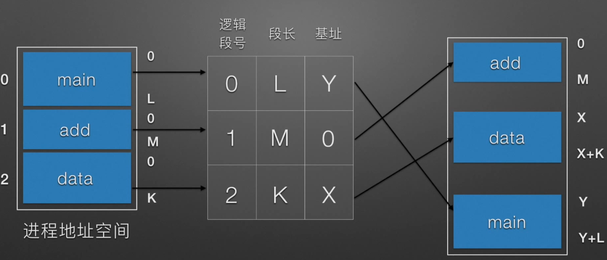

###  3.1 内存管理介绍

👨‍💻 **面试官**: **操作系统的内存管理主要是做什么？**

🙋 **我：** 操作系统的内存管理主要负责内存的分配与回收（malloc 函数：申请内存，free 函数：释放内存），另外地址转换也就是将逻辑地址转换成相应的物理地址等功能也是操作系统内存管理做的事情。

### 3.2 常见的几种内存管理机制

👨‍💻 **面试官**: **操作系统的内存管理机制了解吗？内存管理有哪几种方式?**

🙋 **我：** 这个在学习操作系统的时候有了解过。

简单分为**连续分配管理方式**和**非连续分配管理方式**这两种。连续分配管理方式是指为一个用户程序分配一个连续的内存空间，常见的如 **块式管理** 。同样地，非连续分配管理方式允许一个程序使用的内存分布在离散或者说不相邻的内存中，常见的如**页式管理** 和 **段式管理**。

#### **3.2.1 块式管理** 

 远古时代的计算机操系统的内存管理方式。将内存分为几个固定大小的块，每个块中只包含一个进程。如果程序运行需要内存的话，操作系统就分配给它一块，如果程序运行只需要很小的空间的话，分配的这块内存很大一部分几乎被浪费了。这些在每个块中未被利用的空间，我们称之为碎片。

#### **3.2.2 页式管理** 

把主存分为大小相等且固定的一页一页的形式，页较小，相对相比于块式管理的划分力度更大，提高了内存利用率，减少了碎片。页式管理通过页表对应逻辑地址和物理地址。

#### 3.2.3 **段式管理** 

页式管理虽然提高了内存利用率，但是页式管理其中的页实际并无任何实际意义。 段式管理把主存分为一段段的，段是有实际意义的，每个段定义了一组逻辑信息，例如,有主程序段 MAIN、子程序段 X、数据段 D 及栈段 S 等。 段式管理通过段表对应逻辑地址和物理地址。

段式管理虚地址到内存地址映射：

缺点：容易产生很多外部碎片

简单来说：页是物理单位，段是逻辑单位。分页可以有效提高内存利用率，分段可以更好满足用户需求。

👨‍💻**面试官** ： 回答的还不错！不过漏掉了一个很重要的 **段页式管理机制** 。段页式管理机制结合了段式管理和页式管理的优点。简单来说段页式管理机制就是把主存先分成若干段，每个段又分成若干页，也就是说 **段页式管理机制** 中段与段之间以及段的内部的都是离散的。

🙋 **我** ：谢谢面试官！刚刚把这个给忘记了～

#### 3.2.4 段页式管理

#### 3.2.1 首次适应算法

#### 3.2.2 最佳适应算法

#### 3.2.3 最坏适应算法

#### 3.2.4 伙伴系统

###  3.3 快表和多级页表

👨‍💻**面试官** ： 页表管理机制中有两个很重要的概念：快表和多级页表，这两个东西分别解决了页表管理中很重要的两个问题。你给我简单介绍一下吧！

🙋 **我** ：在分页内存管理中，很重要的两点是：

1. 虚拟地址到物理地址的转换要快。
2. 解决虚拟地址空间大，页表也会很大的问题。

#### 快表

为了解决虚拟地址到物理地址的转换速度，操作系统在 **页表方案** 基础之上引入了 **快表** 来加速虚拟地址到物理地址的转换。我们可以把快表理解为一种特殊的高速缓冲存储器（Cache），其中的内容是页表的一部分或者全部内容。作为页表的 Cache，它的作用与页表相似，但是提高了访问速率。由于采用页表做地址转换，读写内存数据时 CPU 要访问两次主存。有了快表，有时只要访问一次高速缓冲存储器，一次主存，这样可加速查找并提高指令执行速度。

使用快表之后的地址转换流程是这样的：

1. 根据虚拟地址中的页号查快表；
2. 如果该页在快表中，直接从快表中读取相应的物理地址；
3. 如果该页不在快表中，就访问内存中的页表，再从页表中得到物理地址，同时将页表中的该映射表项添加到快表中；
4. 当快表填满后，又要登记新页时，就按照一定的淘汰策略淘汰掉快表中的一个页。

看完了之后你会发现快表和我们平时经常在我们开发的系统使用的缓存（比如 Redis）很像，的确是这样的，操作系统中的很多思想、很多经典的算法，你都可以在我们日常开发使用的各种工具或者框架中找到它们的影子。

#### 多级页表

引入多级页表的主要目的是为了避免把全部页表一直放在内存中占用过多空间，特别是那些根本就不需要的页表就不需要保留在内存中。多级页表属于时间换空间的典型场景，具体可以查看下面这篇文章

- 多级页表如何节约内存：[https://www.polarxiong.com/archives/多级页表如何节约内存.html  (opens new window)](https://www.polarxiong.com/archives/多级页表如何节约内存.html)

#### 总结

为了提高内存的空间性能，提出了多级页表的概念；但是提到空间性能是以浪费时间性能为基础的，因此为了补充损失的时间性能，提出了快表（即 TLB）的概念。 不论是快表还是多级页表实际上都利用到了程序的局部性原理，局部性原理在后面的虚拟内存这部分会介绍到。

### 3.4 分页机制和分段机制的共同点和区别

👨‍💻**面试官** ： **分页机制和分段机制有哪些共同点和区别呢？**

🙋 **我** ：

1. 共同点

    ：

   - 分页机制和分段机制都是为了提高内存利用率，减少内存碎片。
   - 页和段都是离散存储的，所以两者都是离散分配内存的方式。但是，每个页和段中的内存是连续的。

2. 区别

    ：

   - 页的大小是固定的，由操作系统决定；而段的大小不固定，取决于我们当前运行的程序。
   - 分页仅仅是为了满足操作系统内存管理的需求，而段是逻辑信息的单位，在程序中可以体现为代码段，数据段，能够更好满足用户的需要。

### 3.5 虚拟内存管理

#### 3.5.1 覆盖技术

### 3.5 逻辑(虚拟)地址和物理地址

👨‍💻**面试官** ：你刚刚还提到了**逻辑地址和物理地址**这两个概念，我不太清楚，你能为我解释一下不？

🙋 **我：** em...好的嘛！我们编程一般只有可能和逻辑地址打交道，比如在 C 语言中，指针里面存储的数值就可以理解成为内存里的一个地址，这个地址也就是我们说的逻辑地址，逻辑地址由操作系统决定。物理地址指的是真实物理内存中地址，更具体一点来说就是内存地址寄存器中的地址。物理地址是内存单元真正的地址。

### 3.6 CPU 寻址了解吗?为什么需要虚拟地址空间?

👨‍💻**面试官** ：**CPU 寻址了解吗?为什么需要虚拟地址空间?**

🙋 **我** ：这部分我真不清楚！

于是面试完之后我默默去查阅了相关文档！留下了没有技术的泪水。。。

> 这部分内容参考了 Microsoft 官网的介绍，地址：[https://docs.microsoft.com/zh-cn/windows-hardware/drivers/gettingstarted/virtual-address-spaces?redirectedfrom=MSDN  (opens new window)](https://docs.microsoft.com/zh-cn/windows-hardware/drivers/gettingstarted/virtual-address-spaces?redirectedfrom=MSDN)

现代处理器使用的是一种称为 **虚拟寻址(Virtual Addressing)** 的寻址方式。**使用虚拟寻址，CPU 需要将虚拟地址翻译成物理地址，这样才能访问到真实的物理内存。** 实际上完成虚拟地址转换为物理地址转换的硬件是 CPU 中含有一个被称为 **内存管理单元（Memory Management Unit, MMU）** 的硬件。如下图所示：

**为什么要有虚拟地址空间呢？**

先从没有虚拟地址空间的时候说起吧！没有虚拟地址空间的时候，**程序都是直接访问和操作的都是物理内存** 。但是这样有什么问题呢？

1. 用户程序可以访问任意内存，寻址内存的每个字节，这样就很容易（有意或者无意）破坏操作系统，造成操作系统崩溃。
2. 想要同时运行多个程序特别困难，比如你想同时运行一个微信和一个 QQ 音乐都不行。为什么呢？举个简单的例子：微信在运行的时候给内存地址 1xxx 赋值后，QQ 音乐也同样给内存地址 1xxx 赋值，那么 QQ 音乐对内存的赋值就会覆盖微信之前所赋的值，这就造成了微信这个程序就会崩溃。

**总结来说：如果直接把物理地址暴露出来的话会带来严重问题，比如可能对操作系统造成伤害以及给同时运行多个程序造成困难。**

通过虚拟地址访问内存有以下优势：

- 程序可以使用一系列相邻的虚拟地址来访问物理内存中不相邻的大内存缓冲区。
- 程序可以使用一系列虚拟地址来访问大于可用物理内存的内存缓冲区。当物理内存的供应量变小时，内存管理器会将物理内存页（通常大小为 4 KB）保存到磁盘文件。数据或代码页会根据需要在物理内存与磁盘之间移动。
- 不同进程使用的虚拟地址彼此隔离。一个进程中的代码无法更改正在由另一进程或操作系统使用的物理内存。 