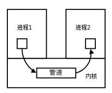

## 1、什么是进程？

进程就是程序的一次执行过程；

进程是分配资源的基本单位；

每一个任务(进程)被创建时，系统会为他分配存储空间等必要资源，然后在内核管理区为该进程创建管理节点，以便后来控制和调度该任务的执行。

进程，是计算机中的程序关于某数据集合上的一次运行活动，是系统进行资源分配和调度的基本单位，是操作系统结构的基础。它的执行需要系统分配资源创建实体之后，才能进行。

## 2、什么是线程？

线程是操作系统能够进行运算调度的最小单位。它被包含在进程之中，是进程中的实际运作单位。一条线程指的是进程中一个单一顺序的控制流，一个进程中可以并发多个线程，每条线程并行执行不同的任务。

## 3、进程和线程的区别？

### 3.1 相同点

无论是进程还是线程，对于程序员而言，都是用来实现多任务并发的技术手段。二者都可以独立调度，因此在多任务环境下，功能上并无差异。并且二者都具有各自的实体，是系统独立管理的对象个体。所以在系统层面，都可以通过技术手段实现二者的控制。而且二者所具有的状态都非常相似。而且，在多任务程序中，子进程(子线程)的调度一般与父进程(父线程)平等竞争。

### 3.2 实现方式的差异

进程是资源分配的基本单位，线程是调度的基本单位。进程的个体间是完全独立的，而线程间是彼此依存的。多进程环境中，任何一个进程的终止，不会影响到其他进程。而多线程环境中，父线程终止，全部子线程被迫终止(没有了资源)。而任何一个子线程终止一般不会影响其他线程，除非子线程执行了exit()系统调用。任何一个子线程执行exit()，全部线程同时灭亡。

### 3.3 多任务程序设计模式的区别

由于进程间是独立的，所以在设计多进程程序时，需要做到资源独立管理时就有了天然优势，而线程就显得麻烦多了。关于资源不独立，看似是个缺点，但在有的情况下就成了优点。多进程环境间完全独立，要实现通信的话就得采用进程间的通信方式，它们通常都是耗时间的。而线程则不用任何手段数据就是共享的。当然多个子线程在同时执行写入操作时需要实现互斥，否则数据就写“脏”了。

### 3.4 实体间(进程间，线程间，进线程间)通信方式的不同

进程间的通信方式有这样几种：

A.共享内存  B.消息队列  C.信号量  D.有名管道  E.无名管道  F.信号

G.文件    H.socket

线程间的通信方式上述进程间的方式都可沿用，且还有自己独特的几种：

A.互斥量   B.自旋锁   C.条件变量 D.读写锁   E.线程信号

G.全局变量

而且，进程间采用的通信方式要么需要切换内核上下文，要么要与外设访问(有名管道，文件)。所以速度会比较慢。而线程采用自己特有的通信方式的话，基本都在自己的进程空间内完成，不存在切换，所以通信速度会较快。也就是说，进程间与线程间分别采用的通信方式，除了种类的区别外，还有速度上的区别。

### 3.5 控制方式的异同

- 在全系统中，进程ID是唯一标识，对于进程的管理都是通过PID来实现的。每创建一个进程，内核去中就会创建一个结构体来存储该进程的全部信息；

- 线程的ID是一个long型变量：它的范围大得多，管理方式也不一样。线程ID一般在本进程空间内作用就可以了，当然系统在管理线程时也需要记录其信息。其方式是，在内核创建一个内核态线程与之对应，也就是说每一个用户创建的线程都有一个内核态线程对应。但这种对应关系不是一对一，而是多对一的关系，也就是一个内核态线程可以对应着多个用户级线程。

### 3.6 资源管理方式的异同

进程本身是资源分配的基本单位，因而它的资源都是独立的，如果有多进程间的共享资源，就要用到进程间的通信方式了，比如共享内存。共享数据就放在共享内存去，大家都可以访问，为保证数据写入的安全，加上信号量一同使用。一般而言，共享内存都是和信号量一起使用。消息队列则不同，由于消息的收发是原子操作，因而自动实现了互斥，单独使用就是安全的。

线程间要使用共享资源不需要用共享内存，直接使用全局变量即可，或者malloc()动态申请内存。显得方便直接。而且互斥使用的是同一进程空间内的互斥量，所以效率上也有优势。

实际中，为了使程序内资源充分规整，也都采用共享内存来存储核心数据。不管进程还是线程，都采用这种方式。原因之一就是，共享内存是脱离进程的资源，如果进程发生意外终止的话，共享内存可以独立存在不会被回收(是否回收由用户编程实现)。

### 3.7 个体间辈分关系的迥异

进程的备份关系森严，在父进程没有结束前，所有的子进程都尊从父子关系，也就是说A创建了B，则A与B是父子关系，B又创建了C，则B与C也是父子关系，A与C构成爷孙关系，也就是说C是A的孙子进程。在系统上使用pstree命令打印进程树，可以清晰看到备份关系。

多线程间的关系没有那么严格，不管是父线程还是子线程创建了新的线程，都是共享父线程的资源，所以，都可以说是父线程的子线程，也就是只存在一个父线程，其余线程都是父线程的子线程。

### 3.8 进程池与线程池的技术实现差别

**进程池**

首先创建了一批进程，就得管理，也就是你得分开保存进程ID，可以用数组，也可用链表。建议用数组，这样可以实现常数内找到某个线程，而且既然做了进程池，就预先估计好了生产多少进程合适，一般也不会再动态延展。就算要动态延展，也能预估范围，提前做一个足够大的数组。不为别的，就是为了快速响应。本来错进程池的目的也是为了效率。

接下来就要让闲置进程冬眠了，可以让他们pause()挂起，也可用信号量挂起，还可以用IPC阻塞，方法很多，分析各自优缺点根据实际情况采用就是了。

然后是分配任务了，当你有任务的时候就要让他干活了。唤醒了进程，让它从哪儿开始干呢？肯定得用到进程间通信了，比如信号唤醒它，然后让它在预先指定的地方去读取任务，可以用函数指针来实现，要让它干什么，就在约定的地方设置代码段指针。这也只是告诉了它怎么干，还没说干什么(数据条件)，再通过共享内存把要处理的数据设置好，这也子进程就知道怎么做了。干完之后再来一次进程间通信然后自己继续冬眠，父进程就知道孩子干完了，收割成果。

最后结束时回收子进程，向各进程发送信号唤醒，改变激活状态让其主动结束，然后逐个wait()就可以了。

**线程池**

线程池的思想与上述类似，只是它更为轻量级，所以调度起来不用等待额外的资源。

要让线程阻塞，用条件变量就是了，需要干活的时候父线程改变条件，子线程就被激活。

线程间通信方式就不用赘述了，不用繁琐的通信就能达成，比起进程间效率要高一些。

线程干完之后自己再改变条件，这样父线程也就知道该收割成果了。

整个程序结束时，逐个改变条件并改变激活状态让子线程结束，最后逐个回收即可。

## 4、 进程有哪几种状态?

**创建状态(new)** ：进程正在被创建，尚未到就绪状态。

**就绪状态(ready)** ：进程已处于准备运行状态，即进程获得了除了处理器之外的一切所需资源，一旦得到处理器资源(处理器分配的时间片)即可运行。

**运行状态(running)** ：进程正在处理器上上运行(单核 CPU 下任意时刻只有一个进程处于运行状态)。

**阻塞状态(waiting)** ：又称为等待状态，进程正在等待某一事件而暂停运行如等待某资源为可用或等待 IO 操作完成。即使处理器空闲，该进程也不能运行。

**结束状态(terminated)** ：进程正在从系统中消失。可能是进程正常结束或其他原因中断退出运行。

## 5、进程间的通信方式

### 5.1 什么是进程间的通信

每个进程各自有不同的用户地址空间，任何一个进程的全局变量在另一个进程中都看不到，所以进程之间要交换数据必须通过内核，在内核中开辟一块缓冲区，进程1把数据从用户空间拷到内核缓冲区，进程2再从内核缓冲区把数据读走，内核提供的这种机制称为**进程间通信（IPC，InterProcess Communication）**

### 5.2 进程间通信的7种方式

#### 5.2.1 **管道/匿名管道(Pipes)** ：

- 管道是半双工的，数据只能向一个方向流动；需要双方通信时，需要建立起两个管道。

- 只**能用于父子进程或者兄弟进程之间(具有亲缘关系的进程);**

- 单独构成一种独立的文件系统：管道对于管道两端的进程而言，就是一个文件，但它不是普通的文件，它不属于某种文件系统，而是自立门户，单独构成一种文件系统，并且只存在与内存中。

- 数据的读出和写入：一个进程向管道中写的内容被管道另一端的进程读出。写入的内容每次都添加在管道缓冲区的末尾，并且每次都是从缓冲区的头部读出数据。

**管道的实质：**
 管道的实质是一个内核缓冲区，进程以先进先出的方式从缓冲区存取数据，管道一端的进程顺序的将数据写入缓冲区，另一端的进程则顺序的读出数据。
 该缓冲区可以看做是一个循环队列，读和写的位置都是自动增长的，不能随意改变，一个数据只能被读一次，读出来以后在缓冲区就不复存在了。
 当缓冲区读空或者写满时，有一定的规则控制相应的读进程或者写进程进入等待队列，**当空的缓冲区有新数据写入或者满的缓冲区有数据读出来时**，就唤醒等待队列中的进程继续读写。

**管道的局限：**
 管道的主要局限性正体现在它的特点上：

- 只支持单向数据流；
- 只能用于具有亲缘关系的进程之间；
- 没有名字；
- 管道的缓冲区是有限的（管道制存在于内存中，在管道创建时，为缓冲区分配一个页面大小）；
- 管道所传送的是无格式字节流，这就要求管道的读出方和写入方必须事先约定好数据的格式，比如多少字节算作一个消息（或命令、或记录）等等；

#### 5.2.2 有名管道

匿名管道，由于没有名字，只能用于亲缘关系的进程间通信。为了克服这个缺点，提出了有名管道(FIFO)。
 有名管道不同于匿名管道之处在于它提供了一个路径名与之关联，**以有名管道的文件形式存在于文件系统中**，这样，**即使与有名管道的创建进程不存在亲缘关系的进程，只要可以访问该路径，就能够彼此通过有名管道相互通信**，因此，通过有名管道不相关的进程也能交换数据。值的注意的是，有名管道严格遵循**先进先出(first in first out)**,对匿名管道及有名管道的读总是从开始处返回数据，对它们的写则把数据添加到末尾。它们不支持诸如lseek()等文件定位操作。**有名管道的名字存在于文件系统中，内容存放在内存中。**

> **匿名管道和有名管道总结：**
>  （1）管道是特殊类型的文件，在满足先入先出的原则条件下可以进行读写，但不能进行定位读写。
>  （2）匿名管道是单向的，只能在有亲缘关系的进程间通信；有名管道以磁盘文件的方式存在，可以实现本机任意两个进程通信。
>  （3）**无名管道阻塞问题：**无名管道无需显示打开，创建时直接返回文件描述符，在读写时需要确定对方的存在，否则将退出。如果当前进程向无名管道的一端写数据，必须确定另一端有某一进程。如果写入无名管道的数据超过其最大值，写操作将阻塞，如果管道中没有数据，读操作将阻塞，如果管道发现另一端断开，将自动退出。
>  （4）**有名管道阻塞问题：**有名管道在打开时需要确实对方的存在，否则将阻塞。即以读方式打开某管道，在此之前必须一个进程以写方式打开管道，否则阻塞。此外，可以以读写（O_RDWR）模式打开有名管道，即当前进程读，当前进程写，不会阻塞。

#### 5.2.3**信号(Signal)**

- 信号是Linux系统中用于进程间互相通信或者操作的一种机制，信号可以在任何时候发给某一进程，而无需知道该进程的状态。
- 如果该进程当前并未处于执行状态，则该信号就有内核保存起来，直到该进程回复执行并传递给它为止。
- 如果一个信号被进程设置为阻塞，则该信号的传递被延迟，直到其阻塞被取消是才被传递给进程。

> **Linux系统中常用信号：**
>  （1）**SIGHUP：**用户从终端注销，所有已启动进程都将收到该信号。系统缺省状态下对该信号的处理是终止进程。
>  （2）**SIGINT：**程序终止信号。程序运行过程中，按`Ctrl+C`键将产生该信号。
>  （3）**SIGQUIT：**程序退出信号。程序运行过程中，按`Ctrl+\\`键将产生该信号。
>  （4）**SIGBUS和SIGSEGV：**进程访问非法地址。
>  （5）**SIGFPE：**运算中出现致命错误，如除零操作、数据溢出等。
>  （6）**SIGKILL：**用户终止进程执行信号。shell下执行`kill -9`发送该信号。
>  （7）**SIGTERM：**结束进程信号。shell下执行`kill 进程pid`发送该信号。
>  （8）**SIGALRM：**定时器信号。
>  （9）**SIGCLD：**子进程退出信号。如果其父进程没有忽略该信号也没有处理该信号，则子进程退出后将形成僵尸进程。

**信号来源**
 信号是软件层次上对中断机制的一种模拟，是一种异步通信方式，信号可以在用户空间进程和内核之间直接交互，内核可以利用信号来通知用户空间的进程发生了哪些系统事件，信号事件主要有两个来源：

- 硬件来源：用户按键输入`Ctrl+C`退出、硬件异常如无效的存储访问等。
- 软件终止：终止进程信号、其他进程调用kill函数、软件异常产生信号。

**信号生命周期和处理流程**
 （1）信号被某个进程产生，并设置此信号传递的对象（一般为对应进程的pid），然后传递给操作系统；
 （2）操作系统根据接收进程的设置（是否阻塞）而选择性的发送给接收者，如果接收者阻塞该信号（且该信号是可以阻塞的），操作系统将暂时保留该信号，而不传递，直到该进程解除了对此信号的阻塞（如果对应进程已经退出，则丢弃此信号），如果对应进程没有阻塞，操作系统将传递此信号。
 （3）目的进程接收到此信号后，将根据当前进程对此信号设置的预处理方式，暂时终止当前代码的执行，保护上下文（主要包括临时寄存器数据，当前程序位置以及当前CPU的状态）、转而执行中断服务程序，执行完成后在回复到中断的位置。当然，对于抢占式内核，在中断返回时还将引发新的调度。

#### 5.2.4 消息(Message)队列

- 消息队列是存放在内核中的消息链表，每个消息队列由消息队列标识符表示。
- 与管道（无名管道：只存在于内存中的文件；命名管道：存在于实际的磁盘介质或者文件系统）不同的是消息队列存放在内核中，只有在内核重启(即，操作系统重启)或者显示地删除一个消息队列时，该消息队列才会被真正的删除。
- 另外与管道不同的是，消息队列在某个进程往一个队列写入消息之前，并不需要另外某个进程在该队列上等待消息的到达。[延伸阅读：消息队列C语言的实践](https://link.jianshu.com?t=http://blog.csdn.net/yang_yulei/article/details/19772649)

> **消息队列特点总结：**
>  （1）消息队列是消息的链表,具有特定的格式,存放在内存中并由消息队列标识符标识.
>  （2）消息队列允许一个或多个进程向它写入与读取消息.
>  （3）管道和消息队列的通信数据都是先进先出的原则。
>  （4）消息队列可以实现消息的随机查询,消息不一定要以先进先出的次序读取,也可以按消息的类型读取.比FIFO更有优势。
>  （5）消息队列克服了信号承载信息量少，管道只能承载无格式字 节流以及缓冲区大小受限等缺。
>  （6）目前主要有两种类型的消息队列：POSIX消息队列以及System V消息队列，系统V消息队列目前被大量使用。系统V消息队列是随内核持续的，只有在内核重起或者人工删除时，该消息队列才会被删除。

#### 5.2.5 共享内存(share memory)

- 使得多个进程可以可以直接读写同一块内存空间，是最快的可用IPC形式。是针对其他通信机制运行效率较低而设计的。
- 为了在多个进程间交换信息，内核专门留出了一块内存区，可以由需要访问的进程将其映射到自己的私有地址空间。进程就可以直接读写这一块内存而不需要进行数据的拷贝，从而大大提高效率。
- 由于多个进程共享一段内存，因此需要依靠某种同步机制（如信号量）来达到进程间的同步及互斥。
   [延伸阅读：Linux支持的主要三种共享内存方式：mmap()系统调用、Posix共享内存，以及System V共享内存实践](https://link.jianshu.com?t=http://www.cnblogs.com/linuxbug/p/4882776.html)

#### **5.2.6 信号量(semaphore)（应用在生产者消费者问题）**

 信号量是一个计数器，用于多进程对共享数据的访问，信号量的意图在于进程间同步。
 为了获得共享资源，进程需要执行下列操作：
 （1）**创建一个信号量**：这要求调用者指定初始值，对于二值信号量来说，它通常是1，也可是0。
 （2）**等待一个信号量**：该操作会测试这个信号量的值，如果小于0，就阻塞。也称为P操作。
 （3）**挂出一个信号量**：该操作将信号量的值加1，也称为V操作。

为了正确地实现信号量，信号量值的测试及减1操作应当是原子操作。为此，信号量通常是在内核中实现的。Linux环境中，有三种类型：**Posix（[可移植性操作系统接口](https://link.jianshu.com?t=http://baike.baidu.com/link?url=hYEo6ngm9MlqsQHT3h28baIDxEooeSPX6wr_FdGF-F8mf7wDp2xJWIDtQWGEDxthtPNiJtlsw460g1_N0txJYa)）有名信号量（使用Posix IPC名字标识）**、**Posix基于内存的信号量（存放在共享内存区中）**、**System V信号量（在内核中维护）**。这三种信号量都可用于进程间或线程间的同步。

> **信号量与普通整型变量的区别：**
>  （1）信号量是非负整型变量，除了初始化之外，它只能通过两个标准原子操作：wait(semap) , signal(semap) ; 来进行访问；
>  （2）操作也被成为PV原语（P来源于荷兰语proberen"测试"，V来源于荷兰语verhogen"增加"，P表示通过的意思，V表示释放的意思），而普通整型变量则可以在任何语句块中被访问；

> **信号量与互斥量之间的区别：**
>  （1）互斥量用于线程的互斥，信号量用于线程的同步。这是互斥量和信号量的根本区别，也就是互斥和同步之间的区别。
>  **互斥：**是指某一资源同时只允许一个访问者对其进行访问，具有唯一性和排它性。但互斥无法限制访问者对资源的访问顺序，即访问是无序的。
>  **同步：**是指在互斥的基础上（大多数情况），通过其它机制实现访问者对资源的有序访问。
>  在大多数情况下，同步已经实现了互斥，特别是所有写入资源的情况必定是互斥的。少数情况是指可以允许多个访问者同时访问资源
>  （2）互斥量值只能为0/1，信号量值可以为非负整数。
>  也就是说，一个互斥量只能用于一个资源的互斥访问，它不能实现多个资源的多线程互斥问题。信号量可以实现多个同类资源的多线程互斥和同步。当信号量为单值信号量是，也可以完成一个资源的互斥访问。
>  （3）互斥量的加锁和解锁必须由同一线程分别对应使用，信号量可以由一个线程释放，另一个线程得到。

#### **5.2.7. 套接字(socket)**

 套接字是一种通信机制，凭借这种机制，客户/服务器（即要进行通信的进程）系统的开发工作既可以在本地单机上进行，也可以跨网络进行。也就是说它可以让不在同一台计算机但通过网络连接计算机上的进程进行通信。

Socket是应用层和传输层之间的桥梁

套接字是支持TCP/IP的网络通信的基本操作单元，可以看做是不同主机之间的进程进行双向通信的端点，简单的说就是通信的两方的一种约定，用套接字中的相关函数来完成通信过程。

**套接字特性**
 套接字的特性由3个属性确定，它们分别是：域、端口号、协议类型。
 **（1）套接字的域**
 它指定套接字通信中使用的网络介质，最常见的套接字域有两种：
 **一是AF_INET，它指的是Internet网络。**当客户使用套接字进行跨网络的连接时，它就需要用到服务器计算机的IP地址和端口来指定一台联网机器上的某个特定服务，所以在使用socket作为通信的终点，服务器应用程序必须在开始通信之前绑定一个端口，服务器在指定的端口等待客户的连接。
 **另一个域AF_UNIX，表示UNIX文件系统，**它就是文件输入/输出，而它的地址就是文件名。
 **（2）套接字的端口号**
 每一个基于TCP/IP网络通讯的程序(进程)都被赋予了唯一的端口和端口号，端口是一个信息缓冲区，用于保留Socket中的输入/输出信息，端口号是一个16位无符号整数，范围是0-65535，以区别主机上的每一个程序（端口号就像房屋中的房间号），低于256的端口号保留给标准应用程序，比如pop3的端口号就是110，每一个套接字都组合进了IP地址、端口，这样形成的整体就可以区别每一个套接字。
 **（3）套接字协议类型**
 因特网提供三种通信机制，
 **一是流套接字，**流套接字在域中通过TCP/IP连接实现，同时也是AF_UNIX中常用的套接字类型。流套接字提供的是一个有序、可靠、双向字节流的连接，因此发送的数据可以确保不会丢失、重复或乱序到达，而且它还有一定的出错后重新发送的机制。
 **二个是数据报套接字，**它不需要建立连接和维持一个连接，它们在域中通常是通过UDP/IP协议实现的。它对可以发送的数据的长度有限制，数据报作为一个单独的网络消息被传输,它可能会丢失、复制或错乱到达，UDP不是一个可靠的协议，但是它的速度比较高，因为它并一需要总是要建立和维持一个连接。
 **三是原始套接字，**原始套接字允许对较低层次的协议直接访问，比如IP、 ICMP协议，它常用于检验新的协议实现，或者访问现有服务中配置的新设备，因为RAW SOCKET可以自如地控制Windows下的多种协议，能够对网络底层的传输机制进行控制，所以可以应用原始套接字来操纵网络层和传输层应用。比如，我们可以通过RAW SOCKET来接收发向本机的ICMP、IGMP协议包，或者接收TCP/IP栈不能够处理的IP包，也可以用来发送一些自定包头或自定协议的IP包。网络监听技术很大程度上依赖于SOCKET_RAW。

> **原始套接字与标准套接字的区别在于：**
>  原始套接字可以读写内核没有处理的IP数据包，而流套接字只能读取TCP协议的数据，数据报套接字只能读取UDP协议的数据。因此，如果要访问其他协议发送数据必须使用原始套接字。

**套接字通信的建立**

Socket通信基本流程

** 服务器端**
 （1）首先服务器应用程序用系统调用socket来创建一个套接字，它是系统分配给该服务器进程的类似文件描述符的资源，它不能与其他的进程共享。
 （2）然后，服务器进程会给套接字起个名字，我们使用系统调用bind来给套接字命名。然后服务器进程就开始等待客户连接到这个套接字。
 （3）接下来，系统调用listen来创建一个队列并将其用于存放来自客户的进入连接。
 （4）最后，服务器通过系统调用accept来接受客户的连接。它会创建一个与原有的命名套接不同的新套接字，这个套接字只用于与这个特定客户端进行通信，而命名套接字（即原先的套接字）则被保留下来继续处理来自其他客户的连接（建立客户端和服务端的用于通信的流，进行通信）。

**客户端**
 （1）客户应用程序首先调用socket来创建一个未命名的套接字，然后将服务器的命名套接字作为一个地址来调用connect与服务器建立连接。
 （2）一旦连接建立，我们就可以像使用底层的文件描述符那样用套接字来实现双向数据的通信（通过流进行数据传输）。
 [延伸阅读 ：Java socket编程](https://link.jianshu.com?t=http://developer.51cto.com/art/201509/490775.htm)

## 6、线程间的同步的方式

线程同步是两个或多个共享关键资源的线程的并发执行。应该同步线程以避免关键的资源使用冲突。操作系统一般有下面三种线程同步的方式：

1. **互斥量(Mutex)**：采用互斥对象机制，只有拥有互斥对象的线程才有访问公共资源的权限。因为互斥对象只有一个，所以可以保证公共资源不会被多个线程同时访问。比如 Java 中的 synchronized 关键词和各种 Lock 都是这种机制。
2. **信号量(Semphares)** ：它允许同一时刻多个线程访问同一资源，但是需要控制同一时刻访问此资源的最大线程数量。
3. **事件(Event)** :Wait/Notify：通过通知操作的方式来保持多线程同步，还可以方便的实现多线程优先级的比较操作。

## 7、常见的调度算法

- 先来先服务调度算法
- 最短作业优先调度算法
- 高响应比优先调度算法
- 时间片轮转调度算法
- 最高优先级调度算法
- 多级反馈队列调度算法

### **1. 先来先服务调度算法**

> 最简单的一个调度算法，就是非抢占式的**先来先服务（\*First Come First Severd, FCFS\*）算法**了。
> 顾名思义，先来后到，**每次从就绪队列选择最先进入队列的进程，然后一直运行，直到进程退出或被阻塞，才会继续从队列中选择第一个进程接着运行。**
> 这似乎很公平，但是当一个长作业先运行了，那么后面的短作业等待的时间就会很长，**不利于短作业。**
> FCFS 对长作业有利，适用于 CPU 繁忙型作业的系统，而不适用于 I/O 繁忙型作业的系统

先来先服务（First Come First Severd, FCFS）

### **2. 最短作业优先调度算法**

> **最短作业优先（\*Shortest Job First, SJF\*）调度算法**同样也是顾名思义，它会**优先选择运行时间最短的进程来运行**，这有助于提高系统的吞吐量。

最短作业优先（Shortest Job First, SJF）调度算法

> 这显然**对长作业不利**，很容易造成一种极端现象。
> 比如，一个长作业在就绪队列等待运行，而这个就绪队列有非常多的短作业，那么就会使得长作业不断的往后推，周转时间变长，致使长作业长期不会被运行。

### **3. 高响应比优先调度算法**

> 前面的「先来先服务调度算法」和「最短作业优先调度算法」都没有很好的权衡短作业和长作业。
> 那么，**高响应比优先 （\*Highest Response Ratio Next, HRRN\*）调度算法**主要是权衡了短作业和长作业。
> **每次进行进程调度时，先计算「响应比优先级」，然后把「响应比优先级」最高的进程投入运行**，「响应比优先级」的计算公式：

高响应比优先调度算法

从上面的公式，可以发现：

> 如果两个进程的**「等待时间」相同时**，**「要求的服务时间」越短**，「响应比」就越高，这样**短作业**的进程容易被选中运行；
> 如果两个进程**「要求的服务时间」相同时**，「**等待时间**」越长，「响应比」就越高，这就兼顾到了**长作业**进程，因为进程的响应比可以随时间等待的增加而提高，当其等待时间足够长时，其响应比便可以升到很高，从而获得运行的机会；

### **4. 时间片轮转调度算法**

> 最古老、最简单、最公平且使用最广的算法就是**时间片轮转（\*Round Robin, RR\*）调度算法**。

时间片轮转（Round Robin, RR）

> **每个进程被分配一个时间段，称为时间片（\*Quantum\*），即允许该进程在该时间段中运行。**

- 如果时间片用完，进程还在运行，那么将会把此进程从 CPU 释放出来，并把 CPU 分配另外一个进程；
- 如果该进程在时间片结束前阻塞或结束，则 CPU 立即进行切换；

> 另外，**时间片的长度**就是一个很关键的点：

- 如果时间片设得太短会导致过多的进程上下文切换，降低了 CPU 效率；
- 如果设得太长又可能引起对短作业进程的响应时间变长。将

> 通常时间片设为 `20ms~50ms` 通常是一个比较合理的折中值。

### **5.最高优先级调度算法**

> 前面的「时间片轮转算法」做了个假设，即让所有的进程同等重要，也不偏袒谁，大家的运行时间都一样。
> 但是，对于多用户计算机系统就有不同的看法了，它们希望调度是有优先级的，即希望调度程序能**从就绪队列中选择最高优先级的进程进行运行，这称为最高优先级（\*Highest Priority First，HPF\*）调度算法**。
> 进程的优先级可以分为，静态优先级或动态优先级：

- **静态优先级**：创建进程时候，就已经确定了优先级了，然后整个运行时间优先级都不会变化；
- **动态优先级**：根据进程的动态变化调整优先级，比如如果进程运行时间增加，则降低其优先级，如果进程等待时间（就绪队列的等待时间）增加，则升高其优先级，也就是**随着时间的推移增加等待进程的优先级**。

> 该算法也有两种处理优先级高的方法，非抢占式和抢占式：

- 非抢占式：当就绪队列中出现优先级高的进程，运行完当前进程，再选择优先级高的进程。
- 抢占式：当就绪队列中出现优先级高的进程，当前进程挂起，调度优先级高的进程运行。

> 但是依然有缺点，可能会导致**低优先级的进程永远不会运行**。

### **6.多级反馈队列调度算法**

> **多级反馈队列（\*Multilevel Feedback Queue\*）调度算法**是「时间片轮转算法」和「最高优先级算法」的综合和发展。

顾名思义：

- 「多级」表示有多个队列，**每个队列优先级从高到低**，同时**优先级越高时间片越短**。
- 「反馈」表示如果有新的进程加入优先级高的队列时，**立刻停止当前正在运行的进程**，转而去运行优先级高的队列；

来看看，它是如何工作的：

- 设置了多个队列，赋予每个队列不同的优先级，每个**队列优先级从高到低**，同时**优先级越高时间片越短**；
- 新的进程会被放入到**第一级队列的末尾**，按先来先服务的原则排队等待被调度，如果在第一级队列规定的时间片没运行完成，则将其转入到第二级队列的末尾，以此类推，直至完成；
- 当**较高优先级的队列为空，才调度较低优先级的队列中的进程运行**。如果进程运行时，有**新进程**进入较高优先级的队列，则**停止当前运行的进程并将其移入到原队列末尾**，接着让较高优先级的进程运行；

可以发现，对于短作业可能可以在第一级队列很快被处理完。对于长作业，如果在第一级队列处理不完，可以移入下次队列等待被执行，虽然等待的时间变长了，但是运行时间也会更长了，所以该算法很好的**兼顾了长短作业，同时有较好的响应时间。**

## 8.死锁

### 8.1 什么是死锁？

多个进程可以竞争有限数量的资源。当一个进程申请资源时，如果这时没有可用资源，那么这个进程进入等待状态。有时，如果所申请的资源被其他等待进程占有，那么该等待进程有可能再也无法改变状态。这种情况称为 **死锁**。 

### **8.2产生死锁的四个必要条件是什么?**

**互斥**：资源必须处于非共享模式，即一次只有一个进程可以使用。如果另一进程申请该资源，那么必须等待直到该资源被释放为止。

**占有并等待**：一个进程至少应该占有一个资源，并等待另一资源，而该资源被其他进程所占有。

**非抢占**：资源不能被抢占。只能在持有资源的进程完成任务后，该资源才会被释放。

**循环等待**：有一组等待进程 `{P0, P1,..., Pn}`，  `P0` 等待的资源被 `P1` 占有，`P1` 等待的资源被 `P2` 占有，......，`Pn-1` 等待的资源被 `Pn` 占有，`Pn` 等待的资源被 `P0` 占有。

